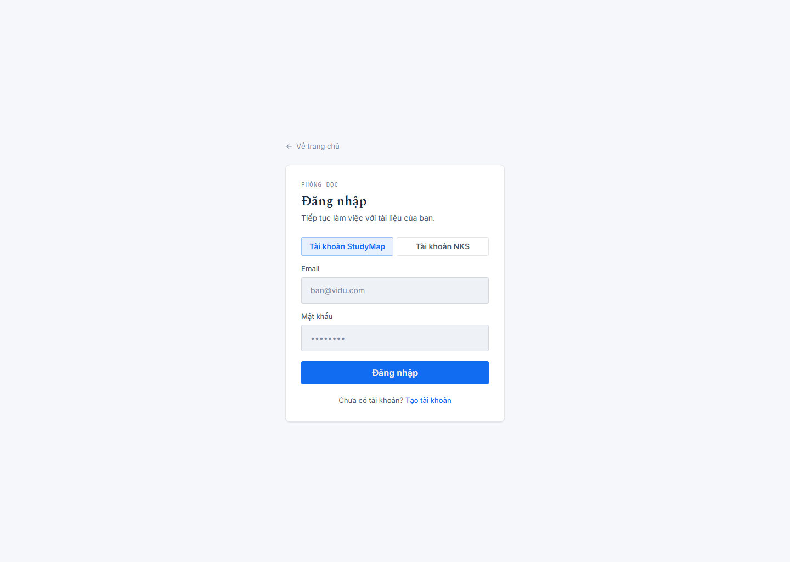
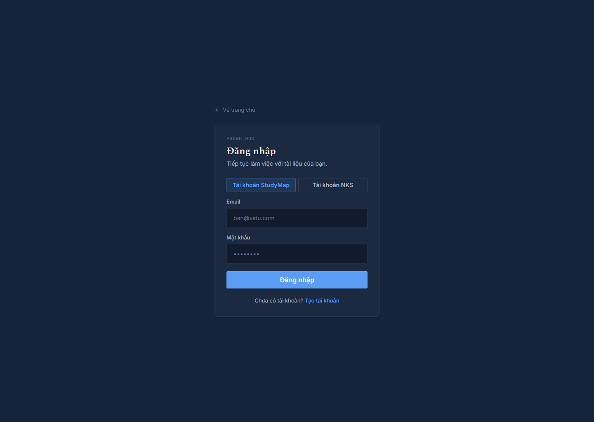
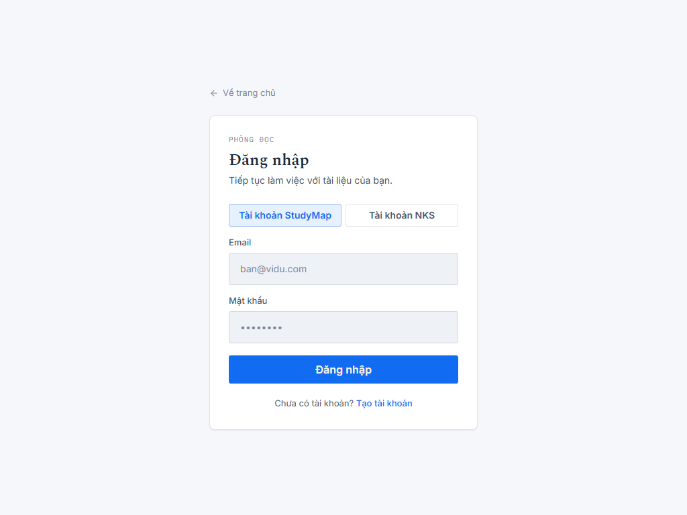
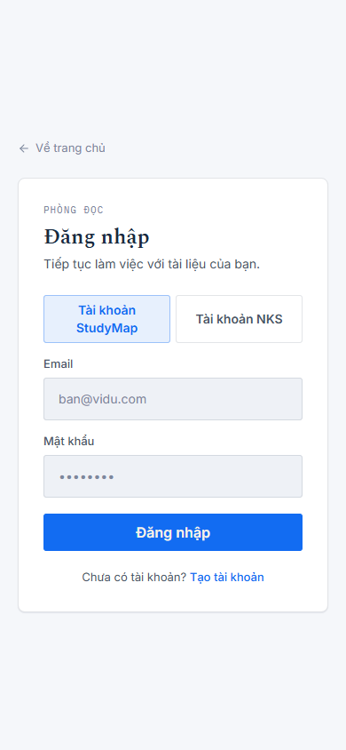

# StudyMap Workspace V3 — implementation candidate

## Status

`Implementation exists; automated verification passed; visual QA blocked by local-origin CORS and unavailable authenticated workspace data.`

This work was performed in an isolated worktree from `177c717` on
`feature/studymap-workspace-v3`. The original dirty worktree and all backend
files were left untouched. No production deployment or Gate B verification was
performed.

## Implemented ownership changes

- `MainLayout.jsx` now owns the single mode switch and the StudyMap tools entry.
- `ModeLibraryMenu.jsx` is the shared real-item library surface for Mind Maps and
  Summaries; it receives the existing saved-item arrays and generation callbacks.
- `StudyToolsMenu.jsx` exposes exactly Tutor, Timeline, and Knowledge, reusing the
  existing right-panel views.
- Mind Map mode hides the permanent right Inspector and opens the existing
  contextual surface as an overlay without changing canvas width.
- `SidebarLeft.jsx` owns source search and a composed type/status/date filter
  popover. Existing selection and upload behavior remains in the same component.
- `SidebarRight.jsx` no longer renders the old four-tab header or bottom artifact
  creator; its library callbacks expose the existing saved-map/summary state to
  the global libraries.
- `index.css` adds responsive styles for the libraries, StudyMap menu, filter
  popover, tool overlay, and contextual surface. Existing Mind Elixir drawer
  lifecycle and transform behavior were not changed.

## Changed-file allowlist

```text
FE/src/components/Layout/MainLayout.jsx
FE/src/components/Layout/ModeLibraryMenu.jsx
FE/src/components/Layout/ModeLibraryMenu.test.jsx
FE/src/components/Layout/SidebarLeft.jsx
FE/src/components/Layout/SidebarRight.jsx
FE/src/components/Layout/SidebarRight.loopFix.test.jsx
FE/src/components/Layout/StudyToolsMenu.jsx
FE/src/components/Layout/StudyToolsMenu.test.jsx
FE/src/index.css
```

No backend files, API contracts, Mind Elixir data, or Mind Map generation code
were changed. The clean base does not contain `cbeb475` as an ancestor.

## Automated verification

Commands run from `FE/`:

| Command | Result |
|---|---|
| `npx vitest run src/components/Layout/ModeLibraryMenu.test.jsx src/components/Layout/StudyToolsMenu.test.jsx src/components/Layout/MainLayout.modeTabs.test.jsx src/components/Layout/SidebarLeft.checkbox.test.jsx` | 7/7 pass |
| `npm test -- --run` | 1076/1076 pass, 95 files |
| `npm run build` | pass, Vite 7.2.1; 2371 modules transformed |
| targeted `npx eslint` on changed layout files | 0 errors; one pre-existing SidebarLeft hook warning |
| `git diff --check` | exit 0; only LF/CRLF conversion notices |

The repository lint baseline remains the existing repository debt; no new error
was introduced by this pass. The icon-registry test and the SidebarRight loop
regression were both rerun after the final corrections.

## Visual QA / browser evidence

Brave was found and launched through the installed Python Playwright package at
`C:\Program Files\BraveSoftware\Brave-Browser\Application\brave.exe`; no browser
dependency was added to package metadata. The candidate ran locally at
`http://127.0.0.1:5173/` with the temporary, non-persisted override
`VITE_API_URL=https://api.studymap.space`.

The real registration attempt used the disposable account
`qa-mindmap-v3-20260919@example.com` and failed before account creation because
the production API correctly rejected the local origin during the registration
preflight:

```text
Access to fetch at https://api.studymap.space/auth/register from origin
http://127.0.0.1:5173 has been blocked by CORS policy: Response to preflight
request doesn't pass access control check: No Access-Control-Allow-Origin header.
```

Therefore no account, document, map, or authenticated workspace state was
created by this attempt. This is a genuine environment/deployment boundary, not
a reason to bypass CORS or call the login screen a Mind Map acceptance pass.

The following screenshots are attached directly as blocker evidence. They show
the candidate's real login surface at the requested dimensions, not fabricated
workspace states:






These are explicitly **not** evidence for the required library, drawer, map
selector, viewport, or real-data checks. Those checks require either a preview
origin included by the production CORS allowlist or deployment of this candidate
to an authorized preview; neither is available under the no-deploy constraint.

The exact local command was:

```text
npm run dev -- --host 127.0.0.1
```

Required follow-up evidence is a real authenticated workspace with at least two
saved maps: light/dark screenshots for closed state, library, StudyMap tools,
source filters, node drawer/sheet, console errors, failed requests, and viewport
transform checks while switching maps and opening/closing transient surfaces.

## Remaining limitations

- This candidate has not been deployed; it must not be used as production
  acceptance evidence.
- Browser tooling itself is available, but authenticated workspace visual QA and
  real-data interaction verification remain outstanding because local-origin
  access to the production API is blocked by CORS.
- The existing Mind Elixir V2 renderer and its documented map-switch/fit
  invariants were intentionally preserved rather than reimplemented.

Final status: **BLOCKED — implementation candidate is pushed, but Gate B cannot
run without an authorized preview/production origin or a CORS policy change.**
