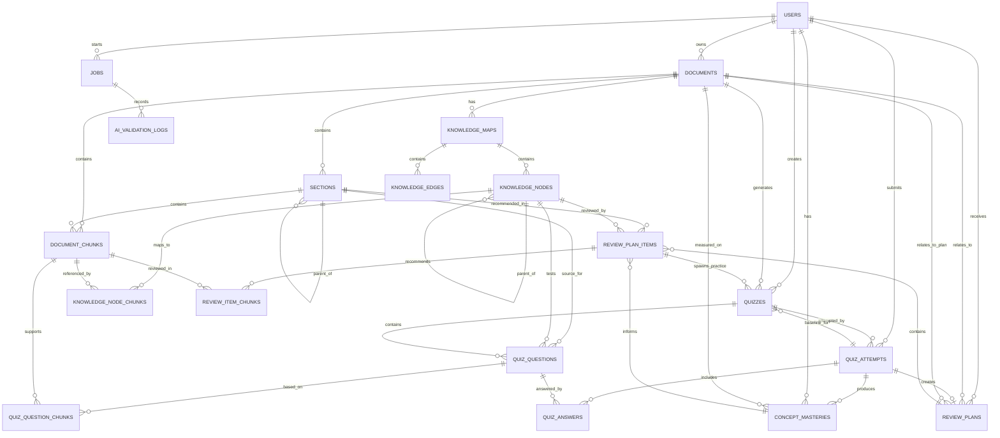

# ĐẶC TẢ MODULE VÀ THIẾT KẾ CƠ SỞ DỮ LIỆU HỆ THỐNG STUDYMAP AI

# ĐẶC TẢ MODULE VÀ THIẾT KẾ CƠ SỞ DỮ LIỆU HỆ THỐNG STUDYMAP AI

## 1. Tổng quan hệ thống

**StudyMap AI** là hệ thống hỗ trợ học tập thông minh, cho phép người dùng tải lên tài liệu học tập như PDF, DOCX, TXT hoặc slide bài giảng. Hệ thống phân tích nội dung tài liệu, tạo bản đồ học tập, sinh quiz chẩn đoán theo từng chủ đề, chấm kết quả làm bài, phát hiện lỗ hổng kiến thức và gợi ý các phần tài liệu cần ôn lại.

Điểm trọng tâm của hệ thống là khả năng liên kết giữa:

```
Tài liệu học tập
→ Section / Chunk
→ Bản đồ học tập
→ Câu hỏi quiz
→ Câu trả lời của người học
→ Chủ đề yếu
→ Phần tài liệu cần ôn
→ Câu luyện tập bổ sung
```

Hệ thống không chỉ tạo câu hỏi hoặc chấm điểm đơn thuần, mà còn giúp người học trả lời được ba câu hỏi quan trọng:

```
1. Mình đang hiểu bài đến đâu?
2. Mình còn yếu ở phần nào?
3. Mình cần quay lại học phần nào trong tài liệu?
```

Dữ liệu chính của hệ thống được lưu theo mô hình có cấu trúc trong cơ sở dữ liệu quan hệ. Các đối tượng như tài liệu, chương mục, đoạn nội dung, câu hỏi, lượt làm bài, điểm mastery và lộ trình ôn tập đều được lưu bằng bảng dữ liệu rõ ràng để dễ truy vấn, mở rộng và kiểm soát.

---

# 2. Kiến trúc chức năng tổng quát

Hệ thống được chia thành các module chính sau:

| STT | Module | Vai trò |
| --- | --- | --- |
| 1 | User & Authentication Module | Quản lý người dùng, đăng nhập, phân quyền |
| 2 | Document Management Module | Upload và quản lý tài liệu học tập |
| 3 | Document Processing Module | Trích xuất, làm sạch, chia chunk, tạo metadata |
| 4 | Study Map Module | Tạo bản đồ học tập từ tài liệu |
| 5 | Semantic Search Module | Tìm kiếm ngữ nghĩa trên nội dung tài liệu |
| 6 | Quiz Generation Module | Tạo quiz chẩn đoán từ tài liệu |
| 7 | Quiz Taking Module | Cho phép người học làm quiz |
| 8 | Grading Module | Chấm điểm và phản hồi câu trả lời |
| 9 | Knowledge Gap Analysis Module | Phân tích lỗ hổng kiến thức |
| 10 | Review Recommendation Module | Gợi ý phần tài liệu cần ôn |
| 11 | Practice Generation Module | Tạo câu luyện tập bổ sung |
| 12 | Progress & Report Module | Theo dõi kết quả và tiến độ học tập |
| 13 | AI Validation Module | Kiểm soát chất lượng đầu ra của AI |
| 14 | Background Job Module | Quản lý các tác vụ xử lý lâu, cập nhật và hiển thị trạng thái xử lý |

> Ghi chú: chức năng thông báo và hiển thị trạng thái xử lý cho người dùng do Background Job Module đảm nhiệm thông qua bảng `jobs`, không tách thành module riêng. Hệ thống gồm đúng 14 module, khớp với mục 3 và bảng mapping ở mục 10.

Luồng xử lý tổng quát:

```
Người dùng đăng nhập
→ Upload tài liệu
→ Hệ thống xử lý tài liệu
→ Tạo Study Map
→ Tạo quiz chẩn đoán
→ Người học làm quiz
→ Hệ thống chấm điểm
→ Phân tích chủ đề yếu
→ Tạo Review Plan
→ Gợi ý section/chunk cần ôn
→ Tạo Practice Quiz bổ sung
```

---

# 3. Đặc tả chi tiết các module

## 3.1. User & Authentication Module

### 3.1.1. Mục đích

Module này quản lý tài khoản người dùng, xác thực đăng nhập và kiểm soát quyền truy cập dữ liệu. Mỗi tài liệu, quiz, kết quả làm bài và kế hoạch ôn tập đều được gắn với một người dùng cụ thể.

### 3.1.2. Chức năng chính

- Đăng ký tài khoản.
- Đăng nhập.
- Đăng xuất.
- Quản lý thông tin cá nhân.
- Phân quyền người dùng.
- Kiểm tra quyền truy cập tài liệu.
- Kiểm tra quyền truy cập quiz, attempt .

### 3.1.3. Vai trò người dùng

| Vai trò | Mô tả |
| --- | --- |
| learner | Người học, sinh viên, người tự học |
| teacher | Giáo viên hoặc trợ giảng |
| admin | Quản trị hệ thống |

Trong phạm vi MVP, hệ thống có thể triển khai trước vai trò `learner`.

### 3.1.4. Input

```json
{
  "email": "student@example.com",
  "password": "********"
}
```

### 3.1.5. Output

```json
{
  "user_id": "user_001",
  "full_name": "Nguyễn Văn A",
  "role": "learner",
  "access_token": "jwt_token"
}
```

### 3.1.6. Ràng buộc

- Email không được trùng.
- Mật khẩu phải được mã hóa.
- Người dùng chỉ được xem dữ liệu thuộc tài khoản của mình.
- API thao tác với tài liệu, quiz, attempt, review plan đều cần kiểm tra `user_id`.

---

## 3.2. Document Management Module

### 3.2.1. Mục đích

Module này cho phép người dùng tải lên tài liệu học tập và quản lý các tài liệu đã upload.

### 3.2.2. Chức năng chính

- Upload tài liệu.
- Kiểm tra định dạng file.
- Kiểm tra dung lượng file.
- Lưu metadata tài liệu.
- Hiển thị danh sách tài liệu.
- Hiển thị trạng thái xử lý tài liệu.
- Xóa tài liệu.
- Chọn tài liệu để tạo Study Map hoặc quiz.

### 3.2.3. Định dạng hỗ trợ

| Định dạng | Mức hỗ trợ |
| --- | --- |
| PDF | Bắt buộc |
| DOCX | Bắt buộc |
| TXT | Bắt buộc |
| Markdown | Có thể hỗ trợ |
| Slide xuất PDF | Có thể hỗ trợ |
| Ảnh tài liệu | Tùy chọn nếu có OCR |

### 3.2.4. Trạng thái tài liệu

| Trạng thái | Ý nghĩa |
| --- | --- |
| uploaded | Tài liệu đã upload |
| processing | Đang xử lý |
| completed | Đã xử lý xong |
| failed | Xử lý thất bại |
| deleted | Đã xóa mềm |

### 3.2.5. Input

```json
{
  "file": "chuong_2_dao_ham.pdf",
  "title": "Chương 2 - Đạo hàm"
}
```

### 3.2.6. Output

```json
{
  "document_id": "doc_001",
  "title": "Chương 2 - Đạo hàm",
  "status": "uploaded"
}
```

### 3.2.7. Acceptance Criteria

- Người dùng upload được tài liệu hợp lệ.
- Tài liệu có bản ghi trong database.
- Hệ thống hiển thị trạng thái xử lý.
- Không cho phép tạo quiz khi tài liệu chưa xử lý xong.
- Tài liệu lỗi phải có thông báo rõ nguyên nhân.

---

## 3.3. Document Processing Module

### 3.3.1. Mục đích

Module này xử lý tài liệu sau khi upload, chuyển tài liệu thành dữ liệu có cấu trúc để phục vụ tạo bản đồ học tập, tìm kiếm ngữ nghĩa, tạo quiz và gợi ý ôn tập.

### 3.3.2. Chức năng chính

- Trích xuất text từ tài liệu.
- Chuẩn hóa nội dung.
- Phát hiện heading/chương/mục.
- Chia nội dung thành các chunk.
- Gắn metadata cho từng chunk.
- Tạo summary ngắn cho section nếu cần.
- Tạo embedding cho từng chunk.
- Lưu dữ liệu vào database có cấu trúc.

### 3.3.3. Quy trình xử lý

```
File tài liệu
→ Extract text
→ Normalize text
→ Detect heading
→ Create sections
→ Chunking
→ Attach metadata
→ Generate embeddings
→ Store structured data
→ Mark document as completed
```

### 3.3.4. Input

```json
{
  "document_id": "doc_001",
  "file_path": "/uploads/chuong_2_dao_ham.pdf",
  "file_type": "pdf"
}
```

### 3.3.5. Output

```json
{
  "document_id": "doc_001",
  "status": "completed",
  "section_count": 8,
  "chunk_count": 42
}
```

### 3.3.6. Metadata của chunk

Mỗi chunk cần có các trường:

```json
{
  "chunk_id": "chunk_001",
  "document_id": "doc_001",
  "section_id": "section_001",
  "chunk_index": 1,
  "heading": "2.1 Khái niệm đạo hàm",
  "page_number": 5,
  "text": "Nội dung chunk...",
  "token_count": 450,
  "embedding_id": "emb_001"
}
```

### 3.3.7. Ràng buộc

- Mỗi chunk phải có `document_id`.
- Mỗi chunk phải có `chunk_id`.
- Cố gắng gắn `section_id` cho mỗi chunk.
- Chunk không được rỗng.
- Nếu tài liệu không có heading rõ, hệ thống tạo section mặc định.
- Nếu text trích xuất quá ít, hệ thống cảnh báo tài liệu không đủ nội dung.

---

## 3.4. Study Map Module

### 3.4.1. Mục đích

Module này tạo bản đồ học tập từ tài liệu đã xử lý. Bản đồ học tập biểu diễn các chủ đề chính, chủ đề con và quan hệ giữa các phần kiến thức.

### 3.4.2. Chức năng chính

- Tạo cây kiến thức từ sections và chunks.
- Tạo node kiến thức.
- Tạo quan hệ cha — con giữa các node.
- Tạo quan hệ chéo giữa các khái niệm nếu có.
- Liên kết node với section/chunk nguồn.
- Hiển thị bản đồ học tập.
- Đánh dấu node yếu sau khi người học làm quiz.

### 3.4.3. Input

```json
{
  "document_id": "doc_001",
  "section_ids": ["section_001", "section_002"]
}
```

### 3.4.4. Output

```json
{
  "map_id": "map_001",
  "document_id": "doc_001",
  "title": "Bản đồ học tập - Chương 2 Đạo hàm",
  "nodes": [],
  "edges": []
}
```

### 3.4.5. Cấu trúc node

```json
{
  "node_id": "node_001",
  "map_id": "map_001",
  "document_id": "doc_001",
  "section_id": "section_2_3",
  "parent_node_id": "node_000",
  "title": "Quy tắc đạo hàm hàm hợp",
  "summary": "Phần này trình bày cách tính đạo hàm của hàm hợp.",
  "node_type": "concept",
  "level": 2,
  "order_index": 3,
  "chunk_refs": ["chunk_018", "chunk_021"]
}
```

### 3.4.6. Cấu trúc edge

```json
{
  "edge_id": "edge_001",
  "source_node_id": "node_002",
  "target_node_id": "node_005",
  "relation_type": "supports",
  "description": "Khái niệm đạo hàm hỗ trợ hiểu quy tắc hàm hợp."
}
```

### 3.4.7. Relation types

| Relation type | Ý nghĩa |
| --- | --- |
| parent_child | Quan hệ cha — con |
| supports | Kiến thức này hỗ trợ kiến thức kia |
| prerequisite | Kiến thức này là nền tảng của kiến thức kia |
| contrasts | Hai khái niệm có tính đối lập |
| related | Hai khái niệm có liên quan |

### 3.4.8. Acceptance Criteria

- Hệ thống tạo được Study Map từ tài liệu.
- Mỗi node có title rõ ràng.
- Mỗi node có liên kết với section hoặc chunk.
- Node cha — con không được tạo vòng lặp.
- Người học có thể xem bản đồ học tập trên giao diện.
- Sau khi làm quiz, node liên quan đến chủ đề yếu có thể được đánh dấu.

---

## 3.5. Semantic Search Module

### 3.5.1. Mục đích

Module này hỗ trợ tìm kiếm ngữ nghĩa trên nội dung tài liệu. Nó được sử dụng khi tạo quiz, tạo review guide hoặc mở lại phần tài liệu liên quan.

### 3.5.2. Chức năng chính

- Tạo embedding cho chunk.
- Lưu vector embedding.
- Tìm chunk liên quan theo truy vấn.
- Trả về chunk kèm metadata.
- Kết hợp tìm kiếm theo section, concept hoặc keyword.

### 3.5.3. Input

```json
{
  "document_id": "doc_001",
  "query": "quy tắc đạo hàm hàm hợp",
  "top_k": 5
}
```

### 3.5.4. Output

```json
{
  "results": [
    {
      "chunk_id": "chunk_018",
      "section_id": "section_2_3",
      "score": 0.87,
      "text": "Nội dung liên quan đến quy tắc hàm hợp..."
    }
  ]
}
```

### 3.5.5. Lưu ý thiết kế

- Vector database hoặc FAISS chỉ dùng để tìm kiếm ngữ nghĩa.
- Dữ liệu nghiệp vụ chính vẫn nằm trong database quan hệ.
- Mỗi vector phải ánh xạ được về `chunk_id`.

---

## 3.6. Quiz Generation Module

### 3.6.1. Mục đích

Module này tạo quiz chẩn đoán từ tài liệu. Quiz không chỉ kiểm tra kiến thức, mà còn dùng để xác định người học yếu ở phần nào.

### 3.6.2. Chức năng chính

- Nhận cấu hình quiz từ người dùng.
- Lấy section/chunk liên quan.
- Xác định concept chính.
- Tạo câu hỏi.
- Tạo đáp án đúng.
- Tạo giải thích.
- Gắn metadata nguồn cho câu hỏi.
- Validate câu hỏi.
- Lưu quiz và câu hỏi vào database.

### 3.6.3. Cấu hình quiz

```json
{
  "document_id": "doc_001",
  "scope": {
    "type": "full_document",
    "section_ids": []
  },
  "question_count": 10,
  "difficulty": "mixed",
  "question_types": ["multiple_choice", "true_false", "short_answer"]
}
```

### 3.6.4. Loại câu hỏi

| Loại câu hỏi | Mô tả | MVP |
| --- | --- | --- |
| multiple_choice | Trắc nghiệm nhiều lựa chọn | Có |
| true_false | Đúng / sai | Có |
| short_answer | Tự luận ngắn | Tùy chọn |
| fill_blank | Điền khuyết | Sau MVP |
| matching | Ghép cặp | Sau MVP |

### 3.6.5. Cấu trúc câu hỏi

```json
{
  "question_id": "q_001",
  "quiz_id": "quiz_001",
  "question_text": "Quy tắc đạo hàm hàm hợp được dùng trong trường hợp nào?",
  "question_type": "multiple_choice",
  "options": [
    "Khi hàm số là tổng của hai hàm",
    "Khi hàm số là tích của hai hàm",
    "Khi hàm số là hàm của một hàm khác",
    "Khi hàm số là hằng số"
  ],
  "correct_answer": "Khi hàm số là hàm của một hàm khác",
  "explanation": "Quy tắc đạo hàm hàm hợp áp dụng khi một hàm được tạo bởi sự lồng nhau của các hàm.",
  "difficulty": "medium",
  "concept_tags": ["đạo hàm", "hàm hợp", "quy tắc dây chuyền"],
  "section_id": "section_2_3",
  "knowledge_node_id": "node_008",
  "chunk_refs": ["chunk_018", "chunk_021"]
}
```

### 3.6.6. Quy tắc tạo quiz

- Câu hỏi phải bám sát tài liệu.
- Không tạo câu hỏi ngoài nội dung tài liệu.
- Mỗi câu hỏi chỉ kiểm tra một concept rõ ràng.
- Mỗi câu hỏi phải có đáp án đúng.
- Mỗi câu hỏi phải có giải thích.
- Mỗi câu hỏi phải có `concept_tags`.
- Mỗi câu hỏi phải có `section_id` hoặc `knowledge_node_id`.
- Mỗi câu hỏi phải liên kết với ít nhất một `chunk_id`.

### 3.6.7. Acceptance Criteria

- Quiz được tạo từ tài liệu đã xử lý.
- Quiz có đủ số câu theo cấu hình.
- Mỗi câu hỏi có đáp án và explanation.
- Mỗi câu hỏi có nguồn tài liệu.
- Không trả `correct_answer` cho frontend trước khi người học nộp bài.
- Quiz có thể lưu và mở lại.

---

## 3.7. Quiz Taking Module

### 3.7.1. Mục đích

Module này cho phép người học làm quiz trên giao diện web.

### 3.7.2. Chức năng chính

- Hiển thị quiz.
- Hiển thị từng câu hỏi.
- Cho phép chọn đáp án.
- Cho phép chuyển câu.
- Lưu câu trả lời tạm thời.
- Cảnh báo câu chưa trả lời.
- Nộp bài.
- Tạo attempt.

### 3.7.3. Input

```json
{
  "quiz_id": "quiz_001",
  "answers": [
    {
      "question_id": "q_001",
      "user_answer": "Khi hàm số là tích của hai hàm"
    }
  ]
}
```

### 3.7.4. Output

```json
{
  "attempt_id": "attempt_001",
  "status": "submitted"
}
```

### 3.7.5. Vòng đời attempt

```
Người học mở quiz
→ POST /api/quizzes/{quiz_id}/attempts     → status = in_progress, started_at
→ PATCH /api/attempts/{attempt_id}/answers → lưu nháp câu trả lời, cập nhật updated_at
→ POST /api/attempts/{attempt_id}/submit   → status = submitted, submitted_at
→ Grading Module chấm bài                  → status = graded, graded_at
```

Attempt được tạo ngay khi người học mở quiz, không đợi tới lúc nộp bài. Nhờ đó trạng thái `in_progress` và cột `started_at` có ý nghĩa thực tế, và người học có thể đổi đáp án trước khi nộp mà vẫn không mất dữ liệu.

### 3.7.6. Trạng thái attempt

| Trạng thái | Ý nghĩa |
| --- | --- |
| in_progress | Đang làm |
| submitted | Đã nộp |
| graded | Đã chấm |
| cancelled | Đã hủy |

### 3.7.7. Acceptance Criteria

- Người học có thể chọn và đổi đáp án.
- Người học có thể nộp bài.
- Hệ thống lưu attempt.
- Hệ thống lưu từng answer.
- Sau khi nộp, người học được chuyển sang trang kết quả.

---

## 3.8. Grading Module

### 3.8.1. Mục đích

Module này chấm bài quiz, tính điểm và tạo phản hồi cho từng câu hỏi.

### 3.8.2. Chức năng chính

- Chấm trắc nghiệm.
- Chấm đúng/sai.
- Chấm tự luận ngắn ở mức cơ bản.
- Tính điểm tổng.
- Tính số câu đúng/sai.
- Lưu feedback.
- Cập nhật trạng thái attempt.

### 3.8.3. Logic chấm điểm

Với trắc nghiệm và đúng/sai:

```
Nếu user_answer = correct_answer
→ verdict = correct
→ is_correct = true
→ score = 1.0

Nếu user_answer != correct_answer
→ verdict = incorrect
→ is_correct = false
→ score = 0.0
```

Với tự luận ngắn, so sánh `user_answer` với `correct_answer` và source context:

```
verdict = correct    → is_correct = true,  score = 1.0
verdict = partial    → is_correct = false, score = 0.5
verdict = incorrect  → is_correct = false, score = 0.0
```

Điểm của attempt:

```
score       = SUM(quiz_answers.score)
max_score   = total_questions × 1.0
percentage  = score / max_score × 100
```

`score` là điểm thô, không quy đổi sang thang 10. Giao diện hiển thị `score / max_score` kèm `percentage` để so sánh được giữa các quiz có số câu khác nhau.

### 3.8.4. Output

```json
{
  "attempt_id": "attempt_001",
  "score": 7.0,
  "max_score": 10.0,
  "percentage": 70.0,
  "correct_count": 7,
  "incorrect_count": 3,
  "total_questions": 10,
  "results": [
    {
      "question_id": "q_001",
      "verdict": "incorrect",
      "is_correct": false,
      "score": 0.0,
      "user_answer": "Khi hàm số là tích của hai hàm",
      "correct_answer": "Khi hàm số là hàm của một hàm khác",
      "feedback": "Bạn đang nhầm giữa quy tắc đạo hàm tích và quy tắc đạo hàm hàm hợp."
    }
  ]
}
```

### 3.8.5. Acceptance Criteria

- Hệ thống chấm được quiz.
- Hệ thống trả điểm tổng.
- Hệ thống trả số câu đúng/sai.
- Hệ thống hiển thị đáp án đúng sau khi nộp.
- Hệ thống lưu kết quả theo attempt.

---

## 3.9. Knowledge Gap Analysis Module

### 3.9.1. Mục đích

Module này phân tích kết quả làm quiz để xác định các chủ đề người học còn yếu.

### 3.9.2. Chức năng chính

- Lấy danh sách câu trả lời.
- Join câu trả lời với câu hỏi.
- Nhóm câu hỏi theo `concept_tags`.
- Nhóm câu hỏi theo `section_id`.
- Nhóm câu hỏi theo `knowledge_node_id`.
- Tính mastery score.
- Phân loại mức độ nắm bài.
- Lưu kết quả mastery.

### 3.9.3. Công thức mastery score

```
earned_score  = SUM(quiz_answers.score) của các câu thuộc concept
total_count   = tổng số câu thuộc concept
mastery_score = earned_score / total_count
```

Câu có `verdict = partial` đóng góp 0.5 điểm. Cột `correct_count` vẫn được lưu để báo cáo số câu đúng hoàn toàn, nhưng `mastery_score` được tính từ `earned_score`.

Mỗi cặp (`attempt_id`, `concept_name`) chỉ sinh đúng một bản ghi `concept_masteries`.

### 3.9.4. Bảng phân loại

| Mastery score | Trạng thái | Ý nghĩa |
| --- | --- | --- |
| >= 0.80 | mastered | Đã nắm tốt |
| 0.60 - 0.79 | light_review | Cần ôn nhẹ |
| 0.40 - 0.59 | review_needed | Cần ôn lại |
| < 0.40 | critical_gap | Hổng kiến thức nghiêm trọng |

### 3.9.5. Output

```json
{
  "weak_topics": [
    {
      "concept": "Quy tắc đạo hàm hàm hợp",
      "mastery_score": 0.25,
      "status": "critical_gap",
      "wrong_questions": ["q_001", "q_004", "q_009"],
      "section_id": "section_2_3",
      "knowledge_node_id": "node_008",
      "chunk_refs": ["chunk_018", "chunk_021"]
    }
  ]
}
```

### 3.9.6. Acceptance Criteria

- Hệ thống xác định được topic yếu.
- Hệ thống tính được mastery score.
- Mỗi topic yếu liên kết được với section, node hoặc chunk.
- Kết quả được dùng để tạo review plan.

---

## 3.10. Review Recommendation Module

### 3.10.1. Mục đích

Module này tạo kế hoạch ôn tập cá nhân hóa dựa trên các chủ đề người học còn yếu.

### 3.10.2. Chức năng chính

- Nhận danh sách concept yếu.
- Lấy section/chunk liên quan.
- Tạo từng review item.
- Sắp xếp thứ tự ưu tiên ôn tập.
- Gợi ý nhiệm vụ học tập.
- Cho phép mở lại đoạn tài liệu cần ôn.

### 3.10.3. Nguyên tắc gợi ý

- Chỉ gợi ý phần tài liệu liên quan đến câu sai.
- Không tự gợi ý phần không có trong tài liệu.
- Ưu tiên topic có mastery score thấp.
- Ưu tiên topic có nhiều câu sai.
- Gợi ý phải có lý do rõ ràng.
- Gợi ý phải có hành động tiếp theo.

### 3.10.4. Output

```json
{
  "review_plan_id": "review_001",
  "attempt_id": "attempt_001",
  "summary": "Bạn cần ôn lại 2 chủ đề chính trước khi làm lại bài kiểm tra.",
  "review_items": [
    {
      "priority": 1,
      "topic": "Quy tắc đạo hàm hàm hợp",
      "mastery_score": 0.25,
      "status": "critical_gap",
      "reason": "Bạn sai 3/4 câu liên quan đến quy tắc đạo hàm hàm hợp.",
      "recommended_sections": [
        {
          "section_id": "section_2_3",
          "section_title": "Quy tắc đạo hàm hàm hợp"
        }
      ],
      "recommended_chunks": ["chunk_018", "chunk_021"],
      "review_tasks": [
        "Đọc lại định nghĩa quy tắc hàm hợp.",
        "Xem lại ví dụ trong mục 2.3.",
        "Làm thêm 5 câu luyện tập mức dễ."
      ]
    }
  ]
}
```

### 3.10.5. Acceptance Criteria

- Review plan được tạo từ attempt.
- Review plan dựa trên concept yếu.
- Mỗi review item có topic, reason, priority.
- Mỗi review item có section/chunk cần ôn.
- Người học có thể mở lại nội dung được gợi ý.

---

## 3.11. Practice Generation Module

### 3.11.1. Mục đích

Module này tạo câu luyện tập bổ sung cho các chủ đề người học còn yếu.

### 3.11.2. Chức năng chính

- Chọn topic yếu từ review plan.
- Lấy chunk liên quan.
- Tạo practice quiz.
- Tạo câu hỏi luyện tập.
- Lưu câu hỏi vào database.
- Cho phép người học làm practice quiz.
- So sánh kết quả trước và sau luyện tập.

### 3.11.3. Input

```json
{
  "review_item_id": "review_item_001",
  "question_count": 5,
  "difficulty": "easy"
}
```

### 3.11.4. Output

```json
{
  "practice_quiz_id": "quiz_practice_001",
  "topic": "Quy tắc đạo hàm hàm hợp",
  "source_review_item_id": "review_item_001",
  "source_attempt_id": "attempt_001",
  "questions": []
}
```

### 3.11.5. Liên kết ngược

Practice quiz phải lưu hai khóa ngoại để truy vết được nguồn gốc:

```
quizzes.quiz_type             = practice
quizzes.source_review_item_id = review_plan_items.id
quizzes.source_attempt_id     = quiz_attempts.id (attempt chẩn đoán gốc)
```

Nhờ hai khóa này, hệ thống mới so sánh được mastery score trước và sau luyện tập, và mới lọc được lịch sử practice quiz theo từng chủ đề yếu.

### 3.11.6. Acceptance Criteria

- Practice quiz được tạo từ topic yếu.
- Câu hỏi luyện tập bám vào chunk được gợi ý.
- Câu hỏi có đáp án và giải thích.
- Câu hỏi có liên kết nguồn tài liệu.
- Kết quả practice quiz được lưu.
- Practice quiz có `source_review_item_id` và `source_attempt_id`.
- So sánh được mastery score trước và sau luyện tập.

---

## 3.12. Progress & Report Module

### 3.12.1. Mục đích

Module này hiển thị kết quả học tập, lịch sử làm bài và tiến độ cải thiện của người học.

### 3.12.2. Chức năng chính

- Hiển thị danh sách quiz đã làm.
- Hiển thị điểm từng lần làm.
- Hiển thị topic yếu.
- Hiển thị mastery score theo topic.
- Hiển thị review plan.
- So sánh quiz chẩn đoán và practice quiz.
- Thống kê số tài liệu, số quiz, số lần luyện tập.

### 3.12.3. Chỉ số hiển thị

| Chỉ số | Ý nghĩa |
| --- | --- |
| Total documents | Số tài liệu đã upload |
| Total quizzes | Số quiz đã tạo |
| Quiz completion rate | Tỷ lệ quiz đã hoàn thành |
| Average score | Điểm trung bình |
| Weak topics | Danh sách chủ đề yếu |
| Mastery score | Mức độ nắm bài theo concept |
| Practice improvement | Mức cải thiện sau luyện tập |

---

## 3.13. AI Validation Module

### 3.13.1. Mục đích

Module này kiểm soát chất lượng dữ liệu do AI tạo ra, tránh lỗi như JSON sai định dạng, câu hỏi thiếu nguồn, câu hỏi ngoài tài liệu hoặc review plan gợi ý sai.

### 3.13.2. Chức năng chính

- Validate JSON output.
- Kiểm tra schema câu hỏi.
- Kiểm tra schema review plan.
- Kiểm tra câu hỏi có đáp án không.
- Kiểm tra câu hỏi có explanation không.
- Kiểm tra câu hỏi có chunk nguồn không.
- Loại câu hỏi trùng lặp.
- Loại câu hỏi không bám tài liệu.
- Retry khi AI trả kết quả lỗi.

### 3.13.3. Câu hỏi hợp lệ phải có

```
question_text
question_type
correct_answer
explanation
difficulty
concept_tags
section_id hoặc knowledge_node_id
chunk_refs
```

### 3.13.4. Review item hợp lệ phải có

```
topic
reason
priority
status
mastery_score
section_id hoặc knowledge_node_id
chunk_refs
review_tasks
```

### 3.13.5. Ghi log validation

Item bị loại không được insert vào `quiz_questions` hay `review_plan_items`, nên phải ghi lại ở bảng riêng `ai_validation_logs`. Nếu không, hệ thống mất hoàn toàn dấu vết và không tính được các chỉ số chất lượng.

Mỗi bản ghi log gồm:

```
job_id       — job sinh ra output
target_type  — quiz_question | review_item
target_ref   — mã tạm của item bị loại
rule_code    — mã quy tắc vi phạm, ví dụ FR-13.5
severity     — rejected | warning
message      — mô tả lỗi
payload_json — nội dung item bị loại
```

Dữ liệu này phục vụ trực tiếp hai chỉ số: citation accuracy và quiz relevance accuracy.

### 3.13.6. Acceptance Criteria

- Mọi item bị loại đều có bản ghi trong `ai_validation_logs`.
- Log ghi rõ `rule_code` tương ứng với yêu cầu FR-13.
- Có thể thống kê số item bị loại theo từng job và từng quy tắc.

---

## 3.14. Background Job Module

### 3.14.1. Mục đích

Module này quản lý các tác vụ xử lý lâu như xử lý tài liệu, tạo Study Map, tạo quiz và tạo practice quiz.

### 3.14.2. Chức năng chính

- Tạo job.
- Cập nhật trạng thái job.
- Cập nhật tiến độ.
- Lưu lỗi nếu job thất bại.
- Hủy job nếu người dùng yêu cầu.
- Cho phép frontend polling trạng thái.
- Lưu kết quả job.

### 3.14.3. Loại job

| Job type | Mục đích |
| --- | --- |
| document_processing | Xử lý tài liệu |
| study_map_generation | Tạo bản đồ học tập |
| quiz_generation | Tạo quiz chẩn đoán |
| short_answer_grading | Chấm tự luận ngắn |
| gap_analysis | Phân tích lỗ hổng kiến thức |
| review_plan_generation | Tạo lộ trình ôn tập |
| practice_generation | Tạo quiz luyện tập |

### 3.14.4. Trạng thái job

| Status | Ý nghĩa |
| --- | --- |
| pending | Đang chờ |
| running | Đang chạy |
| completed | Hoàn tất |
| failed | Thất bại |
| cancelled | Đã hủy |
| timeout | Quá thời gian |

### 3.14.5. Output

```json
{
  "job_id": "job_001",
  "job_type": "quiz_generation",
  "status": "completed",
  "progress": 100,
  "result_type": "quiz",
  "result_id": "quiz_001"
}
```

---

# 4. Thiết kế cơ sở dữ liệu

## 4.1. Tổng quan database

Hệ thống sử dụng database quan hệ để lưu trữ dữ liệu nghiệp vụ chính. Các bảng được thiết kế nhằm đảm bảo mọi câu hỏi, câu trả lời, topic yếu và gợi ý ôn tập đều truy ngược được về tài liệu gốc.

Các nhóm dữ liệu chính gồm:

```
1. Người dùng
2. Tài liệu
3. Section / Chunk
4. Study Map
5. Quiz
6. Attempt / Answer
7. Concept Mastery
8. Review Plan
9. Practice Quiz
10. Background Job
11. AI Validation Log
```

Danh sách bảng:

```
users
documents
sections
document_chunks
knowledge_maps
knowledge_nodes
knowledge_edges
knowledge_node_chunks
quizzes
quiz_questions
quiz_question_chunks
quiz_attempts
quiz_answers
concept_masteries
review_plans
review_plan_items
review_item_chunks
jobs
ai_validation_logs
```

---

# 5. Chi tiết các bảng dữ liệu

## 5.1. Bảng users

### Mục đích

Lưu thông tin người dùng.

| Cột | Kiểu dữ liệu | Ràng buộc | Mô tả |
| --- | --- | --- | --- |
| id | UUID | PK | Mã người dùng |
| full_name | VARCHAR(255) | NOT NULL | Họ tên |
| email | VARCHAR(255) | UNIQUE, NOT NULL | Email đăng nhập |
| password_hash | TEXT | NOT NULL | Mật khẩu đã mã hóa |
| role | VARCHAR(50) | NOT NULL | learner, teacher, admin |
| created_at | TIMESTAMP | NOT NULL | Ngày tạo |
| updated_at | TIMESTAMP | NOT NULL | Ngày cập nhật |

### Quan hệ

- Một user có nhiều documents.
- Một user có nhiều quizzes.
- Một user có nhiều quiz_attempts.
- Một user có nhiều review_plans.
- Một user có nhiều jobs.

---

## 5.2. Bảng documents

### Mục đích

Lưu thông tin tài liệu người dùng upload.

| Cột | Kiểu dữ liệu | Ràng buộc | Mô tả |
| --- | --- | --- | --- |
| id | UUID | PK | Mã tài liệu |
| user_id | UUID | FK → users.id | Người sở hữu |
| title | VARCHAR(255) | NOT NULL | Tên tài liệu |
| file_type | VARCHAR(50) | NOT NULL | pdf, docx, txt, md |
| file_path | TEXT | NOT NULL | Đường dẫn file |
| status | VARCHAR(50) | NOT NULL | uploaded, processing, completed, failed, deleted |
| file_size | BIGINT | NULL | Kích thước file tính bằng byte |
| page_count | INT | NULL | Số trang |
| char_count | INT | NULL | Số ký tự trích xuất được |
| chunk_count | INT | NULL | Số chunk sinh ra |
| error_message | TEXT | NULL | Thông báo lỗi |
| created_at | TIMESTAMP | NOT NULL | Ngày upload |
| updated_at | TIMESTAMP | NOT NULL | Ngày cập nhật |

### Quan hệ

- Một document thuộc về một user.
- Một document có nhiều sections.
- Một document có nhiều document_chunks.
- Một document có nhiều knowledge_maps.
- Một document có nhiều quizzes.
- Một document có nhiều review_plans.

---

## 5.3. Bảng sections

### Mục đích

Lưu cấu trúc chương, mục, tiểu mục trong tài liệu.

| Cột | Kiểu dữ liệu | Ràng buộc | Mô tả |
| --- | --- | --- | --- |
| id | UUID | PK | Mã section |
| document_id | UUID | FK → documents.id | Tài liệu chứa section |
| parent_section_id | UUID | FK → sections.id, NULL | Section cha |
| title | VARCHAR(500) | NOT NULL | Tiêu đề section |
| level | INT | NOT NULL | Cấp heading |
| order_index | INT | NOT NULL | Thứ tự |
| page_start | INT | NULL | Trang bắt đầu |
| page_end | INT | NULL | Trang kết thúc |
| summary | TEXT | NULL | Tóm tắt section |
| metadata_json | JSONB | NULL | Metadata bổ sung |
| created_at | TIMESTAMP | NOT NULL | Ngày tạo |

### Quan hệ

- Một section thuộc về một document.
- Một section có thể có section cha.
- Một section có thể có nhiều section con.
- Một section có nhiều document_chunks.
- Một section có nhiều quiz_questions.
- Một section có nhiều review_plan_items.

---

## 5.4. Bảng document_chunks

### Mục đích

Lưu các đoạn nội dung nhỏ được chia từ tài liệu.

| Cột | Kiểu dữ liệu | Ràng buộc | Mô tả |
| --- | --- | --- | --- |
| id | UUID | PK | Mã chunk |
| document_id | UUID | FK → documents.id | Tài liệu chứa chunk |
| section_id | UUID | FK → sections.id, NULL | Section chứa chunk |
| chunk_index | INT | NOT NULL | Thứ tự chunk |
| text | TEXT | NOT NULL | Nội dung chunk |
| heading | VARCHAR(500) | NULL | Heading gần nhất |
| page_number | INT | NULL | Số trang |
| token_count | INT | NULL | Số token |
| checksum | VARCHAR(255) | NULL | Kiểm tra thay đổi nội dung |
| embedding_id | VARCHAR(255) | NULL | ID vector embedding |
| embedding_model | VARCHAR(100) | NULL | Model dùng để tạo embedding |
| embedding_dim | INT | NULL | Số chiều vector |
| metadata_json | JSONB | NULL | Metadata bổ sung |
| created_at | TIMESTAMP | NOT NULL | Ngày tạo |

### Quan hệ

- Một chunk thuộc về một document.
- Một chunk có thể thuộc về một section.
- Một chunk có thể liên kết với nhiều knowledge_nodes.
- Một chunk có thể làm nguồn cho nhiều quiz_questions.
- Một chunk có thể được gợi ý trong nhiều review_plan_items.

---

## 5.5. Bảng knowledge_maps

### Mục đích

Lưu thông tin bản đồ học tập được tạo từ tài liệu.

| Cột | Kiểu dữ liệu | Ràng buộc | Mô tả |
| --- | --- | --- | --- |
| id | UUID | PK | Mã bản đồ |
| document_id | UUID | FK → documents.id | Tài liệu nguồn |
| user_id | UUID | FK → users.id | Người tạo |
| title | VARCHAR(500) | NOT NULL | Tên bản đồ |
| status | VARCHAR(50) | NOT NULL | processing, completed, failed |
| generator_json | JSONB | NULL | Thông tin generator |
| created_at | TIMESTAMP | NOT NULL | Ngày tạo |
| updated_at | TIMESTAMP | NOT NULL | Ngày cập nhật |

### Quan hệ

- Một knowledge_map thuộc về một document.
- Một knowledge_map thuộc về một user.
- Một knowledge_map có nhiều knowledge_nodes.
- Một knowledge_map có nhiều knowledge_edges.

---

## 5.6. Bảng knowledge_nodes

### Mục đích

Lưu các node kiến thức trong bản đồ học tập.

| Cột | Kiểu dữ liệu | Ràng buộc | Mô tả |
| --- | --- | --- | --- |
| id | UUID | PK | Mã node |
| map_id | UUID | FK → knowledge_maps.id | Bản đồ chứa node |
| document_id | UUID | FK → documents.id | Tài liệu nguồn |
| section_id | UUID | FK → sections.id, NULL | Section liên quan |
| parent_node_id | UUID | FK → knowledge_nodes.id, NULL | Node cha |
| title | VARCHAR(500) | NOT NULL | Tên node |
| summary | TEXT | NULL | Tóm tắt node |
| node_type | VARCHAR(50) | NOT NULL | root, section, concept, example |
| level | INT | NOT NULL | Cấp độ node |
| order_index | INT | NOT NULL | Thứ tự hiển thị |
| metadata_json | JSONB | NULL | Metadata bổ sung |
| created_at | TIMESTAMP | NOT NULL | Ngày tạo |

### Quan hệ

- Một node thuộc về một knowledge_map.
- Một node có thể thuộc về một section.
- Một node có thể có node cha.
- Một node có thể có nhiều node con.
- Một node có thể liên kết nhiều chunks qua bảng `knowledge_node_chunks`.
- Một node có thể liên quan đến nhiều `concept_masteries`.

---

## 5.7. Bảng knowledge_edges

### Mục đích

Lưu quan hệ giữa các node trong bản đồ học tập.

| Cột | Kiểu dữ liệu | Ràng buộc | Mô tả |
| --- | --- | --- | --- |
| id | UUID | PK | Mã edge |
| map_id | UUID | FK → knowledge_maps.id | Bản đồ chứa edge |
| source_node_id | UUID | FK → knowledge_nodes.id | Node nguồn |
| target_node_id | UUID | FK → knowledge_nodes.id | Node đích |
| relation_type | VARCHAR(50) | NOT NULL | parent_child, supports, prerequisite, contrasts, related |
| description | TEXT | NULL | Mô tả quan hệ |
| created_at | TIMESTAMP | NOT NULL | Ngày tạo |

### Quan hệ

- Một knowledge_map có nhiều knowledge_edges.
- Một edge nối hai knowledge_nodes.

---

## 5.8. Bảng knowledge_node_chunks

### Mục đích

Liên kết node kiến thức với chunk nguồn.

| Cột | Kiểu dữ liệu | Ràng buộc | Mô tả |
| --- | --- | --- | --- |
| id | UUID | PK | Mã bản ghi |
| node_id | UUID | FK → knowledge_nodes.id | Node kiến thức |
| chunk_id | UUID | FK → document_chunks.id | Chunk nguồn |
| created_at | TIMESTAMP | NOT NULL | Ngày tạo |

### Quan hệ

- Một node có thể liên kết nhiều chunk.
- Một chunk có thể thuộc nhiều node.
- Đây là quan hệ nhiều — nhiều giữa `knowledge_nodes` và `document_chunks`.

---

## 5.9. Bảng quizzes

### Mục đích

Lưu thông tin quiz.

| Cột | Kiểu dữ liệu | Ràng buộc | Mô tả |
| --- | --- | --- | --- |
| id | UUID | PK | Mã quiz |
| user_id | UUID | FK → users.id | Người tạo quiz |
| document_id | UUID | FK → documents.id | Tài liệu nguồn |
| map_id | UUID | FK → knowledge_maps.id, NULL | Bản đồ học tập liên quan |
| source_review_item_id | UUID | FK → review_plan_items.id, NULL | Review item sinh ra practice quiz |
| source_attempt_id | UUID | FK → quiz_attempts.id, NULL | Attempt chẩn đoán gốc |
| title | VARCHAR(500) | NOT NULL | Tên quiz |
| quiz_type | VARCHAR(50) | NOT NULL | diagnostic, practice |
| scope_json | JSONB | NULL | Phạm vi tạo quiz |
| question_count | INT | NOT NULL | Số câu |
| difficulty | VARCHAR(50) | NOT NULL | easy, medium, hard, mixed |
| status | VARCHAR(50) | NOT NULL | processing, ready, failed |
| created_at | TIMESTAMP | NOT NULL | Ngày tạo |
| updated_at | TIMESTAMP | NOT NULL | Ngày cập nhật |

### Quan hệ

- Một quiz thuộc về một user.
- Một quiz được tạo từ một document.
- Một quiz có thể liên kết với một knowledge_map.
- Một practice quiz phải liên kết với một review_plan_item và một attempt gốc.
- Một quiz có nhiều quiz_questions.
- Một quiz có nhiều quiz_attempts.

---

## 5.10. Bảng quiz_questions

### Mục đích

Lưu từng câu hỏi trong quiz.

| Cột | Kiểu dữ liệu | Ràng buộc | Mô tả |
| --- | --- | --- | --- |
| id | UUID | PK | Mã câu hỏi |
| quiz_id | UUID | FK → quizzes.id | Quiz chứa câu hỏi |
| section_id | UUID | FK → sections.id, NULL | Section nguồn |
| knowledge_node_id | UUID | FK → knowledge_nodes.id, NULL | Node liên quan |
| question_text | TEXT | NOT NULL | Nội dung câu hỏi |
| question_type | VARCHAR(50) | NOT NULL | multiple_choice, true_false, short_answer |
| options_json | JSONB | NULL | Danh sách lựa chọn |
| correct_answer | TEXT | NOT NULL | Đáp án đúng |
| explanation | TEXT | NOT NULL | Giải thích đáp án |
| difficulty | VARCHAR(50) | NOT NULL | easy, medium, hard |
| concept_tags_json | JSONB | NOT NULL | Danh sách concept |
| order_index | INT | NOT NULL | Thứ tự câu |
| created_at | TIMESTAMP | NOT NULL | Ngày tạo |

### Quan hệ

- Một question thuộc về một quiz.
- Một question có thể liên kết với section.
- Một question có thể liên kết với knowledge_node.
- Một question có nhiều chunk nguồn qua `quiz_question_chunks`.
- Một question có nhiều câu trả lời qua `quiz_answers`.

---

## 5.11. Bảng quiz_question_chunks

### Mục đích

Liên kết câu hỏi với chunk nguồn.

| Cột | Kiểu dữ liệu | Ràng buộc | Mô tả |
| --- | --- | --- | --- |
| id | UUID | PK | Mã bản ghi |
| question_id | UUID | FK → quiz_questions.id | Câu hỏi |
| chunk_id | UUID | FK → document_chunks.id | Chunk nguồn |
| created_at | TIMESTAMP | NOT NULL | Ngày tạo |

### Quan hệ

- Một câu hỏi có thể dựa trên nhiều chunk.
- Một chunk có thể được dùng cho nhiều câu hỏi.
- Đây là quan hệ nhiều — nhiều giữa `quiz_questions` và `document_chunks`.

---

## 5.12. Bảng quiz_attempts

### Mục đích

Lưu mỗi lượt làm quiz của người học.

| Cột | Kiểu dữ liệu | Ràng buộc | Mô tả |
| --- | --- | --- | --- |
| id | UUID | PK | Mã lượt làm |
| quiz_id | UUID | FK → quizzes.id | Quiz được làm |
| user_id | UUID | FK → users.id | Người làm bài |
| score | DECIMAL(5,2) | NULL | Điểm tổng |
| correct_count | INT | NULL | Số câu đúng |
| incorrect_count | INT | NULL | Số câu sai |
| total_questions | INT | NOT NULL | Tổng số câu |
| max_score | DECIMAL(5,2) | NOT NULL | Điểm tối đa của attempt |
| percentage | DECIMAL(5,2) | NULL | score / max_score × 100 |
| duration_seconds | INT | NULL | Thời lượng làm bài |
| status | VARCHAR(50) | NOT NULL | in_progress, submitted, graded, cancelled |
| started_at | TIMESTAMP | NOT NULL | Thời điểm bắt đầu |
| submitted_at | TIMESTAMP | NULL | Thời điểm nộp |
| graded_at | TIMESTAMP | NULL | Thời điểm chấm |
| metadata_json | JSONB | NULL | Metadata bổ sung |

### Quan hệ

- Một attempt thuộc về một quiz.
- Một attempt thuộc về một user.
- Một attempt có nhiều quiz_answers.
- Một attempt tạo ra nhiều concept_masteries.
- Một attempt có thể tạo một review_plan.

---

## 5.13. Bảng quiz_answers

### Mục đích

Lưu câu trả lời của người học cho từng câu hỏi.

| Cột | Kiểu dữ liệu | Ràng buộc | Mô tả |
| --- | --- | --- | --- |
| id | UUID | PK | Mã câu trả lời |
| attempt_id | UUID | FK → quiz_attempts.id | Lượt làm |
| question_id | UUID | FK → quiz_questions.id | Câu hỏi |
| user_answer | TEXT | NULL | Câu trả lời |
| verdict | VARCHAR(20) | NULL | correct, partial, incorrect |
| is_correct | BOOLEAN | NULL | Đúng/sai |
| score | DECIMAL(4,2) | NULL | Điểm câu: 1.0, 0.5 hoặc 0.0 |
| feedback | TEXT | NULL | Phản hồi |
| graded_at | TIMESTAMP | NULL | Thời điểm chấm |
| created_at | TIMESTAMP | NOT NULL | Ngày tạo |
| updated_at | TIMESTAMP | NULL | Lần sửa đáp án gần nhất khi còn nháp |

### Quan hệ

- Một answer thuộc về một attempt.
- Một answer thuộc về một question.
- Một question có thể có nhiều answer từ nhiều lượt làm khác nhau.

---

## 5.14. Bảng concept_masteries

### Mục đích

Lưu mức độ nắm kiến thức của người học theo từng concept.

| Cột | Kiểu dữ liệu | Ràng buộc | Mô tả |
| --- | --- | --- | --- |
| id | UUID | PK | Mã mastery |
| user_id | UUID | FK → users.id | Người học |
| document_id | UUID | FK → documents.id | Tài liệu liên quan |
| attempt_id | UUID | FK → quiz_attempts.id | Lượt làm bài |
| section_id | UUID | FK → sections.id, NULL | Section liên quan |
| knowledge_node_id | UUID | FK → knowledge_nodes.id, NULL | Node liên quan |
| concept_name | VARCHAR(255) | NOT NULL | Tên concept |
| correct_count | INT | NOT NULL | Số câu đúng hoàn toàn |
| earned_score | DECIMAL(5,2) | NOT NULL | Tổng điểm đạt được, tính cả câu partial |
| total_count | INT | NOT NULL | Tổng số câu |
| mastery_score | DECIMAL(4,2) | NOT NULL | Điểm mastery |
| status | VARCHAR(50) | NOT NULL | mastered, light_review, review_needed, critical_gap |
| created_at | TIMESTAMP | NOT NULL | Ngày tạo |

### Quan hệ

- Một attempt tạo nhiều concept_masteries.
- Một concept_mastery thuộc về một user.
- Một concept_mastery thuộc về một document.
- Một concept_mastery có thể liên kết với section hoặc knowledge_node.
- Một concept_mastery có thể được dùng để tạo review_plan_item.

> Ghi chú: mỗi bản ghi là snapshot mastery theo một attempt cụ thể, không phải mastery tích lũy. Mastery tổng hợp theo thời gian được tính bằng cách aggregate nhiều attempt của cùng một user và concept.

---

## 5.15. Bảng review_plans

### Mục đích

Lưu kế hoạch ôn tập cá nhân hóa.

| Cột | Kiểu dữ liệu | Ràng buộc | Mô tả |
| --- | --- | --- | --- |
| id | UUID | PK | Mã review plan |
| attempt_id | UUID | FK → quiz_attempts.id, UNIQUE | Lượt làm tạo plan |
| user_id | UUID | FK → users.id | Người học |
| document_id | UUID | FK → documents.id | Tài liệu liên quan |
| summary | TEXT | NOT NULL | Tóm tắt gợi ý ôn |
| created_at | TIMESTAMP | NOT NULL | Ngày tạo |
| updated_at | TIMESTAMP | NOT NULL | Ngày cập nhật |

### Quan hệ

- Một review_plan thuộc về một attempt.
- Một review_plan thuộc về một user.
- Một review_plan thuộc về một document.
- Một review_plan có nhiều review_plan_items.

---

## 5.16. Bảng review_plan_items

### Mục đích

Lưu từng mục ôn tập cụ thể trong review plan.

| Cột | Kiểu dữ liệu | Ràng buộc | Mô tả |
| --- | --- | --- | --- |
| id | UUID | PK | Mã mục ôn |
| review_plan_id | UUID | FK → review_plans.id | Review plan |
| concept_mastery_id | UUID | FK → concept_masteries.id, NULL | Concept yếu |
| section_id | UUID | FK → sections.id, NULL | Section cần ôn |
| knowledge_node_id | UUID | FK → knowledge_nodes.id, NULL | Node cần ôn |
| topic | VARCHAR(255) | NOT NULL | Chủ đề cần ôn |
| priority | INT | NOT NULL | Thứ tự ưu tiên |
| reason | TEXT | NOT NULL | Lý do cần ôn |
| status | VARCHAR(50) | NOT NULL | light_review, review_needed, critical_gap |
| mastery_score | DECIMAL(4,2) | NOT NULL | Điểm mastery |
| review_tasks_json | JSONB | NOT NULL | Danh sách nhiệm vụ ôn |
| created_at | TIMESTAMP | NOT NULL | Ngày tạo |

### Quan hệ

- Một review_plan có nhiều review_plan_items.
- Một review_plan_item có thể liên kết với concept_mastery.
- Một review_plan_item có thể liên kết với section.
- Một review_plan_item có thể liên kết với knowledge_node.
- Một review_plan_item có nhiều chunk cần ôn qua `review_item_chunks`.

---

## 5.17. Bảng review_item_chunks

### Mục đích

Liên kết từng mục ôn tập với các chunk tài liệu cần đọc lại.

| Cột | Kiểu dữ liệu | Ràng buộc | Mô tả |
| --- | --- | --- | --- |
| id | UUID | PK | Mã bản ghi |
| review_item_id | UUID | FK → review_plan_items.id | Mục ôn tập |
| chunk_id | UUID | FK → document_chunks.id | Chunk cần ôn |
| created_at | TIMESTAMP | NOT NULL | Ngày tạo |

### Quan hệ

- Một review item có thể gợi ý nhiều chunk.
- Một chunk có thể xuất hiện trong nhiều review items.
- Đây là quan hệ nhiều — nhiều giữa `review_plan_items` và `document_chunks`.

---

## 5.18. Bảng jobs

### Mục đích

Lưu trạng thái các tác vụ chạy nền.

| Cột | Kiểu dữ liệu | Ràng buộc | Mô tả |
| --- | --- | --- | --- |
| id | UUID | PK | Mã job |
| user_id | UUID | FK → users.id | Người tạo job |
| job_type | VARCHAR(100) | NOT NULL | Loại job |
| status | VARCHAR(50) | NOT NULL | pending, running, completed, failed, cancelled, timeout |
| progress | INT | NOT NULL | Tiến độ 0–100 |
| current_step | VARCHAR(255) | NULL | Bước đang xử lý |
| input_json | JSONB | NULL | Dữ liệu đầu vào |
| result_type | VARCHAR(100) | NULL | Loại kết quả |
| result_id | UUID | NULL | ID kết quả |
| error_message | TEXT | NULL | Thông báo lỗi |
| cancel_requested | BOOLEAN | NOT NULL DEFAULT false | Yêu cầu hủy |
| created_at | TIMESTAMP | NOT NULL | Ngày tạo |
| updated_at | TIMESTAMP | NOT NULL | Ngày cập nhật |

### Quan hệ

- Một user có nhiều jobs.
- Job có thể tạo ra document processed, knowledge_map, quiz, review_plan hoặc practice quiz.
- Một job có nhiều ai_validation_logs.

> Ghi chú: `result_id` là khóa đa hình nên không đặt FK. Ứng dụng kiểm tra tính hợp lệ dựa trên `result_type` với các giá trị hợp lệ: `document`, `knowledge_map`, `quiz`, `review_plan`.

---

## 5.19. Bảng ai_validation_logs

### Mục đích

Lưu vết các câu hỏi và review item bị AI Validation Module loại bỏ. Vì item bị loại không được insert vào bảng nghiệp vụ, đây là nơi duy nhất giữ lại thông tin để debug và tính chỉ số chất lượng.

| Cột | Kiểu dữ liệu | Ràng buộc | Mô tả |
| --- | --- | --- | --- |
| id | UUID | PK | Mã log |
| job_id | UUID | FK → jobs.id, NULL | Job sinh ra output |
| target_type | VARCHAR(50) | NOT NULL | quiz_question, review_item |
| target_ref | VARCHAR(255) | NULL | Mã tạm của item bị loại |
| rule_code | VARCHAR(50) | NOT NULL | Mã quy tắc vi phạm, ví dụ FR-13.5 |
| severity | VARCHAR(20) | NOT NULL | rejected, warning |
| message | TEXT | NULL | Mô tả lỗi |
| payload_json | JSONB | NULL | Nội dung item bị loại |
| created_at | TIMESTAMP | NOT NULL | Ngày tạo |

### Quan hệ

- Một job có nhiều bản ghi log.
- Log không tham chiếu trực tiếp tới `quiz_questions` vì item bị loại chưa từng tồn tại trong bảng đó.

---

# 6. Quan hệ giữa các bảng

## 6.1. Bảng quan hệ tổng quát

| Quan hệ | Kiểu | Ý nghĩa |
| --- | --- | --- |
| users → documents | 1 - N | Một user có nhiều tài liệu |
| users → quizzes | 1 - N | Một user tạo nhiều quiz |
| users → quiz_attempts | 1 - N | Một user có nhiều lượt làm bài |
| users → review_plans | 1 - N | Một user có nhiều kế hoạch ôn tập |
| users → jobs | 1 - N | Một user có nhiều job |
| documents → sections | 1 - N | Một tài liệu có nhiều section |
| documents → document_chunks | 1 - N | Một tài liệu có nhiều chunk |
| documents → knowledge_maps | 1 - N | Một tài liệu có nhiều bản đồ học tập |
| documents → quizzes | 1 - N | Một tài liệu có thể tạo nhiều quiz |
| sections → sections | 1 - N | Một section cha có nhiều section con |
| sections → document_chunks | 1 - N | Một section có nhiều chunk |
| knowledge_maps → knowledge_nodes | 1 - N | Một map có nhiều node |
| knowledge_maps → knowledge_edges | 1 - N | Một map có nhiều edge |
| knowledge_nodes → knowledge_nodes | 1 - N | Một node cha có nhiều node con |
| knowledge_nodes ↔︎ document_chunks | N - N | Node liên kết nhiều chunk |
| quizzes → quiz_questions | 1 - N | Một quiz có nhiều câu hỏi |
| quiz_questions ↔︎ document_chunks | N - N | Câu hỏi dựa trên nhiều chunk |
| quizzes → quiz_attempts | 1 - N | Một quiz có nhiều lượt làm |
| quiz_attempts → quiz_answers | 1 - N | Một attempt có nhiều câu trả lời |
| quiz_questions → quiz_answers | 1 - N | Một câu hỏi có nhiều answer |
| quiz_attempts → concept_masteries | 1 - N | Một attempt sinh nhiều mastery record |
| quiz_attempts → review_plans | 1 - 0..1 | Một attempt có thể sinh tối đa một review plan |
| review_plans → review_plan_items | 1 - N | Một review plan có nhiều item |
| review_plan_items ↔︎ document_chunks | N - N | Một item gợi ý nhiều chunk cần ôn |
| documents → review_plans | 1 - N | Một tài liệu có nhiều kế hoạch ôn tập |
| users → concept_masteries | 1 - N | Một user có nhiều bản ghi mastery |
| documents → concept_masteries | 1 - N | Một tài liệu có nhiều bản ghi mastery |
| review_plan_items → quizzes | 1 - N | Một review item có thể sinh nhiều practice quiz |
| quiz_attempts → quizzes | 1 - N | Một attempt chẩn đoán có thể sinh nhiều practice quiz |
| jobs → ai_validation_logs | 1 - N | Một job sinh nhiều log validation |

---

## 6.2. ERD dạng văn bản

```
users
 ├── documents
 │    ├── sections
 │    │    ├── sections self-reference
 │    │    └── document_chunks
 │    ├── document_chunks
 │    ├── knowledge_maps
 │    │    ├── knowledge_nodes
 │    │    │    ├── knowledge_nodes self-reference
 │    │    │    └── knowledge_node_chunks ── document_chunks
 │    │    └── knowledge_edges ── knowledge_nodes
 │    └── quizzes
 │         ├── quiz_questions
 │         │    └── quiz_question_chunks ── document_chunks
 │         └── quiz_attempts
 │              ├── quiz_answers ── quiz_questions
 │              ├── concept_masteries
 │              └── review_plans
 │                   └── review_plan_items
 │                        └── review_item_chunks ── document_chunks
 └── jobs
      └── ai_validation_logs
```

---

## 6.3. Mermaid ERD



---

# 7. Luồng dữ liệu giữa các bảng

## 7.1. Luồng upload và xử lý tài liệu

```
users
→ documents
→ sections
→ document_chunks
→ embeddings / vector index
```

Diễn giải:

1. Người dùng upload tài liệu.
2. Hệ thống tạo bản ghi trong `documents`.
3. Hệ thống phân tích tài liệu và tạo `sections`.
4. Nội dung được chia thành `document_chunks`.
5. Mỗi chunk có thể được tạo embedding và lưu vector để tìm kiếm ngữ nghĩa.

---

## 7.2. Luồng tạo bản đồ học tập

```
documents
→ sections
→ document_chunks
→ knowledge_maps
→ knowledge_nodes
→ knowledge_edges
→ knowledge_node_chunks
```

Diễn giải:

1. Hệ thống lấy section và chunk của tài liệu.
2. Tạo bản đồ học tập trong `knowledge_maps`.
3. Tạo các node kiến thức trong `knowledge_nodes`.
4. Tạo quan hệ giữa node trong `knowledge_edges`.
5. Liên kết node với chunk nguồn qua `knowledge_node_chunks`.

---

## 7.3. Luồng tạo quiz

```
documents
→ sections / document_chunks / knowledge_nodes
→ quizzes
→ quiz_questions
→ quiz_question_chunks
```

Diễn giải:

1. Người dùng chọn tài liệu hoặc phạm vi section.
2. Hệ thống lấy chunk và node liên quan.
3. Tạo quiz trong `quizzes`.
4. Tạo câu hỏi trong `quiz_questions`.
5. Liên kết câu hỏi với chunk nguồn qua `quiz_question_chunks`.

---

## 7.4. Luồng làm bài và chấm điểm

```
quizzes
→ quiz_attempts
→ quiz_answers
→ concept_masteries
```

Diễn giải:

1. Người học mở quiz.
2. Khi bắt đầu hoặc nộp bài, hệ thống tạo `quiz_attempts`.
3. Từng câu trả lời được lưu trong `quiz_answers`.
4. Hệ thống chấm điểm và cập nhật attempt.
5. Hệ thống tính mastery theo concept và lưu vào `concept_masteries`.

---

## 7.5. Luồng gợi ý ôn tập

```
concept_masteries
→ review_plans
→ review_plan_items
→ review_item_chunks
→ document_chunks
```

Diễn giải:

1. Hệ thống lấy các concept có mastery thấp.
2. Tạo review plan trong `review_plans`.
3. Mỗi chủ đề yếu tạo thành một `review_plan_item`.
4. Review item liên kết với chunk cần đọc lại qua `review_item_chunks`.
5. Người học có thể mở lại đúng phần tài liệu cần ôn.

---

## 7.6. Luồng tạo practice quiz

```
review_plan_items
→ review_item_chunks
→ document_chunks
→ quizzes
→ quiz_questions
→ quiz_question_chunks
```

Diễn giải:

1. Người học chọn một chủ đề yếu.
2. Hệ thống lấy chunk liên quan.
3. Tạo quiz mới với `quiz_type = practice`, ghi `source_review_item_id` và `source_attempt_id`.
4. Sinh câu hỏi luyện tập.
5. Câu luyện tập vẫn được liên kết với chunk nguồn.
6. Sau khi người học làm xong, so sánh mastery score của attempt mới với mastery score của `source_attempt_id`.

---

# 8. Quy tắc ràng buộc dữ liệu

## 8.1. Ràng buộc người dùng

- `users.email` phải unique.
- `users.role` chỉ nhận các giá trị hợp lệ.
- Không lưu mật khẩu dạng plain text.

## 8.2. Ràng buộc tài liệu

- `documents.user_id` không được null.
- `documents.status` chỉ nhận trạng thái hợp lệ.
- Chỉ xử lý tài liệu có định dạng được hỗ trợ.
- Không tạo quiz khi document chưa `completed`.

## 8.3. Ràng buộc section/chunk

- `sections.document_id` không được null.
- `document_chunks.document_id` không được null.
- `document_chunks.text` không được rỗng.
- `document_chunks.chunk_index` phải có thứ tự trong tài liệu.
- Mỗi chunk nên có `section_id` nếu xác định được.

## 8.4. Ràng buộc Study Map

- `knowledge_maps.document_id` không được null.
- `knowledge_nodes.map_id` không được null.
- `knowledge_nodes.title` không được rỗng.
- `knowledge_nodes.parent_node_id` không được trỏ về chính nó.
- `knowledge_edges.source_node_id` và `target_node_id` không được giống nhau.

## 8.5. Ràng buộc quiz

- `quizzes.document_id` không được null.
- `quiz_questions.quiz_id` không được null.
- `quiz_questions.question_text` không được rỗng.
- `quiz_questions.correct_answer` không được rỗng.
- `quiz_questions.explanation` không được rỗng.
- Mỗi câu hỏi phải có ít nhất một chunk nguồn trong `quiz_question_chunks`.

## 8.6. Ràng buộc attempt/answer

- `quiz_attempts.quiz_id` không được null.
- `quiz_attempts.user_id` không được null.
- `quiz_answers.attempt_id` không được null.
- `quiz_answers.question_id` không được null.
- Một attempt không nên có hai answer cho cùng một question.

## 8.7. Ràng buộc mastery/review

- `concept_masteries.mastery_score` nằm trong khoảng 0 đến 1.
- `concept_masteries.total_count` phải lớn hơn 0.
- `review_plans.attempt_id` nên unique.
- `review_plan_items.priority` không được null.
- Mỗi review item nên có section, knowledge node hoặc chunk liên quan.

## 8.8. Ràng buộc UNIQUE

| Bảng | Ràng buộc UNIQUE | Lý do |
| --- | --- | --- |
| users | (email) | Email là định danh đăng nhập |
| document_chunks | (document_id, chunk_index) | Thứ tự chunk không được trùng trong một tài liệu |
| quiz_question_chunks | (question_id, chunk_id) | Bảng nối, tránh trùng bản ghi |
| knowledge_node_chunks | (node_id, chunk_id) | Bảng nối, tránh trùng bản ghi |
| review_item_chunks | (review_item_id, chunk_id) | Bảng nối, tránh trùng bản ghi |
| quiz_answers | (attempt_id, question_id) | Một attempt chỉ có một answer cho mỗi câu hỏi |
| concept_masteries | (attempt_id, concept_name) | Một attempt chỉ có một mastery cho mỗi concept |
| review_plans | (attempt_id) | Một attempt chỉ có một review plan |
| review_plan_items | (review_plan_id, priority) | Không có hai item cùng thứ tự ưu tiên |

## 8.9. Ràng buộc CHECK

| Bảng | Ràng buộc CHECK |
| --- | --- |
| users | `role IN ('learner','teacher','admin')` |
| documents | `status IN ('uploaded','processing','completed','failed','deleted')` |
| documents | `file_size > 0` |
| sections | `id <> parent_section_id` |
| sections | `level >= 1` |
| document_chunks | `length(trim(text)) > 0` |
| knowledge_nodes | `id <> parent_node_id` |
| knowledge_edges | `source_node_id <> target_node_id` |
| quizzes | `quiz_type IN ('diagnostic','practice')` |
| quizzes | `difficulty IN ('easy','medium','hard','mixed')` |
| quizzes | `status IN ('processing','ready','failed')` |
| quizzes | `quiz_type <> 'practice' OR source_review_item_id IS NOT NULL` |
| quiz_questions | `question_type IN ('multiple_choice','true_false','short_answer')` |
| quiz_questions | `difficulty IN ('easy','medium','hard')` |
| quiz_attempts | `status IN ('in_progress','submitted','graded','cancelled')` |
| quiz_attempts | `correct_count + incorrect_count <= total_questions` |
| quiz_attempts | `score <= max_score` |
| quiz_attempts | `percentage BETWEEN 0 AND 100` |
| quiz_answers | `verdict IN ('correct','partial','incorrect')` |
| quiz_answers | `score IN (0, 0.5, 1)` |
| concept_masteries | `mastery_score BETWEEN 0 AND 1` |
| concept_masteries | `total_count > 0` |
| concept_masteries | `correct_count <= total_count` |
| concept_masteries | `earned_score <= total_count` |
| concept_masteries | `status IN ('mastered','light_review','review_needed','critical_gap')` |
| review_plan_items | `priority >= 1` |
| review_plan_items | `status IN ('light_review','review_needed','critical_gap')` |
| jobs | `progress BETWEEN 0 AND 100` |
| jobs | `status IN ('pending','running','completed','failed','cancelled','timeout')` |
| ai_validation_logs | `severity IN ('rejected','warning')` |

## 8.10. Quy tắc xóa dữ liệu

- Xóa tài liệu ở mức người dùng là soft delete: `documents.status = 'deleted'`, dữ liệu con giữ nguyên và bị ẩn ở tầng truy vấn.
- Hard delete tài liệu áp dụng `ON DELETE CASCADE` theo cây quan hệ ở mục 6.2.
- `jobs.result_id` là khóa đa hình, không đặt FK, kiểm tra ở tầng ứng dụng theo `result_type`.

---

# 9. Index đề xuất

## 9.1. Index cho người dùng

```
users.email
documents.user_id
quizzes.user_id
quiz_attempts.user_id
review_plans.user_id
jobs.user_id
```

## 9.2. Index cho tài liệu

```
documents.status
sections.document_id
sections.parent_section_id
document_chunks.document_id
document_chunks.section_id
document_chunks.embedding_id
```

## 9.3. Index cho bản đồ học tập

```
knowledge_maps.document_id
knowledge_nodes.map_id
knowledge_nodes.parent_node_id
knowledge_nodes.section_id
knowledge_edges.map_id
knowledge_edges.source_node_id
knowledge_edges.target_node_id
```

## 9.4. Index cho quiz

```
quizzes.document_id
quizzes.quiz_type
quiz_questions.quiz_id
quiz_questions.section_id
quiz_questions.knowledge_node_id
quiz_attempts.quiz_id
quiz_answers.attempt_id
quiz_answers.question_id
```

## 9.5. Index cho review

```
concept_masteries.user_id
concept_masteries.document_id
concept_masteries.attempt_id
concept_masteries.status
review_plans.attempt_id
review_plan_items.review_plan_id
review_plan_items.priority
review_item_chunks.review_item_id
review_item_chunks.chunk_id
concept_masteries.concept_name
```

## 9.6. Index cho bảng nối và cột lọc bổ sung

```
quiz_question_chunks.question_id
quiz_question_chunks.chunk_id
knowledge_node_chunks.node_id
knowledge_node_chunks.chunk_id
quiz_questions (quiz_id, order_index)
quiz_attempts.status
quizzes.status
quizzes.source_review_item_id
quizzes.source_attempt_id
jobs.status
jobs (result_type, result_id)
ai_validation_logs.job_id
ai_validation_logs.rule_code
```

---

# 10. Mapping module với database

| Module | Bảng sử dụng |
| --- | --- |
| User & Authentication | users |
| Document Management | documents |
| Document Processing | documents, sections, document_chunks, jobs |
| Study Map | knowledge_maps, knowledge_nodes, knowledge_edges, knowledge_node_chunks |
| Semantic Search | document_chunks, embeddings/vector index |
| Quiz Generation | quizzes, quiz_questions, quiz_question_chunks, sections, document_chunks, knowledge_nodes |
| Quiz Taking | quizzes, quiz_questions, quiz_attempts, quiz_answers |
| Grading | quiz_attempts, quiz_answers, quiz_questions |
| Knowledge Gap Analysis | quiz_answers, quiz_questions, concept_masteries |
| Review Recommendation | concept_masteries, review_plans, review_plan_items, review_item_chunks |
| Practice Generation | review_plan_items, review_item_chunks, quizzes (quiz_type = practice, source_review_item_id, source_attempt_id), quiz_questions, quiz_question_chunks |
| Progress & Report | quiz_attempts, quiz_answers, concept_masteries, review_plans |
| AI Validation | ai_validation_logs, quiz_questions, quiz_question_chunks, review_plan_items, jobs |
| Background Job | jobs |

---

# 11. Ví dụ dữ liệu theo một luồng học

## 11.1. Người dùng upload tài liệu

```
users.id = user_001
documents.id = doc_001
documents.title = "Chương 2 - Đạo hàm"
documents.status = completed
```

## 11.2. Hệ thống tạo section và chunk

```
sections.id = section_2_3
sections.title = "Quy tắc đạo hàm hàm hợp"

document_chunks.id = chunk_018
document_chunks.section_id = section_2_3
document_chunks.text = "Nội dung giải thích quy tắc hàm hợp..."
```

## 11.3. Hệ thống tạo Study Map

```
knowledge_maps.id = map_001
knowledge_maps.document_id = doc_001

knowledge_nodes.id = node_008
knowledge_nodes.title = "Quy tắc đạo hàm hàm hợp"
knowledge_nodes.section_id = section_2_3

knowledge_node_chunks.node_id = node_008
knowledge_node_chunks.chunk_id = chunk_018
```

## 11.4. Hệ thống tạo quiz

```
quizzes.id = quiz_001
quizzes.document_id = doc_001
quizzes.quiz_type = diagnostic

quiz_questions.id = q_001
quiz_questions.quiz_id = quiz_001
quiz_questions.section_id = section_2_3
quiz_questions.knowledge_node_id = node_008
quiz_questions.concept_tags_json = ["đạo hàm", "hàm hợp"]

quiz_question_chunks.question_id = q_001
quiz_question_chunks.chunk_id = chunk_018
```

## 11.5. Người học làm sai câu hỏi

```
quiz_attempts.id = attempt_001
quiz_attempts.quiz_id = quiz_001
quiz_attempts.user_id = user_001

quiz_attempts.total_questions = 10
quiz_attempts.max_score = 10.0
quiz_attempts.score = 7.0
quiz_attempts.percentage = 70.0

quiz_answers.attempt_id = attempt_001
quiz_answers.question_id = q_001
quiz_answers.verdict = incorrect
quiz_answers.is_correct = false
quiz_answers.score = 0.0
```

## 11.6. Hệ thống phát hiện chủ đề yếu

```
concept_masteries.id = mastery_001
concept_masteries.attempt_id = attempt_001
concept_masteries.concept_name = "Quy tắc đạo hàm hàm hợp"
concept_masteries.correct_count = 1
concept_masteries.earned_score = 1.0
concept_masteries.total_count = 4
concept_masteries.mastery_score = 0.25
concept_masteries.status = critical_gap
```

## 11.7. Hệ thống tạo gợi ý ôn tập

```
review_plans.id = review_001
review_plans.attempt_id = attempt_001

review_plan_items.id = review_item_001
review_plan_items.topic = "Quy tắc đạo hàm hàm hợp"
review_plan_items.reason = "Bạn sai 3/4 câu liên quan đến chủ đề này."
review_plan_items.section_id = section_2_3
review_plan_items.knowledge_node_id = node_008

review_item_chunks.review_item_id = review_item_001
review_item_chunks.chunk_id = chunk_018
```

## 11.8. Người học luyện tập thêm

```
quizzes.id = quiz_practice_001
quizzes.quiz_type = practice
quizzes.source_review_item_id = review_item_001
quizzes.source_attempt_id = attempt_001

quiz_attempts.id = attempt_002
quiz_attempts.quiz_id = quiz_practice_001

concept_masteries.attempt_id = attempt_002
concept_masteries.concept_name = "Quy tắc đạo hàm hàm hợp"
concept_masteries.mastery_score = 0.80
concept_masteries.status = mastered
```

Nhờ `source_attempt_id`, hệ thống so sánh được mastery score 0.25 ở attempt_001 với 0.80 ở attempt_002 và kết luận chủ đề đã chuyển từ `critical_gap` sang `mastered`.

Kết quả cuối cùng: người học không chỉ biết mình sai, mà còn biết cần đọc lại đúng mục **Quy tắc đạo hàm hàm hợp** và đúng chunk liên quan trong tài liệu.

---

# 12. API tổng quan

## 12.1. API xác thực

```
POST /api/auth/register
POST /api/auth/login
POST /api/auth/refresh
POST /api/auth/logout
GET /api/auth/me
```

## 12.2. API tài liệu

```
POST /api/documents/upload
GET /api/documents
GET /api/documents/{document_id}
DELETE /api/documents/{document_id}
GET /api/documents/{document_id}/sections
GET /api/documents/{document_id}/chunks
```

## 12.3. API tìm kiếm ngữ nghĩa

```
POST /api/documents/{document_id}/search
POST /api/search
```

## 12.4. API Study Map

```
POST /api/study-maps/generate
GET /api/study-maps/jobs/{job_id}
GET /api/study-maps/{map_id}
GET /api/documents/{document_id}/study-maps
```

## 12.5. API Quiz

```
POST /api/quizzes/generate
GET /api/quizzes/jobs/{job_id}
GET /api/quizzes/{quiz_id}
POST /api/quizzes/{quiz_id}/attempts
GET /api/quizzes/results/{attempt_id}
```

## 12.6. API Attempt

```
GET /api/attempts/{attempt_id}
PATCH /api/attempts/{attempt_id}/answers
POST /api/attempts/{attempt_id}/submit
```

## 12.7. API Review Plan

```
POST /api/review-plans/generate
GET /api/review-plans/{attempt_id}
GET /api/review-plans/{review_plan_id}/items
```

## 12.8. API Practice

```
POST /api/practice/generate
GET /api/practice/{practice_quiz_id}
POST /api/practice/{practice_quiz_id}/submit
GET /api/practice/{practice_quiz_id}/comparison
```

## 12.9. API tiến độ và báo cáo

```
GET /api/progress/overview
GET /api/progress/concepts
GET /api/progress/attempts
```

## 12.10. API Job

```
GET /api/jobs/{job_id}
POST /api/jobs/{job_id}/cancel
```

---

# 13. Kết luận thiết kế

Thiết kế hệ thống StudyMap AI tập trung vào một luồng học tập có định hướng:

```
Tài liệu
→ Bản đồ học tập
→ Quiz chẩn đoán
→ Kết quả làm bài
→ Chủ đề yếu
→ Phần tài liệu cần ôn
→ Câu luyện tập bổ sung
```

Điểm quan trọng nhất của thiết kế là tất cả dữ liệu đều được lưu có cấu trúc và có quan hệ rõ ràng. Mỗi câu hỏi quiz phải truy ngược được về section/chunk nguồn. Mỗi lỗi sai phải liên kết được với concept hoặc node kiến thức. Mỗi gợi ý ôn tập phải chỉ ra được phần tài liệu cụ thể cần đọc lại.

Nhờ thiết kế này, StudyMap AI không chỉ là hệ thống tạo quiz, mà là một nền tảng hỗ trợ học tập cá nhân hóa dựa trên tài liệu, giúp người học biết mình yếu ở đâu và cần ôn lại phần nào một cách rõ ràng, minh bạch và có căn cứ.

[SRS — ĐẶC TẢ YÊU CẦU PHẦN MỀM](https://app.notion.com/p/SRS-C-T-Y-U-C-U-PH-N-M-M-3baca208a99c8058a171e46ce160e42e?pvs=21)