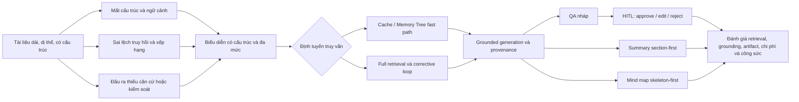

# A. REVISED FULL CHAPTER 1 WITH INLINE NUMERIC CITATIONS

# CHƯƠNG 1. TỔNG QUAN ĐỀ TÀI

## 1.1. Bối cảnh và lý do chọn đề tài

### 1.1.1. Nhu cầu khai thác tài liệu dài và dị thể

Tài liệu phục vụ học tập và nghiên cứu thường không tồn tại dưới một biểu diễn thống nhất. Cùng một tập tri thức có thể được phân bố trong báo cáo PDF, văn bản Word, Markdown, HTML, bảng dữ liệu hoặc ảnh; bên trong mỗi tài liệu, nội dung còn được tổ chức theo tiêu đề, mục, đoạn, bảng và các dấu hiệu bố cục khác nhau. Bài toán khai thác tài liệu vì vậy không chỉ là tìm một chuỗi ký tự phù hợp với truy vấn, mà còn phải nhận diện được đơn vị nội dung, quan hệ cấu trúc và vị trí của bằng chứng trong nguồn. Khi độ dài tài liệu tăng, thông tin trả lời một câu hỏi có thể xuất hiện ở nhiều phần cách xa nhau hoặc chỉ có ý nghĩa khi được đặt trong ngữ cảnh của mục chứa nó.

Khả năng tiếp nhận cửa sổ ngữ cảnh dài của mô hình ngôn ngữ không tự động giải quyết khó khăn này. Nghiên cứu *Lost in the Middle* cho thấy hiệu quả khai thác thông tin có thể thay đổi đáng kể theo vị trí của bằng chứng trong ngữ cảnh [1]. Kết quả trên LongBench cũng cho thấy việc hiểu đầu vào dài vẫn là một thách thức trên nhiều loại tác vụ [2]. Do đó, việc đưa toàn bộ tài liệu vào một lần gọi mô hình vừa bị giới hạn bởi tài nguyên, vừa không bảo đảm rằng mọi phần liên quan được khai thác đồng đều. Một quy trình phù hợp cần chuyển tài liệu dị thể sang biểu diễn có thể xử lý, bảo toàn các dấu hiệu cấu trúc quan trọng và cung cấp cơ chế tiếp cận thông tin ở nhiều độ phân giải.

Trong phạm vi dự án, nhu cầu trên được cụ thể hóa bằng việc tiếp nhận nhiều định dạng tài liệu, chuẩn hóa chúng về một biểu diễn trung gian, phân đoạn theo cấu trúc khi điều kiện dữ liệu cho phép, rồi xây dựng các biểu diễn phục vụ hỏi–đáp, tóm tắt và sơ đồ tư duy. Đây là phạm vi triển khai được xác định từ mã nguồn, không phải kết luận rằng phương pháp đã đạt chất lượng tốt hơn các cách tiếp cận khác. Hiệu quả của từng quyết định biểu diễn vẫn cần được kiểm chứng bằng thực nghiệm có đối chứng.

### 1.1.2. Giới hạn của biểu diễn tài liệu phẳng và truy hồi đơn giai đoạn

Biểu diễn tài liệu như một chuỗi phẳng buộc hệ thống phải chia văn bản thành các đoạn trước khi lập chỉ mục. Quyết định này tạo ra sự đánh đổi: đoạn quá ngắn có thể tách thực thể khỏi phần giải thích, làm mất liên kết tham chiếu hoặc ngữ cảnh của mục; đoạn quá dài có thể chứa nhiều thông tin không liên quan và làm giảm độ tập trung của bằng chứng. Công trình về late chunking chỉ ra rằng embedding từng đoạn độc lập có thể bỏ mất phụ thuộc nằm ngoài biên đoạn [3]. Nghiên cứu gần đây về phân đoạn tài liệu cho RAG cũng cho thấy kích thước và tính liền mạch của đoạn ảnh hưởng đến truy hồi và hỏi–đáp [4]. Late Chunking hiện mới là một preprint arXiv, vì vậy trong báo cáo này nó được sử dụng như nguồn gốc phương pháp chứ không được mô tả là công trình đã qua phản biện.

Khó khăn tiếp theo nằm ở sự khác biệt giữa khớp từ vựng và khớp ngữ nghĩa. Truy hồi thưa phù hợp với thuật ngữ xuất hiện rõ trong tài liệu, còn truy hồi đặc có khả năng liên kết các diễn đạt gần nghĩa nhưng phụ thuộc vào miền dữ liệu và mô hình biểu diễn. Kết quả tổng hợp của BEIR cho thấy BM25 vẫn là một baseline bền vững, trong khi không có một mô hình truy hồi đơn lẻ chiếm ưu thế trên mọi tập dữ liệu [5]. Điều này tạo cơ sở cho thiết kế kết hợp nhiều kênh truy hồi và tinh lọc thứ hạng, nhưng chưa đủ để khẳng định cấu hình kết hợp cụ thể của dự án sẽ tốt hơn trên tài liệu tiếng Việt hoặc dữ liệu người dùng thực tế.

Ngay cả khi truy hồi được ghép với mô hình sinh, sai số ở tầng bằng chứng vẫn có thể truyền sang câu trả lời. RAG cung cấp cơ chế kết hợp kho tri thức ngoài với mô hình sinh [6], nhưng chất lượng đầu ra phụ thuộc vào mức liên quan và độ tin cậy của tài liệu được chọn. Corrective RAG được đề xuất để đánh giá kết quả truy hồi trước khi sinh và kích hoạt hành động hiệu chỉnh khi cần [7]. Tuy nhiên, CRAG gốc hiện là preprint arXiv và sử dụng bộ đánh giá đã huấn luyện, tinh lọc tri thức cùng tìm kiếm web; dự án hiện chỉ thích nghi tư tưởng ba mức đánh giá bằng một grader heuristic và truy hồi lại kho nội bộ. Vì vậy, vấn đề nghiên cứu không phải là tái hiện nguyên trạng CRAG, mà là đánh giá liệu một quy trình nhiều giai đoạn được điều chỉnh cho kho tài liệu cục bộ có cải thiện được tập bằng chứng hay không.

### 1.1.3. Yêu cầu về tính có căn cứ, khả năng truy vết và kiểm soát đầu ra

Một câu trả lời trôi chảy không đồng nghĩa với một câu trả lời có căn cứ. RAGTruth cho thấy mô hình vẫn có thể sinh các khẳng định không được tài liệu hỗ trợ hoặc mâu thuẫn với nội dung truy hồi, dù câu trả lời đã được tạo trong bối cảnh RAG [8]. Do đó, quy trình nghiên cứu cần phân biệt ít nhất ba vấn đề: bằng chứng có liên quan hay không, câu trả lời có trung thành với bằng chứng hay không, và mỗi khẳng định quan trọng có thể truy ngược tới nguồn hay không. Ba vấn đề này không thể được thay thế bằng một đánh giá chung về độ tự nhiên của văn bản.

Khả năng truy vết cũng phải được xem như một đối tượng đánh giá độc lập. ALCE phân tách chất lượng nội dung với tính đúng và mức bao phủ của citation, qua đó cho thấy việc đính kèm một nguồn không tự chứng minh rằng nguồn ấy thực sự hỗ trợ khẳng định tương ứng [9]. Đối với dự án, định danh nguồn và đoạn được bảo toàn qua các pipeline nhằm tạo điều kiện kiểm tra provenance. Tuy nhiên, hệ thống hiện chưa có bộ xác thực citation ở cấp khẳng định sau bước sinh; vì thế báo cáo chỉ có thể mô tả cơ chế gắn nguồn đã được hiện thực, còn mức chính xác của citation phải được đo trong Chương 4.

Đối với đầu ra sinh tự động, cơ chế con người tham gia cần được xem là một lớp kiểm soát riêng thay vì bằng chứng mặc định về chất lượng. Các nghiên cứu về HITL và tương tác người–AI nhấn mạnh vai trò của phản hồi, khả năng sửa lỗi và quyền kiểm soát của người sử dụng [10]–[12]. Dự án hiện thực luồng tạm dừng để người duyệt lựa chọn chấp thuận, chỉnh sửa hoặc từ chối. Dù vậy, sự hiện diện của ReviewGate không chứng minh rằng đầu ra cuối tốt hơn; tác động của HITL phải được đánh giá qua mức thay đổi chất lượng, tỷ lệ can thiệp, thời gian duyệt và chi phí phát sinh.

Từ các nhóm nghiên cứu đã khảo sát có thể nhận thấy rằng phân đoạn, truy hồi, hiệu chỉnh truy hồi, attribution, sinh tri thức có cấu trúc và human review thường được nghiên cứu như những vấn đề tương đối tách biệt. Khoảng trống được đặt ra trong đề tài này vì thế là nhu cầu khảo sát sự tích hợp của nhiều mối quan tâm trên trong một quy trình khai thác tài liệu thống nhất. Cách phát biểu này không hàm ý rằng chưa từng tồn tại hệ thống tương tự, cũng không xem việc ghép nhiều thành phần là bằng chứng tự thân về tính mới hay hiệu quả.

## 1.2. Phát biểu bài toán nghiên cứu

### 1.2.1. Đầu vào và không gian tài liệu

Gọi \(D=\{d_1,d_2,\ldots,d_n\}\) là tập tài liệu do người sử dụng cung cấp. Mỗi tài liệu \(d_i\) có thể khác nhau về định dạng, độ dài, cấu trúc mục, ngôn ngữ biểu đạt và chất lượng trích xuất. Mã nguồn hiện hỗ trợ trực tiếp các định dạng PDF, TXT, Markdown, DOCX, HTML/HTM, CSV và JSON; một số định dạng ảnh và DOC được chuyển qua nhánh trích xuất dự phòng. Phạm vi này không đồng nghĩa mọi biến thể của từng định dạng đều được xử lý tương đương, đặc biệt đối với PDF quét không có lớp văn bản.

Sau chuẩn hóa và phân đoạn, tập đơn vị có thể truy hồi được ký hiệu là \(C(D)=\{c_1,c_2,\ldots,c_m\}\). Mỗi đoạn \(c_j\) cần gắn với thông tin nhận dạng nguồn và, khi có thể, đường dẫn tiêu đề, trang, chỉ số đoạn hoặc quan hệ cha–con. Ngoài truy vấn \(q\) do người dùng nhập, bài toán còn bao gồm các yêu cầu sinh sản phẩm ở cấp tài liệu như tóm tắt và sơ đồ tư duy. Vì vậy, không gian đầu vào không chỉ chứa văn bản thô mà còn bao gồm cấu trúc tài liệu, metadata và lựa chọn nguồn cần xử lý.

### 1.2.2. Các yêu cầu xử lý

Bài toán trung tâm là xây dựng và đánh giá một quy trình biến tập tài liệu dị thể thành biểu diễn đa tầng có thể truy hồi, sau đó sử dụng bằng chứng được chọn để tạo đầu ra có căn cứ và truy vết được. Trước hết, quy trình phải hạn chế mất cấu trúc khi chuẩn hóa và phân đoạn, đồng thời duy trì một đường dự phòng khi tài liệu không đáp ứng điều kiện cho phân đoạn theo tiêu đề hoặc late chunking. Tiếp theo, hệ thống phải hỗ trợ cả câu hỏi chi tiết lẫn câu hỏi khái quát bằng sự phối hợp giữa biểu diễn đoạn và biểu diễn document/section.

Đối với hỏi–đáp, luồng thực tế có ba nhánh. Một kết quả semantic cache hợp lệ có thể trả về câu trả lời đã lưu; Memory Tree có thể tạo câu trả lời trực tiếp cho một số loại truy vấn; khi hai nhánh nhanh không cung cấp kết quả, hệ thống chuyển sang truy hồi đầy đủ bằng BM25–FAISS, hợp nhất thứ hạng, reranking, kiểm tra mâu thuẫn và đánh giá chất lượng bằng chứng. Nếu grader xác định bằng chứng mơ hồ hoặc không phù hợp và ngân sách hiệu chỉnh còn lại, truy vấn truy hồi được viết lại rồi thực hiện lại chuỗi truy hồi trong số vòng hữu hạn. Các nhánh tạo ra câu trả lời không lỗi đều được thiết kế đi qua HITL khi chức năng này được bật. Cấu trúc phân nhánh này là một ràng buộc của bài toán: không được giả định mọi truy vấn đều tuần tự đi qua toàn bộ các tầng truy hồi.

Cuối cùng, quy trình cần bảo toàn truy vấn gốc cho bước sinh, bảo toàn định danh bằng chứng qua các phép đổi thứ hạng hoặc loại lọc, và cung cấp cơ chế suy giảm có kiểm soát khi một mô hình phụ trợ không khả dụng. Những yêu cầu này nhằm làm cho hệ thống có thể quan sát và đánh giá theo từng tầng. Chúng chưa phải bằng chứng rằng các fallback hoặc fast path hiện tại là tối ưu.

### 1.2.3. Các đầu ra cần tạo lập và kiểm chứng

Ba nhóm đầu ra chính được xem xét. Thứ nhất, với truy vấn \(q\), hệ thống tạo câu trả lời nháp \(a_{sys}\) dựa trên tập bằng chứng được chọn; sau bước HITL, đầu ra cuối \(a_{final}\) có thể giữ nguyên, được chỉnh sửa hoặc bị từ chối. Thứ hai, hệ thống tạo bản tóm tắt \(s(D)\) bằng quy trình section-first, trong đó nội dung được tổ chức theo các mục trước khi tổng hợp ở cấp tài liệu. Thứ ba, hệ thống tạo sơ đồ tư duy \(m(D)\) bằng quy trình skeleton-first, sau đó làm giàu nút và quan hệ trong giới hạn bằng chứng.

Với mỗi đơn vị đầu ra \(x\), nghiên cứu kỳ vọng tồn tại ánh xạ provenance \(\pi(x)\subseteq C(D)\) chỉ tới các đoạn nguồn có liên quan. Ánh xạ này cần được kiểm chứng ở cả mức tồn tại của định danh và mức bằng chứng thực sự hỗ trợ nội dung. Đối với QA, đánh giá phải tách chất lượng truy hồi, độ đúng câu trả lời, faithfulness và citation. Đối với tóm tắt và mind map, đánh giá cần xét độ phủ, tính trung thành, cấu trúc và khả năng truy ngược. Đối với HITL, phải phân biệt rõ đầu ra do hệ thống sinh với đầu ra cuối đã được người duyệt tác động.

## 1.3. Mục tiêu nghiên cứu

### 1.3.1. Mục tiêu tổng quát

Mục tiêu tổng quát của đề tài là thiết kế, hiện thực và xây dựng giao thức đánh giá cho một quy trình trí tuệ tài liệu đa tầng, có nhận biết cấu trúc và bằng chứng, nhằm hỗ trợ hỏi–đáp có căn cứ, tóm tắt theo cấu trúc và sinh sơ đồ tư duy từ tài liệu dài, dị thể. Quy trình được nghiên cứu theo hướng kết hợp biểu diễn ở nhiều độ phân giải, truy hồi nhiều giai đoạn, hiệu chỉnh khi bằng chứng chưa đạt yêu cầu, bảo toàn provenance và đưa quyết định của con người vào trước khi hoàn tất câu trả lời.

### 1.3.2. Mục tiêu cụ thể

Thứ nhất, đề tài xây dựng biểu diễn tài liệu có lưu dấu cấu trúc và đánh giá ảnh hưởng của phân đoạn nhận biết cấu trúc cùng late chunking có điều kiện so với phân đoạn đệ quy và embedding độc lập. Thứ hai, đề tài xác định đóng góp của truy hồi từ vựng, truy hồi vector, hợp nhất thứ hạng và cross-encoder reranking đối với chất lượng xếp hạng bằng chứng. Thứ ba, đề tài khảo sát vai trò của NLI, grader heuristic lấy cảm hứng từ CRAG và query rewriting trong các tình huống bằng chứng mơ hồ, thiếu hoặc mâu thuẫn.

Thứ tư, đề tài kiểm tra khả năng bảo toàn liên kết nguồn–đoạn qua ba pipeline QA, tóm tắt section-first và mind map skeleton-first. Thứ năm, đề tài thiết kế đánh giá sự đánh đổi của full pipeline và HITL về chất lượng, unsupported claims, độ trễ, số lần gọi mô hình, chi phí token và công sức người duyệt. Các mục tiêu này được trình bày dưới dạng có thể kiểm chứng; tại thời điểm viết Chương 1, repository chưa cung cấp đủ benchmark nghiên cứu để kết luận mục tiêu nào đã tạo ra cải thiện định lượng.

## 1.4. Câu hỏi nghiên cứu

Năm câu hỏi sau định hướng việc mô tả phương pháp ở Chương 3 và thiết kế đánh giá ở Chương 4; chúng chưa được trả lời trong chương tổng quan này.

**RQ1.** Biểu diễn nhận biết cấu trúc và late chunking có điều kiện ảnh hưởng như thế nào đến chất lượng truy hồi bằng chứng so với phân đoạn đệ quy và embedding từng đoạn độc lập?

**RQ2.** Việc kết hợp BM25, FAISS, hợp nhất thứ hạng và cross-encoder reranking ảnh hưởng như thế nào đến chất lượng xếp hạng bằng chứng so với các cấu hình truy hồi đơn lẻ hoặc truy hồi lai chưa rerank?

**RQ3.** NLI kết hợp CRAG và query rewriting ảnh hưởng như thế nào đến mức độ đầy đủ, liên quan và nhất quán của bằng chứng đối với các truy vấn mơ hồ, thiếu bằng chứng hoặc có nguồn mâu thuẫn?

**RQ4.** Các pipeline QA, tóm tắt section-first và mind map skeleton-first bảo toàn khả năng truy vết từ nội dung sinh về đoạn tài liệu nguồn ở mức nào?

**RQ5.** Full pipeline và HITL tạo ra sự đánh đổi như thế nào giữa chất lượng đầu ra, tỷ lệ khẳng định không được hỗ trợ, độ trễ, chi phí mô hình và công sức người duyệt?

## 1.5. Đối tượng, phạm vi và giới hạn nghiên cứu

### 1.5.1. Đối tượng nghiên cứu

Đối tượng nghiên cứu là các phương pháp biểu diễn, truy hồi và sinh nội dung từ tập tài liệu dài có cấu trúc không đồng nhất, với trọng tâm là chất lượng bằng chứng và khả năng truy vết. Đề tài không nghiên cứu việc huấn luyện một mô hình ngôn ngữ nền tảng mới. Các mô hình embedding, reranking, NLI và sinh ngôn ngữ được xem là thành phần trong một quy trình cần thiết kế, phối hợp và đánh giá.

Đối tượng đánh giá bao gồm bốn lớp: biểu diễn đoạn và phân cấp; xếp hạng và hiệu chỉnh bằng chứng; đầu ra QA/tóm tắt/mind map; và quyết định HITL. Hạ tầng frontend, backend, hàng đợi công việc và container phục vụ việc hiện thực hóa, nhưng không được xem là đóng góp nghiên cứu ngang hàng với các quyết định phương pháp.

### 1.5.2. Phạm vi dữ liệu và chức năng

Phạm vi dữ liệu bao gồm các tài liệu do người dùng tải lên thuộc những định dạng được mã nguồn tiếp nhận: PDF, TXT, Markdown, DOCX, HTML/HTM, CSV và JSON; ảnh và DOC được xử lý qua cơ chế dự phòng. Nội dung được chuẩn hóa, phân đoạn, lập chỉ mục và lựa chọn theo nguồn. Nghiên cứu tập trung vào tài liệu văn bản; không đặt mục tiêu xử lý đầy đủ mọi loại bảng phức tạp, công thức trực quan, âm thanh hoặc video như nguồn dữ liệu đầu vào độc lập.

Phạm vi chức năng gồm quản lý nguồn tài liệu, hỏi–đáp bất đồng bộ có bằng chứng, tóm tắt section-first, mind map skeleton-first và HITL cho luồng QA. Xác thực người dùng và giao diện hỗ trợ quá trình sử dụng nhưng không phải đối tượng chính của đánh giá phương pháp. Những mô tả về định dạng hoặc chức năng trong tài liệu quảng bá chỉ được chấp nhận khi có đường thực thi tương ứng trong mã nguồn.

### 1.5.3. Phạm vi phương pháp và triển khai

Ở tầng biểu diễn, đề tài xem xét chuẩn hóa Markdown, phân đoạn nhận biết tiêu đề, metadata nguồn–đoạn, embedding độc lập và late chunking có điều kiện. Ở tầng truy hồi, phạm vi gồm Memory Tree ở mức document/section, semantic cache, truy hồi lai BM25–FAISS, hợp nhất thứ hạng, cross-encoder reranking, NLI, grader heuristic ba trạng thái và query rewriting với ngân sách hữu hạn. Ở tầng sinh, phạm vi gồm grounded QA, tóm tắt section-first, mind map skeleton-first, provenance và ReviewGate với ba hành động approve, edit, reject.

Việc triển khai được giới hạn trong kiến trúc ứng dụng hiện có, sử dụng graph để điều phối và các kho lưu trữ cục bộ/ngoài tiến trình theo cấu hình. Các feature flags tiếp tục được giữ để phục vụ ablation. Mặc dù semantic cache và Memory Tree cùng tham gia kiến trúc nghiên cứu, chúng là các fast path có thể bỏ qua chuỗi truy hồi đầy đủ; do đó chúng phải được đánh giá như chính sách định tuyến riêng, không phải như hai bước nối tiếp bắt buộc của full pipeline.

### 1.5.4. Các giới hạn của nghiên cứu hiện tại

Phạm vi hiện thực có một số giới hạn cần được ghi nhận trước khi đánh giá. Late chunking chỉ được áp dụng khi tài liệu có văn bản và span Markdown căn chỉnh, đồng thời encoder khả dụng; các trường hợp khác quay về embedding từng đoạn. Memory Tree hiện chỉ sử dụng các mức document và section, trong đó việc nhóm mục đơn giản hơn các cây chủ đề ngữ nghĩa đệ quy. OCR ảnh có đường thực thi, nhưng chưa đủ bằng chứng để xác nhận một pipeline OCR chuyên biệt và tin cậy cho toàn bộ PDF quét.

Trong full retrieval, NLI chỉ kiểm tra một số hữu hạn cặp ứng viên và chính sách hiện tại ưu tiên giữ đoạn xếp hạng cao hơn khi phát hiện mâu thuẫn. CRAG grader là heuristic dựa trên tín hiệu lexical và score sẵn có, chưa được huấn luyện hoặc hiệu chỉnh thực nghiệm; đây không phải bản tái hiện đầy đủ learned evaluator, knowledge refinement và web search của CRAG gốc. Hệ thống có source/chunk tags và trả evidence metadata, nhưng chưa có bộ xác thực citation ở cấp khẳng định sau generation; provenance của Memory Tree fast path cũng cần được kiểm chứng trên chỉ mục thực.

HITL có checkpoint và endpoint resume, song một phần metadata phục vụ resume vẫn nằm trong bộ nhớ tiến trình; vì vậy resume sau khi backend khởi động lại và vận hành nhiều worker còn bị giới hạn. Cấu hình triển khai hiện giảm web concurrency để hạn chế rủi ro này. Ngoài ra, chưa có xác nhận đầy đủ cho luồng Docker end-to-end, SSE qua reverse proxy, citation trên chỉ mục tài liệu thực hoặc khả năng vận hành ở quy mô production.

Quan trọng nhất, các kiểm thử phần mềm hiện có chỉ chứng minh một số hợp đồng và đường thực thi kỹ thuật. Repository chưa cung cấp bộ dữ liệu nghiên cứu, qrels, gold answers, nhãn citation hoặc nghiên cứu người dùng đủ để chứng minh phương pháp đề xuất vượt các baseline. Vì vậy, Chương 1 không đưa ra tuyên bố cải thiện về Recall, nDCG, faithfulness, độ trễ hay chi phí.

## 1.6. Phương pháp nghiên cứu

### 1.6.1. Nghiên cứu tài liệu và tổng hợp cơ sở lý thuyết

Nghiên cứu tài liệu được thực hiện theo các họ vấn đề gắn trực tiếp với phương pháp: xử lý tài liệu dài; segmentation và late chunking; sparse, dense và hybrid retrieval; rank fusion và reranking; NLI và corrective retrieval; grounded generation và citation; tóm tắt phân cấp; concept map; HITL; và đánh giá RAG. Nguồn được ưu tiên từ paper gốc, hội nghị, tạp chí và kho xuất bản chính thức. Các blog, tài liệu thư viện và model card chỉ được dùng như bằng chứng triển khai bổ sung, không thay thế nguồn học thuật.

Quá trình tổng hợp không nhằm lập danh sách công trình riêng lẻ, mà đối chiếu bài toán, giả định, ưu điểm, giới hạn và quan hệ với dự án. Từ đó, đề tài sử dụng một phát biểu khoảng trống bảo thủ: các mối quan tâm kể trên thường được khảo sát tách biệt, trong khi nghiên cứu này xem xét sự tích hợp của chúng. Do chưa thực hiện systematic review theo giao thức PRISMA hoặc một khảo sát bao phủ toàn bộ lĩnh vực, báo cáo không tuyên bố tính mới tuyệt đối.

### 1.6.2. Phân tích, thiết kế và hiện thực phương pháp

Phương pháp được xây dựng bằng cách truy vết từ vấn đề nghiên cứu tới quyết định thiết kế và đường thực thi trong mã nguồn. Đối với mỗi thành phần, phân tích xác định đầu vào, biến đổi, đầu ra, metadata được bảo toàn, điều kiện kích hoạt, fallback và trạng thái lưu trữ. Cách làm này đặc biệt quan trọng đối với pipeline phân nhánh: cache hit và Memory Tree direct answer được phân biệt với full evidence retrieval; query rewriting chỉ được kích hoạt bởi CRAG; HITL chỉ hoàn tất sau quyết định review.

Mã nguồn và cấu hình runtime là căn cứ xác nhận chức năng đã hiện thực. Tài liệu kiến trúc chỉ đóng vai trò tham khảo khi không mâu thuẫn với code. Các kiểm thử đơn vị và tích hợp được sử dụng để kiểm tra hợp đồng phần mềm, không được dùng thay kết quả nghiên cứu. Việc phân tách này cho phép Chương 3 mô tả đúng hệ thống đang tồn tại, đồng thời giữ Chương 4 cho đánh giá hiệu quả.

### 1.6.3. Thiết kế thực nghiệm, so sánh và ablation

Thiết kế thực nghiệm được tổ chức theo năm câu hỏi nghiên cứu. Đối với RQ1, các chỉ mục tương đương cần được dựng lại dưới các cấu hình phân đoạn và embedding khác nhau. Đối với RQ2, cần so sánh BM25-only, FAISS-only, hybrid/fusion và hybrid có reranking; do graph runtime chưa cung cấp flag trực tiếp cho BM25-only và FAISS-only, hai baseline này cần một evaluation harness sử dụng các phương thức retrieval hiện có. Đối với RQ3, các tập truy vấn mơ hồ, thiếu bằng chứng và mâu thuẫn phải được gán nhãn để đo tác động của NLI và vòng hiệu chỉnh.

Đối với RQ4, đánh giá phải kiểm tra cả tính hợp lệ của định danh và quan hệ hỗ trợ nội dung giữa artifact với đoạn nguồn. Đối với RQ5, full pipeline không HITL và full pipeline có HITL phải được so sánh trên cùng truy vấn, đồng thời ghi nhận chất lượng trước–sau duyệt, độ trễ, số lần gọi mô hình, token và thời gian reviewer. Các cấu hình ablation phải giữ cố định corpus, query set, model và tham số không thuộc biến đang khảo sát.

### 1.6.4. Đánh giá định lượng, định tính và đánh giá người dùng

Đánh giá định lượng được tách theo tầng để tránh che lấp nguồn sai số. Retrieval có thể sử dụng Recall@k, MRR và nDCG; grounded QA cần answer correctness, faithfulness, context relevance, citation precision/recall và unsupported claim rate. Corrective retrieval cần bổ sung tỷ lệ hiệu chỉnh thành công, số vòng trung bình và chất lượng bằng chứng trước–sau rewrite. Cách tách context relevance, answer faithfulness và answer relevance phù hợp với hướng đánh giá đa chiều của RAGAS và ARES [13], [14].

Đánh giá định tính được dùng để phân tích trường hợp thành công, thất bại, query drift, mâu thuẫn tài liệu, bằng chứng không đầy đủ và artifact suy giảm. Đối với summary và mind map, cần rubric người đánh giá về độ phủ, trung thành, dư thừa, phân cấp, quan hệ và provenance. Đối với HITL, nghiên cứu người dùng cần ghi nhận approve/edit/reject, mức chỉnh sửa, thời gian duyệt và độ nhất quán giữa người đánh giá. Nếu sử dụng LLM-as-a-judge, kết quả phải được hiệu chỉnh bằng một tập nhãn người và không được xem là ground truth duy nhất.

## 1.7. Đóng góp của đề tài

### 1.7.1. Đóng góp về phương pháp

Đóng góp phương pháp của đề tài được xác định ở cấp thiết kế tích hợp. Nghiên cứu tổ chức chuỗi xử lý từ chuẩn hóa và biểu diễn có cấu trúc, qua biểu diễn document/section và chunk, tới truy hồi nhiều giai đoạn, tinh lọc bằng chứng, hiệu chỉnh truy vấn, sinh có căn cứ và duyệt người. Thiết kế đồng thời tách ba đường truy vấn—semantic cache, Memory Tree direct answer và full retrieval—để phản ánh đúng quan hệ giữa hiệu quả vận hành và mức độ kiểm tra bằng chứng.

Một đóng góp phương pháp khác là đặt provenance như ràng buộc xuyên suốt thay vì chỉ gắn citation ở giao diện. Định danh nguồn–đoạn được mang qua ingestion, retrieval và các pipeline sinh artifact; thiết kế đánh giá yêu cầu kiểm tra mức hỗ trợ nội dung chứ không dừng ở sự tồn tại của ID. Đối với corrective retrieval, đề tài bảo toàn truy vấn gốc cho generation và chỉ sử dụng rewritten query để tối ưu retrieval trong ngân sách hữu hạn.

### 1.7.2. Đóng góp về kỹ thuật

Ở cấp kỹ thuật, đề tài hiện thực một hệ thống có khả năng tiếp nhận tài liệu dị thể, chuẩn hóa Markdown, phân đoạn nhận biết cấu trúc, lập chỉ mục FAISS và lưu metadata đoạn; xây dựng Memory Tree mức document/section; kết hợp BM25–FAISS, hợp nhất thứ hạng, reranking, NLI và grader heuristic; đồng thời cung cấp các graph riêng cho QA, tóm tắt section-first và mind map skeleton-first. Các cơ chế fallback cho phép quy trình tiếp tục khi một số thành phần tăng cường không khả dụng.

Hệ thống cũng hiện thực luồng công việc bất đồng bộ, theo dõi tiến độ, trả bằng chứng, checkpoint graph và ReviewGate với approve/edit/reject/resume. Các feature flags được giữ để chuyển đổi cấu hình trong ablation. Những nội dung này là đóng góp hiện thực hóa và nền tảng thực nghiệm; chúng không tự chứng minh hiệu quả nghiên cứu.

### 1.7.3. Ranh giới của tuyên bố đóng góp

Đề tài không tuyên bố phát minh BM25, FAISS, RRF, cross-encoder, NLI, late chunking, CRAG, RAG hay HITL. Late chunking và CRAG được kế thừa ở mức ý tưởng từ các preprint gốc, còn cách triển khai trong dự án có các điều kiện và điều chỉnh riêng. Đặc biệt, grader CRAG của dự án là heuristic chứ không phải learned evaluator của công trình gốc; Memory Tree cũng không tương đương RAPTOR hoặc một cây chủ đề ngữ nghĩa đệ quy.

Tính mới, nếu được khẳng định sau này, chỉ có thể nằm ở cách tích hợp, chính sách định tuyến, bảo toàn provenance hoặc kết quả thực nghiệm rút ra từ cấu hình này. Trước khi có benchmark và so sánh công bằng, báo cáo chỉ sử dụng các thuật ngữ “phương pháp đề xuất”, “thiết kế tích hợp” và “cách tiếp cận được điều chỉnh”, không sử dụng các tuyên bố về ưu thế, đột phá hoặc tính mới tuyệt đối.

## 1.8. Cấu trúc báo cáo

Báo cáo gồm đúng bốn chương. Chương 1 xác lập bối cảnh, bài toán, mục tiêu, câu hỏi nghiên cứu, phạm vi, phương pháp và ranh giới đóng góp. Chương 2 trình bày cơ sở lý thuyết và tổng hợp nghiên cứu liên quan cần thiết để hiểu các quyết định trong phương pháp, đồng thời làm rõ vị trí của đề tài so với các họ cách tiếp cận đã công bố.

Chương 3 trình bày phương pháp đề xuất và cách hiện thực hệ thống, bắt đầu từ tiếp nhận và biểu diễn tài liệu, biểu diễn phân cấp, truy hồi nhiều giai đoạn, sinh có căn cứ, provenance, HITL, tới các pipeline tóm tắt và mind map. Chương này phân biệt rõ fast path với full retrieval path. Chương 4 trình bày thiết kế thực nghiệm, đánh giá và thảo luận theo RQ1–RQ5; nếu dữ liệu thực nghiệm chưa được thu thập đầy đủ, phần tương ứng phải được ghi rõ là giao thức đánh giá đề xuất thay vì kết quả. Sau Chương 4 là phần Kết luận và hướng phát triển, không được đánh số thành Chương 5.

## BẢNG 1.1. MỤC TIÊU NGHIÊN CỨU, CÂU HỎI VÀ BẰNG CHỨNG CẦN THU THẬP

| Mục tiêu nghiên cứu | Câu hỏi nghiên cứu | Bằng chứng cần thiết |
|---|---|---|
| Đánh giá biểu diễn nhận biết cấu trúc và late chunking có điều kiện | RQ1 | Corpus cố định; các chỉ mục được dựng lại với recursive chunking/standalone embedding và structure-aware/late chunking; qrels; Recall@k, MRR, nDCG; phân tích theo loại tài liệu và truy vấn. |
| Đánh giá truy hồi lai, hợp nhất thứ hạng và reranking | RQ2 | Kết quả BM25-only, FAISS-only, hybrid/fusion và hybrid + cross-encoder trên cùng query set; ranking logs; Recall@k, MRR, nDCG, Precision@k; latency từng tầng. |
| Đánh giá NLI và corrective retrieval | RQ3 | Tập truy vấn mơ hồ/thiếu/mâu thuẫn có nhãn; danh sách trước–sau NLI; CRAG grade; rewritten query; số vòng; evidence relevance/completeness/consistency; fallback rate. |
| Đánh giá provenance của QA, summary và mind map | RQ4 | Gold claim–evidence/citation; kiểm tra chunk ID tồn tại; citation precision/recall; faithfulness; rubric coverage/hierarchy/relation; so sánh cache, Memory Tree và full path. |
| Đánh giá trade-off của full pipeline và HITL | RQ5 | Câu trả lời trước/sau review; approve/edit/reject; unsupported claim rate; reviewer time; latency; LLM calls; tokens/cost; đánh giá chất lượng mù khi có thể. |

## BẢNG 1.2. PHẠM VI NGHIÊN CỨU

| Phạm vi | Bao gồm | Loại trừ hoặc giới hạn |
|---|---|---|
| Dữ liệu đầu vào | PDF, TXT, Markdown, DOCX, HTML/HTM, CSV, JSON; ảnh và DOC qua fallback | Không bảo đảm OCR chuyên biệt cho mọi PDF quét; không tập trung âm thanh/video như nguồn đầu vào độc lập; bảng/công thức phức tạp chưa được bảo đảm. |
| Biểu diễn tài liệu | Markdown trung gian; heading-aware chunks; metadata; standalone embedding; late chunking có điều kiện | Late chunking không áp dụng cho mọi tài liệu; semantic chunking không có một thuật toán chuẩn duy nhất; recursive splitter là heuristic triển khai. |
| Biểu diễn phân cấp | Document/section Memory Tree và chunk index | Chưa phải cây chủ đề ngữ nghĩa đệ quy nhiều tầng; không đồng nhất với RAPTOR. |
| Truy hồi | Semantic cache; Memory Tree fast path; BM25–FAISS; rank fusion; reranking; NLI; CRAG heuristic; query rewrite | Không phải mọi truy vấn đi qua full pipeline; NLI chỉ xét số cặp hữu hạn; CRAG không có learned evaluator, web search hoặc knowledge refinement như paper gốc. |
| Đầu ra | Grounded QA; summary section-first; mind map skeleton-first; evidence metadata | Chưa có claim-level citation validator; không tuyên bố chất lượng artifact khi chưa có benchmark. |
| HITL | ReviewGate; approve/edit/reject; resume trong điều kiện runtime hiện hành | Resume sau restart/multi-worker còn hạn chế; chưa có user study chứng minh lợi ích. |
| Triển khai | Ứng dụng web, graph orchestration, job/checkpoint, SSE/polling, container config | Docker end-to-end, reverse-proxy SSE và production scale chưa được xác minh đầy đủ. |
| Đánh giá | Thiết kế baseline, ablation, metrics retrieval/grounding/artifact/HITL/cost | Chưa có dữ liệu để báo cáo ưu thế định lượng; software tests không thay thế research experiments. |

## ĐẶC TẢ HÌNH 1.1

**Tên hình:** Hình 1.1. Từ khó khăn khai thác tài liệu dài đến phạm vi nghiên cứu của đề tài.

**Mục đích:** Trình bày logic nghiên cứu ở mức khái niệm, không mô tả chi tiết kiến trúc phần mềm. Hình phải cho thấy vì sao đầu vào dài và dị thể dẫn tới ba nhóm khó khăn, phương pháp đề xuất phản hồi các khó khăn đó như thế nào, và các đầu ra phải được đánh giá trên những chiều nào.

**Thành phần:** (1) tài liệu dài, nhiều định dạng và có cấu trúc; (2) ba nhóm khó khăn: mất cấu trúc/ngữ cảnh, sai lệch truy hồi, đầu ra thiếu căn cứ/kiểm soát; (3) phạm vi phương pháp: biểu diễn có cấu trúc, truy hồi phân nhánh và nhiều giai đoạn, hiệu chỉnh bằng chứng, provenance và HITL; (4) ba đầu ra QA, summary, mind map; (5) các chiều đánh giá retrieval, faithfulness/citation, cấu trúc artifact, chất lượng–chi phí–công sức người duyệt.

**Quan hệ:** Tài liệu đi vào lớp biểu diễn; lớp biểu diễn cung cấp dữ liệu cho hai loại routing là fast path và full retrieval; bằng chứng sau xử lý cấp nguồn cho các pipeline sinh; QA đi qua HITL trước đầu ra cuối; mọi đầu ra liên kết tới lớp đánh giá. Không vẽ Memory Tree nối tiếp bắt buộc trước BM25–FAISS vì Memory Tree là direct-answer fast path.

**Vị trí đề xuất:** Cuối mục 1.1.3, sau phát biểu khoảng trống và trước mục 1.2.

**Nguồn xây dựng hình:** Tác giả tổng hợp từ literature claim map và mã nguồn dự án; không sao chép một hình từ công trình bên ngoài.

# B. TÀI LIỆU THAM KHẢO

Danh mục dưới đây sử dụng thứ tự xuất hiện đầu tiên trong Chương 1. Metadata được lấy từ `reports/literature-evidence/phase6_report/references.bib`; kiểu trình bày số là quy ước tạm thời cho đến khi có mẫu chính thức của cơ sở đào tạo.

[1] N. F. Liu et al., “Lost in the Middle: How Language Models Use Long Contexts,” *Transactions of the Association for Computational Linguistics*, 2024, doi: 10.1162/tacl_a_00638.

[2] Y. Bai et al., “LongBench: A Bilingual, Multitask Benchmark for Long Context Understanding,” in *ACL*, 2024, doi: 10.18653/v1/2024.acl-long.172.

[3] M. Günther, I. Mohr, D. J. Williams, B. Wang, and H. Xiao, “Late Chunking: Contextual Chunk Embeddings Using Long-Context Embedding Models,” *arXiv preprint arXiv:2409.04701*, 2024, doi: 10.48550/arXiv.2409.04701.

[4] Z. Wang et al., “Document Segmentation Matters for Retrieval-Augmented Generation,” in *Findings of ACL*, 2025, doi: 10.18653/v1/2025.findings-acl.422.

[5] N. Thakur et al., “BEIR: A Heterogeneous Benchmark for Zero-shot Evaluation of Information Retrieval Models,” in *NeurIPS Datasets and Benchmarks*, 2021. [Online]. Available: https://datasets-benchmarks-proceedings.neurips.cc/paper/2021/hash/65b9eea6e1cc6bb9f0cd2a47751a186f-Abstract-round2.html

[6] P. Lewis et al., “Retrieval-Augmented Generation for Knowledge-Intensive NLP Tasks,” in *Advances in Neural Information Processing Systems*, 2020. [Online]. Available: https://proceedings.neurips.cc/paper/2020/hash/6b493230-Abstract.html

[7] S.-Q. Yan, J.-C. Gu, Y. Zhu, and Z.-H. Ling, “Corrective Retrieval Augmented Generation,” *arXiv preprint arXiv:2401.15884*, 2024, doi: 10.48550/arXiv.2401.15884.

[8] C. Niu et al., “RAGTruth: A Hallucination Corpus for Developing Trustworthy Retrieval-Augmented Language Models,” in *ACL*, 2024, doi: 10.18653/v1/2024.acl-long.585.

[9] T. Gao, H. Yen, J. Yu, and D. Chen, “Enabling Large Language Models to Generate Text with Citations,” in *EMNLP*, 2023, doi: 10.18653/v1/2023.emnlp-main.398.

[10] Z. J. Wang, D. Choi, S. Xu, and D. Yang, “Putting Humans in the Natural Language Processing Loop: A Survey,” in *Proceedings of HCINLP*, 2021. [Online]. Available: https://aclanthology.org/2021.hcinlp-1.8/

[11] S. Amershi et al., “Guidelines for Human-AI Interaction,” in *CHI Conference on Human Factors in Computing Systems*, 2019, doi: 10.1145/3290605.3300233.

[12] B. Shneiderman, “Human-Centered Artificial Intelligence: Reliable, Safe and Trustworthy,” *International Journal of Human-Computer Interaction*, vol. 36, no. 6, 2020, doi: 10.1080/10447318.2020.1741118.

[13] S. Es, J. James, L. Espinosa-Anke, and S. Schockaert, “RAGAS: Automated Evaluation of Retrieval Augmented Generation,” in *EACL System Demonstrations*, 2024, doi: 10.18653/v1/2024.eacl-demo.16.

[14] J. Saad-Falcon, O. Khattab, C. Potts, and M. Zaharia, “ARES: An Automated Evaluation Framework for Retrieval-Augmented Generation Systems,” in *NAACL-HLT*, 2024, doi: 10.18653/v1/2024.naacl-long.20.

# C. ÁNH XẠ SỐ TRÍCH DẪN ↔ BIBTEX KEY

| Số trích dẫn | BibTeX key | Lần xuất hiện đầu tiên |
|---:|---|---|
| [1] | `liu2024lost` | 1.1.1 — độ nhạy theo vị trí trong ngữ cảnh dài |
| [2] | `bai2024longbench` | 1.1.1 — thách thức hiểu đầu vào dài trên nhiều tác vụ |
| [3] | `gunther2024late` | 1.1.2 — mất ngữ cảnh khi embedding đoạn độc lập |
| [4] | `wang2025segmentation` | 1.1.2 — ảnh hưởng của phân đoạn tới retrieval/RAG |
| [5] | `thakur2021beir` | 1.1.2 — benchmark truy hồi dị thể và vai trò của BM25 |
| [6] | `lewis2020rag` | 1.1.2 — cơ chế kết hợp retrieval với generation |
| [7] | `yan2024crag` | 1.1.2 — đánh giá và hiệu chỉnh kết quả truy hồi |
| [8] | `niu2024ragtruth` | 1.1.3 — unsupported và contradictory claims trong RAG |
| [9] | `gao2023alce` | 1.1.3 — citation correctness và coverage |
| [10] | `wang2021hitl` | 1.1.3 — tổng quan HITL trong NLP |
| [11] | `amershi2019guidelines` | 1.1.3 — nguyên tắc tương tác người–AI |
| [12] | `shneiderman2020hcai` | 1.1.3 — kiểm soát và độ tin cậy trong human-centered AI |
| [13] | `es2024ragas` | 1.6.4 — đánh giá RAG đa chiều |
| [14] | `saadfalcon2024ares` | 1.6.4 — context relevance, faithfulness và answer relevance |

# D. CÁC TRÍCH DẪN CÒN CẦN LƯU Ý VỀ PHẠM VI HỖ TRỢ

Không còn trường hợp nào có vị trí trích dẫn không xác định trong phần văn xuôi. Tuy nhiên, bốn nhóm nguồn dưới đây có ranh giới diễn giải cần tiếp tục được giữ khi biên tập các chương sau:

1. **[3] — Late Chunking:** nguồn hỗ trợ nhận định về mất ngữ cảnh khi embedding từng đoạn độc lập và cơ chế late chunking, nhưng hiện là preprint arXiv. Nguồn không chứng minh late chunking luôn cải thiện truy hồi hoặc đã cải thiện hệ thống này.
2. **[7] — Corrective RAG:** nguồn hỗ trợ động cơ đánh giá truy hồi và kiến trúc CRAG gốc. Nó không chứng minh grader heuristic của dự án tương đương learned evaluator, knowledge refinement hay web search trong công trình gốc.
3. **[10]–[12] — HITL và human-centered AI:** các nguồn hỗ trợ vai trò chung của phản hồi, sửa lỗi và quyền kiểm soát của con người. Chúng không chứng minh ba hành động approve/edit/reject của dự án đã nâng cao chất lượng hoặc usability.
4. **[13], [14] — Đánh giá RAG:** các nguồn hỗ trợ việc tách các chiều context relevance, answer faithfulness và answer relevance. Chúng không xác lập toàn bộ danh sách metric trong mục 1.6.4 là một chuẩn duy nhất, cũng không loại bỏ nhu cầu hiệu chỉnh bằng nhãn người.

Kiểu trích dẫn chính thức của cơ sở đào tạo vẫn chưa được xác nhận; hệ thống đánh số hiện tại chỉ là định dạng tạm thời. Khi có template chính thức, các số [1]–[14] phải được sinh lại từ ánh xạ ở mục C thay vì chỉnh sửa thủ công từng citation.
