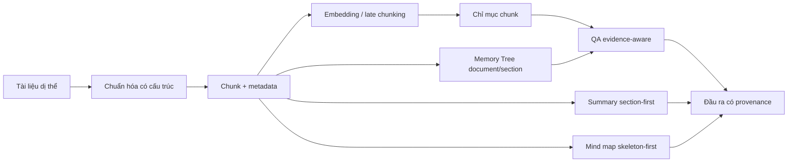
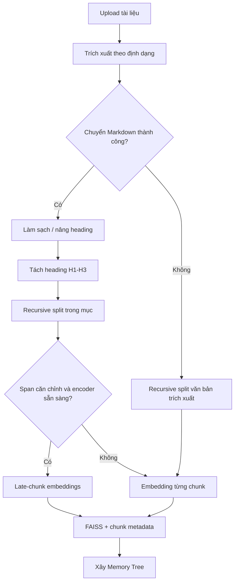
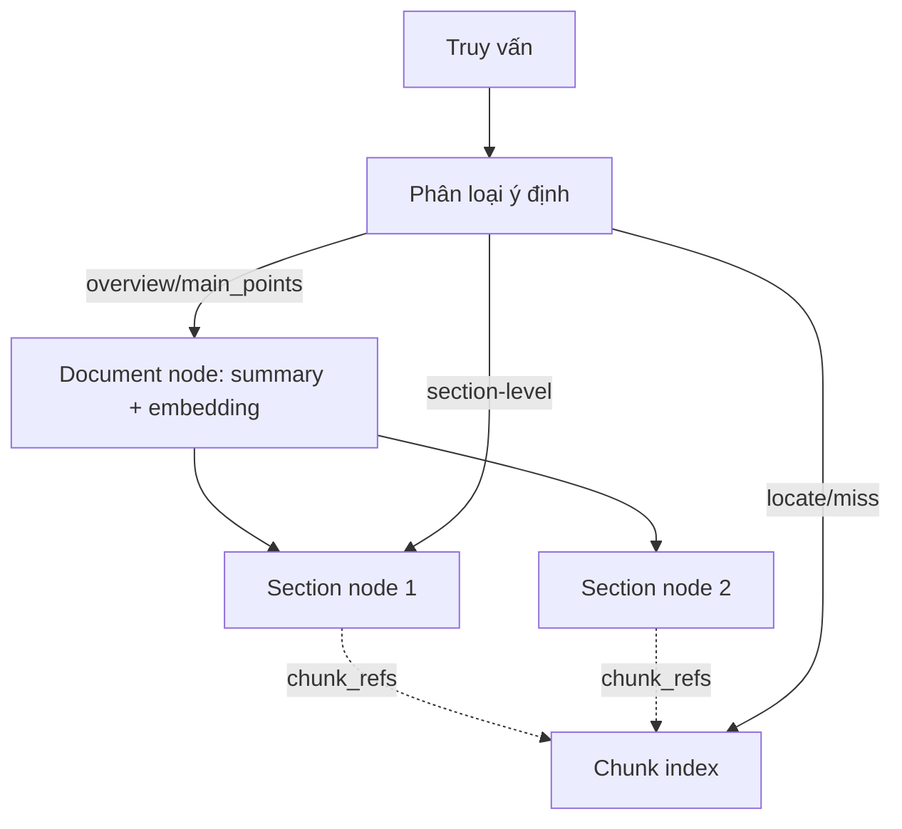
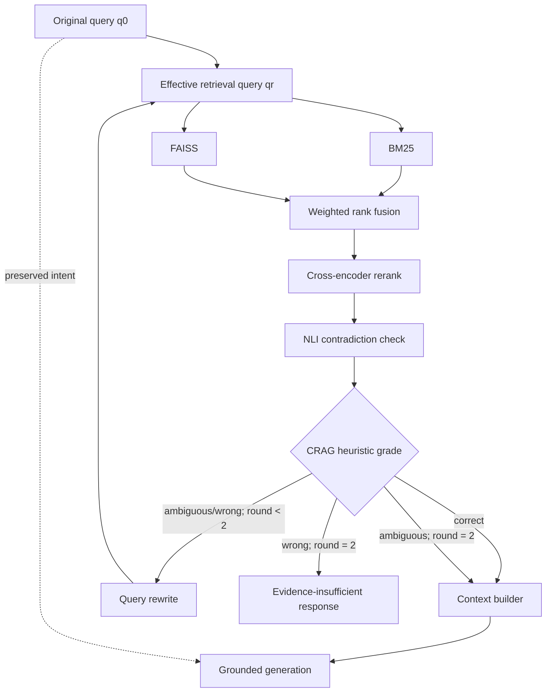
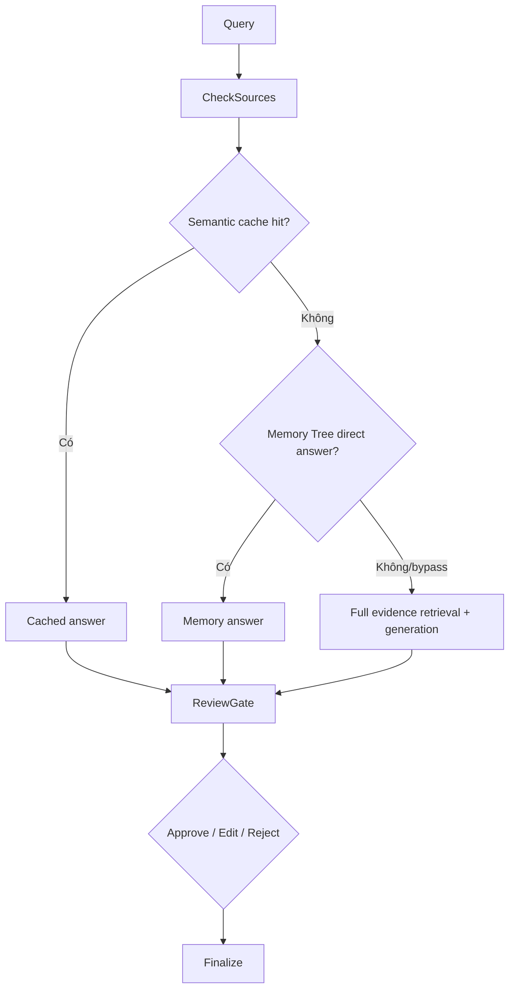
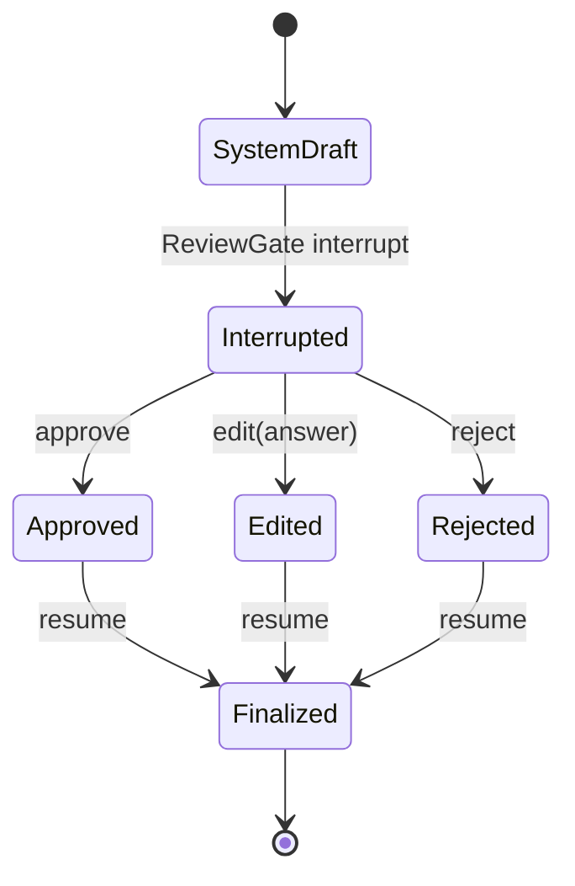
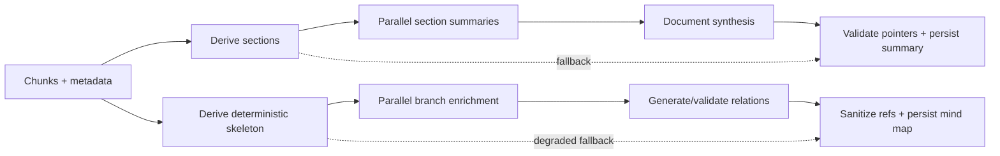
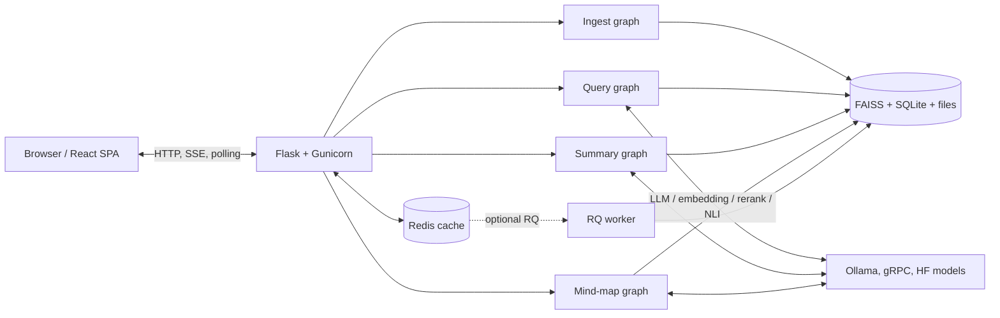

# A. TOÀN VĂN CHƯƠNG 3

# CHƯƠNG 3. PHƯƠNG PHÁP ĐỀ XUẤT VÀ XÂY DỰNG HỆ THỐNG

## 3.1. Tổng quan phương pháp đề xuất

### 3.1.1. Phát biểu hình thức của bài toán

Nghiên cứu xét một tập tài liệu dị thể \(D=\{d_1,d_2,\ldots,d_n\}\), trong đó mỗi tài liệu có thể chứa văn bản liên tục, tiêu đề, mục, trang và các dấu hiệu cấu trúc khác nhau. Với mỗi \(d_i\), hệ thống cần xây dựng một biểu diễn có thể truy hồi thay vì chỉ lưu một chuỗi văn bản phẳng. Biểu diễn của tài liệu được ký hiệu:

\[
\mathcal{R}(d_i)=\langle C_i, E_i, M_i, H_i, P_i\rangle,
\tag{3.1}
\]

trong đó \(C_i\) là tập đoạn; \(E_i\) là các vector biểu diễn; \(M_i\) là metadata cấu trúc; \(H_i\) là biểu diễn phân cấp ở mức tài liệu–mục; và \(P_i\) là ánh xạ provenance từ các đơn vị sinh trở về nguồn. Từ biểu diễn này, hệ thống xử lý ba nhóm tác vụ: trả lời câu hỏi có căn cứ, tóm tắt theo cấu trúc và tạo sơ đồ tư duy có liên kết bằng chứng.

Đối với một truy vấn người dùng \(q_0\), bài toán QA không chỉ là sinh chuỗi trả lời \(a\). Hệ thống cần xác định đường xử lý thích hợp \(p\), thu được tập bằng chứng \(C^*\), tạo bản nháp \(a_s\), rồi nhận quyết định kiểm duyệt \(h\) để hình thành kết quả cuối \(a_f\):

\[
(q_0,D)\rightarrow p\rightarrow C^*\rightarrow a_s\rightarrow h\rightarrow a_f,
\qquad h\in\{\text{approve},\text{edit},\text{reject}\}.
\tag{3.2}
\]

Phát biểu này phản ánh hai yêu cầu cốt lõi. Thứ nhất, nội dung sinh phải gắn với các đơn vị nguồn có thể truy vết, phù hợp với nguyên tắc của RAG và sinh văn bản có trích dẫn [6], [9]. Thứ hai, bản nháp của mô hình và kết quả cuối sau kiểm duyệt là hai trạng thái khác nhau; sự tham gia của con người được xem là một lớp kiểm soát chứ không phải một bảo đảm tự động về tính đúng [10]–[12].

### 3.1.2. Quy trình trí tuệ tài liệu đa tầng

Phương pháp được đề xuất là một quy trình trí tuệ tài liệu đa tầng, có nhận biết cấu trúc và bằng chứng. Tầng tiếp nhận chuyển các định dạng đầu vào về biểu diễn Markdown hoặc văn bản đã chuẩn hóa. Tầng biểu diễn chia tài liệu theo tiêu đề, bảo toàn đường dẫn mục và vị trí ký tự, sau đó mã hóa các đoạn bằng embedding độc lập hoặc late chunking khi điều kiện kỹ thuật cho phép. Tầng chỉ mục duy trì đồng thời chỉ mục đoạn và một Memory Tree ở mức tài liệu–mục. Trên các biểu diễn đó, tầng truy hồi thực hiện định tuyến giữa cache, trả lời phân cấp và truy hồi bằng chứng đầy đủ. Cuối cùng, các pipeline sinh QA, tóm tắt và mind map chuyển tập bằng chứng thành sản phẩm đầu ra có metadata nguồn.

Thiết kế này không được trình bày như một thuật toán hoàn toàn mới. Các thành phần lý thuyết—late chunking [3], truy hồi thưa và dày [19], [20], FAISS [21], hợp nhất thứ hạng [22], cross-encoder [24], NLI [26]–[28], corrective RAG [7] và query rewriting [29]—đều có nguồn gốc độc lập trong văn liệu. Đóng góp phương pháp ở phạm vi đề tài nằm ở sự tích hợp chúng thành một luồng có phân nhánh, hiệu chỉnh hữu hạn, bảo toàn truy vấn gốc, bảo toàn provenance kỹ thuật và đặt HITL sau mọi đường tạo câu trả lời. Hiệu quả của sự tích hợp này chưa được giả định; Chương 4 sẽ thiết kế thực nghiệm để đo từng tác động.

### 3.1.3. Ba đường xử lý truy vấn

Query graph hiện thực ba đường logic, thay vì buộc mọi truy vấn đi tuần tự qua toàn bộ các mô-đun nâng cao. Đường A áp dụng khi semantic cache tìm được kết quả hợp lệ trong cùng phạm vi nguồn, bộ lọc, phiên bản chỉ mục và người dùng. Kết quả cache bỏ qua truy hồi lại nhưng vẫn đi qua ReviewGate. Đường B áp dụng khi Memory Tree tạo được câu trả lời trực tiếp từ node tài liệu hoặc mục và các đoạn tham chiếu. Đường này cũng bỏ qua truy hồi lai, reranker, NLI và CRAG nhưng vẫn phải qua HITL. Đường C được kích hoạt khi hai đường nhanh không trả lời được; khi đó hệ thống thực hiện đầy đủ truy hồi lai, hợp nhất, tái xếp hạng, phát hiện mâu thuẫn, chấm bằng chứng, hiệu chỉnh truy vấn nếu cần, xây dựng ngữ cảnh và sinh câu trả lời.

Có thể biểu diễn hàm định tuyến ở mức khái niệm như sau:

\[
p(q_0,D)=
\begin{cases}
P_A, & \text{nếu cache hợp lệ trả về câu trả lời};\\
P_B, & \text{nếu Memory Tree trả lời trực tiếp};\\
P_C, & \text{trong các trường hợp còn lại}.
\end{cases}
\tag{3.3}
\]

Thứ tự này thể hiện chủ ý giảm chi phí trong các tình huống có thể tái sử dụng hoặc trả lời ở độ phân giải cao. Tuy nhiên, nó cũng tạo ra yêu cầu đánh giá riêng cho từng đường: chất lượng của full retrieval không thể được suy ra từ cache hit hoặc Memory Tree hit; ngược lại, độ trễ trung bình của hệ thống sẽ phụ thuộc vào tỷ lệ phân bố giữa ba đường.

### 3.1.4. Nguyên tắc bảo toàn bằng chứng và suy giảm có kiểm soát

Phương pháp sử dụng hai nguyên tắc xuyên suốt. Nguyên tắc thứ nhất là bảo toàn bằng chứng: mỗi đoạn được gắn định danh nguồn chuẩn hóa, định danh chunk, đường dẫn tiêu đề, trang và chỉ số đoạn khi dữ liệu đầu vào cho phép. Các pipeline tóm tắt và mind map tiếp tục mang `chunk_refs` hoặc con trỏ được xây dựng từ metadata thật. Ở QA, thẻ nguồn được đặt cùng chuỗi đoạn trước các bước rerank và NLI để định danh không bị tách khỏi nội dung khi xếp hạng hoặc lọc. Đây là provenance kỹ thuật; nó không đồng nghĩa với việc mọi khẳng định của mô hình đã được một bộ kiểm tra citation ở cấp claim xác nhận.

Nguyên tắc thứ hai là suy giảm có kiểm soát. Một mô-đun tăng cường không được làm hỏng toàn bộ truy vấn khi có phương án nền khả dụng: lỗi chuẩn hóa Markdown quay về văn bản trích xuất; late chunking không khả dụng quay về embedding từng đoạn; lỗi Memory Tree chuyển sang full retrieval; lỗi cache được xem như cache miss; lỗi reranker giữ thứ hạng lai; lỗi NLI giữ tập sau rerank; lỗi grader CRAG dùng chính sách fail-open có ghi trạng thái; lỗi rewrite dùng lại truy vấn trước đó nhưng vẫn tiêu hao ngân sách vòng. Suy giảm được ghi nhận bằng trạng thái node để phân biệt kết quả đầy đủ và kết quả degraded, thay vì che giấu việc một tầng đã thất bại.

## 3.2. Tiếp nhận và biểu diễn tài liệu

### 3.2.1. Trích xuất và chuẩn hóa tài liệu dị thể

Đầu vào dị thể đặt ra hai vấn đề: bộ trích xuất phụ thuộc định dạng và các dấu hiệu cấu trúc không đồng nhất. Ingest graph xử lý vấn đề này bằng chuỗi `ExtractText → Normalize → Chunk → ProcessChunks → EmbedAndIndex → BuildMemoryTree → Finalize`. Bộ nạp trực tiếp hỗ trợ PDF, TXT, Markdown, DOCX, HTML, CSV và JSON; ảnh, DOC cũ và trường hợp fallback được chuyển cho bộ trích xuất tổng quát. Ảnh sử dụng Tesseract với dữ liệu ngôn ngữ Anh–Việt. Đối với PDF, đường chính dùng PyMuPDF hoặc `pymupdf4llm`; vì mã không thể hiện một pipeline OCR riêng cho PDF scan, đề tài không tuyên bố đã xử lý đầy đủ loại tài liệu này.

Sau trích xuất, tài liệu được chuyển về Markdown khi có thể: DOCX dùng Mammoth, DOC được thử chuyển qua LibreOffice, HTML được chuyển bằng Markdownify, còn TXT/MD giữ nội dung trực tiếp. Văn bản được làm sạch và có thể nâng cấp các dòng giống tiêu đề thành heading. Markdown được chọn làm biểu diễn trung gian vì nó cho phép đồng nhất các dấu hiệu tiêu đề mà vẫn nhẹ hơn mô hình bố cục chuyên biệt. Khi chuyển đổi thất bại, graph không dừng ngay mà chuyển văn bản đã trích xuất sang nhánh phân đoạn fallback. Quyết định này ưu tiên khả năng xử lý liên tục, đồng thời buộc metadata phải ghi rõ nhánh biểu diễn nào đã thực sự được dùng.

### 3.2.2. Phân đoạn nhận biết cấu trúc

Với tài liệu Markdown hợp lệ, hệ thống tách trước theo tiêu đề cấp 1–3, sau đó áp dụng bộ tách ký tự đệ quy có giới hạn kích thước và overlap trong từng vùng cấu trúc. Mỗi đoạn kết quả gồm nội dung, `heading_path`, vị trí `start/end` trong văn bản tài liệu được dựng lại và các metadata nguồn. Cách kết hợp này nhằm tránh hai cực: phân đoạn chỉ theo tiêu đề có thể tạo mục quá dài, còn phân đoạn chỉ theo số ký tự có thể cắt rời quan hệ mục–nội dung. Văn liệu cho thấy lựa chọn phân đoạn có thể ảnh hưởng đáng kể đến truy hồi và RAG [4]; tuy nhiên, ảnh hưởng cụ thể của chiến lược hiện tại phải được đo bằng ablation, không được suy ra từ thiết kế.

Khi Markdown không đủ điều kiện, ingest graph quay về phân đoạn tài liệu hoặc văn bản bằng bộ tách đệ quy; mã còn chứa nhánh semantic chunking tùy cấu hình. Do đó, “phân đoạn nhận biết cấu trúc” là đường ưu tiên chứ không phải thuộc tính bảo đảm cho mọi tệp. Sự phân biệt này cần được lưu trong cấu hình thí nghiệm: so sánh structure-aware với recursive chỉ có ý nghĩa khi cùng nội dung, kích thước đoạn, overlap, embedding và chỉ mục được kiểm soát.

### 3.2.3. Metadata và định danh nguồn–đoạn

Định danh nguồn được chuẩn hóa bởi một hàm dùng chung cho upload, ingest, index, registry, truy vấn và xóa. Hàm thực hiện chuẩn hóa Unicode, lấy basename, loại hậu tố thời gian theo quy ước và tạo `source_stem` ổn định. Trên mỗi đoạn, hệ thống tiếp tục gắn `chunk_id`, chỉ số đoạn, trang, đường dẫn tiêu đề và quan hệ parent/subsplit khi có. Các trường video/frame và mã QR có thể được bổ sung theo kiểu best-effort, nhưng không phải điều kiện bắt buộc để truy hồi.

Về hình thức, provenance kỹ thuật được xem là ánh xạ:

\[
\pi(c)=\langle source\_id,source\_stem,chunk\_id,page,heading\_path,chunk\_index\rangle.
\tag{3.4}
\]

Không phải mọi thành phần của \(\pi(c)\) đều tồn tại đối với mọi định dạng; `source_stem` và `chunk_id` là hạt nhân, còn trang hoặc heading phụ thuộc khả năng trích xuất. Các pipeline sinh chỉ được phép giữ con trỏ tới chunk tồn tại trong chỉ mục metadata. Nhờ đó, lỗi sinh một ID không có thật có thể bị loại ở tầng lắp ráp artifact, mặc dù tính hỗ trợ ngữ nghĩa của một claim vẫn cần phương pháp đánh giá riêng [9].

### 3.2.4. Late chunking có điều kiện

Late chunking được bật trong cấu hình chuẩn, sử dụng mô hình mặc định BAAI/bge-m3; mô hình BGE-M3 hỗ trợ biểu diễn đa ngôn ngữ và nhiều chức năng truy hồi [18]. Tuy nhiên, việc thực thi late chunking phụ thuộc đồng thời vào văn bản tài liệu đầy đủ, các span Markdown căn chỉnh được và encoder sẵn sàng. Encoder mã hóa các cửa sổ token chồng lấn của toàn tài liệu, trung bình biểu diễn tại vùng giao nhau, rồi pooling theo span của từng chunk và chuẩn hóa L2. Cơ chế này thích nghi ý tưởng đưa ngữ cảnh rộng vào biểu diễn chunk [3]. Nguồn Late Chunking hiện là arXiv preprint, vì vậy báo cáo không mô tả nó là bằng chứng đã bình duyệt về ưu thế của phương pháp.

Nếu span không hợp lệ, tài liệu không đi qua nhánh Markdown, tải mô hình bị bỏ qua hoặc mã hóa thất bại, hệ thống quay về embedding độc lập cho từng đoạn. Với đoạn bị chia nhỏ thêm trong `ProcessChunks`, vector của đoạn cha có thể được ánh xạ cho các subchunk tương ứng. Vì thế, Chương 4 phải ghi nhận số tài liệu thực sự được late-chunk và xây dựng lại chỉ mục khi thực hiện ablation; chỉ đổi cờ ở thời điểm truy vấn không tạo ra một so sánh hợp lệ.

### 3.2.5. Embedding và xây dựng chỉ mục đoạn

Đường triển khai chuẩn sử dụng FAISS thông qua lớp vector store của LangChain, lưu `index.faiss`, `index.pkl` và metadata chỉ mục. Một đường FAISS thô dựa trên `IndexIDMap(IndexFlatL2)` được giữ làm fallback tương thích. Khi late chunking tạo được vector sẵn, vector đó được đưa trực tiếp vào chỉ mục; nếu không, store gọi embedding model trên từng chunk. Metadata chỉ mục ghi nhận mô hình, số chiều và chính sách pooling để giảm nguy cơ trộn các biểu diễn không tương thích. FAISS đảm nhiệm tìm kiếm vector hiệu quả [21], nhưng bản thân hạ tầng chỉ mục không chứng minh chất lượng ngữ nghĩa của embedding.

Nội dung chunk được lưu trong SQLite và có thể được đọc từ metadata inline hoặc video khi các nguồn trước không khả dụng. Thứ tự điều khiển thực tế là SQLite → metadata inline → video; do đó báo cáo không xem video là nguồn chuẩn duy nhất. Sau bước chỉ mục, chunk trở thành độ phân giải chi tiết cho truy hồi, trong khi cùng tập `chunk_refs` được dùng để xây dựng tầng Memory Tree.

## 3.3. Biểu diễn phân cấp và Memory Tree

### 3.3.1. Biểu diễn ở mức tài liệu, mục và đoạn

Chỉ mục đoạn phù hợp với câu hỏi chi tiết nhưng có thể kém hiệu quả đối với yêu cầu tổng quan. Phương pháp vì thế bổ sung biểu diễn ở hai mức trừu tượng: node tài liệu và node mục, mỗi node mang bản tóm tắt, embedding và danh sách `chunk_refs`. Tập biểu diễn được viết:

\[
H(d)=\{v_d\}\cup\{v_{s_1},\ldots,v_{s_m}\},\qquad
v_x=\langle type,summary,embedding,chunk\_refs\rangle.
\tag{3.5}
\]

Mức đoạn vẫn nằm trong chỉ mục vector chính; nó không phải một tầng node của Memory Tree hiện tại. Thiết kế này có cùng động cơ chung với truy hồi nhiều độ phân giải như RAPTOR [16], nhưng không phải hiện thực RAPTOR: hệ thống không phân cụm đệ quy thành cây chủ đề nhiều tầng và không được mô tả bằng tên phương pháp đó.

### 3.3.2. Xây dựng chỉ mục Memory Tree

Khi ingest hoàn tất chỉ mục đoạn, builder nhóm các chunk của từng nguồn thành một node tài liệu và một số node mục. Bản tóm tắt tài liệu được tạo từ phần đầu nội dung có giới hạn; các tóm tắt mục được sinh song song, sau đó toàn bộ summary được embedding theo lô. Cấu trúc được lưu vào `memory_trees.json`, trong khi vector node và metadata được ghi vào `memory_index.faiss` và `memory_index.json`.

Tên “Memory Tree” cần được hiểu theo phạm vi hiện thực. Bộ nhóm mục hiện dùng quy tắc chia theo số lượng chunk, không thực hiện phân tích chủ đề ngữ nghĩa sâu; khi tài liệu nhỏ, một mục “Tổng quan tài liệu” có thể đại diện cho toàn bộ. Kiểu node `topic` tồn tại trong schema nhưng không được builder hiện tại tạo ra. Do đó, đóng góp có thể xác nhận là chỉ mục phân cấp tài liệu–mục gắn với chunk, không phải cây ngữ nghĩa nhiều tầng hoàn chỉnh.

### 3.3.3. Phân loại truy vấn và truy hồi node

Khi một truy vấn đi đến Memory Tree, bộ phân loại xác định các nhóm ý định như `overview`, `main_points`, `detail`, `how`, `why`, `compare`, `locate` và `fact`. Phân loại có thể dựa trên heuristic và mô hình; kết quả điều khiển loại node được ưu tiên. Hệ thống tìm node gần truy vấn trong chỉ mục memory, lọc theo nguồn, nạp các chunk được tham chiếu và dùng chúng để tạo câu trả lời trực tiếp.

Tách ý định khỏi truy hồi node giúp các câu hỏi tổng quan tìm đến summary ở mức cao, trong khi câu hỏi chi tiết có thể rơi về chunk retrieval. Tuy vậy, đây là cơ chế định tuyến thực dụng chứ chưa phải một bộ phân loại đã được huấn luyện và đánh giá trên nhãn chuẩn. Sai số phân loại có thể làm thay đổi đường chạy, vì vậy tỷ lệ Memory Tree hit, chất lượng câu trả lời theo từng loại ý định và tỷ lệ fallback cần được ghi trong thực nghiệm.

### 3.3.4. Cơ chế trả lời trực tiếp và điều kiện chuyển sang full retrieval

Memory Tree là một answer fast path. Nếu hàm truy vấn trả về payload có câu trả lời, graph đánh dấu hoàn tất phần sinh và chuyển thẳng đến ReviewGate. Truy vấn đó không đi qua BM25–FAISS, reranker, NLI hoặc CRAG. Riêng ý định `locate` chủ động trả `None`, và mọi miss, lỗi hoặc timeout đều chuyển sang RetrieveFAISS. Bộ lọc category/language cũng làm graph bỏ qua Memory Tree trong cấu hình hiện tại.

Quyết định này giảm số tầng cần gọi cho câu hỏi phù hợp với summary node, nhưng tạo sự khác biệt về bằng chứng giữa các đường. Memory Tree trả `evidence_chunk_ids` trong payload; trong khi đó cơ chế API gắn `sources/chunks` cho QA chủ yếu đọc các trường `retrieved_*` của full path. Vì vậy, khả năng hiển thị provenance đầy đủ của câu trả lời trực tiếp từ Memory Tree cần được xác nhận bằng E2E trên chỉ mục thật trước khi tuyên bố thống nhất giữa ba đường.

### 3.3.5. Giới hạn của biểu diễn phân cấp hiện tại

Biểu diễn hiện tại có ba giới hạn chính. Thứ nhất, mức phân cấp chỉ gồm tài liệu và mục; node chủ đề và phân cấp đệ quy chưa nằm trên đường runtime. Thứ hai, ranh giới mục được tạo bằng nhóm chunk đơn giản, không phải phân đoạn ngữ nghĩa đã hiệu chỉnh. Thứ ba, câu trả lời trực tiếp phụ thuộc vào summary do LLM tạo và bộ phân loại ý định chưa có benchmark. Vì vậy, Memory Tree nên được đánh giá như một chiến lược fast path hai mức với lợi ích–rủi ro riêng, không được cộng tuyến tính vào “full pipeline” như một tầng truy hồi mà mọi truy vấn đều đi qua.

## 3.4. Phương pháp truy hồi bằng chứng nhiều giai đoạn

### 3.4.1. Truy hồi lai BM25–FAISS

Khi hai đường nhanh không tạo được câu trả lời, graph chuyển sang full retrieval. Truy vấn dùng cho truy hồi là `rewritten_query` nếu đã có vòng hiệu chỉnh, nếu không là `standalone_question`, rồi mới đến truy vấn gốc. Ở cấu hình mặc định có reranker, tầng đầu lấy 20 ứng viên thay vì chỉ lấy số chunk cuối; mỗi kênh BM25 và FAISS còn mở rộng nội bộ đến \(\max(20,3k)\) trước khi hợp nhất. BM25 cung cấp tín hiệu lexical có lợi cho thuật ngữ chính xác [19], trong khi FAISS tìm láng giềng trong không gian embedding [21]. Hai kênh được dùng bổ sung, không giả định một kênh luôn ưu thế trên mọi truy vấn—phù hợp với quan sát về tính không đồng nhất của các tập truy hồi [5].

### 3.4.2. Hợp nhất thứ hạng

Đường mặc định đặt `USE_LC_ENSEMBLE=1` và dùng `EnsembleRetriever` với trọng số BM25 0,4 và FAISS 0,6. Cơ chế này hợp nhất thứ hạng của hai retriever theo trọng số rồi cắt tập ứng viên. Hệ thống cũng giữ một đường `HybridRetriever.retrieve` dùng RRF thủ công với hằng số \(k=60\) khi ensemble bị tắt. RRF có nền tảng từ phương pháp hợp nhất dựa trên nghịch đảo hạng [22], nhưng hai đường không được xem là công thức đồng nhất: đường chuẩn là weighted rank fusion của LangChain, còn công thức RRF thủ công là hiện thực thay thế không trọng số.

Một giới hạn cần ghi nhận là đối tượng được tái dựng từ `EnsembleRetriever` không duy trì đầy đủ điểm BM25 và vector theo từng kênh. Điều này không cản xếp hạng ứng viên, nhưng ảnh hưởng tín hiệu mà grader CRAG nhận được ở các ablation tắt reranker. Bởi vậy, thí nghiệm so sánh phải lưu hạng của từng kênh ở harness đánh giá thay vì giả định mọi điểm trung gian đều đã có trong trạng thái graph.

### 3.4.3. Tái xếp hạng bằng cross-encoder

Tập 20 ứng viên hợp nhất được đưa vào cross-encoder `BAAI/bge-reranker-v2-m3`. Khác với bi-encoder ở tầng sinh ứng viên, cross-encoder mã hóa cặp truy vấn–đoạn cùng nhau để tính mức liên quan; cách tổ chức hai tầng này kế thừa nguyên lý reranking bằng BERT [24]. Backend tạo `CrossEncoder` với độ dài tối đa 512 token, batch 16; thời gian suy luận mỗi lượt được giới hạn 10 giây. Kết quả được sắp theo raw score và cắt về `RERANK_TOP_N`; giá trị 0 trong cấu hình có nghĩa dùng `HYBRID_TOP_K`, hiện là 6 trong cấu hình Compose.

Graph dùng sigmoid trên raw score để tạo tín hiệu chuẩn hóa cho grader heuristic. Đây là phép biến đổi kỹ thuật, chưa phải calibration thực nghiệm. Nó phù hợp nhất với backend cross-encoder đang cấu hình; các backend Cohere hoặc LLM có thang điểm khác nhưng hiện không thuộc baseline. Khi timeout hoặc lỗi dự đoán, node giữ thứ hạng lai ban đầu, cắt cùng top-N và ghi `rerank_status=fallback`, nhờ đó truy vấn vẫn tiếp tục. Thiết kế chỉ cho thấy reranker thực sự được gọi; mức cải thiện xếp hạng phải được kiểm chứng ở Chương 4.

### 3.4.4. Kiểm tra mâu thuẫn bằng NLI

Sau rerank, node NLI dùng checkpoint đa ngôn ngữ `MoritzLaurer/mDeBERTa-v3-base-mnli-xnli`. Cơ sở lý thuyết là bài toán quan hệ entailment–neutral–contradiction được phát triển trong SNLI, MultiNLI và XNLI [26]–[28]. Tuy nhiên, XNLI chỉ hỗ trợ nền tảng lý thuyết đa ngôn ngữ, không phải bằng chứng đánh giá cho checkpoint cụ thể này.

Node ưu tiên các cặp chunk có tổng hạng thấp, chỉ kiểm tra tối đa ba cặp ở cấu hình chuẩn. Với mỗi cặp, mô hình đánh giá cả hai chiều premise–hypothesis; nếu xác suất contradiction lớn nhất không dưới 0,6, cặp được đánh dấu xung đột. Chính sách giải quyết giữ chunk có hạng cao hơn và loại chunk còn lại. Đây là chính sách dựa trên hạng, không xét độ mới, thẩm quyền nguồn hoặc quan hệ thời gian; vì vậy NLI trong đề tài chỉ phát hiện mâu thuẫn tiềm năng giữa bằng chứng, không “xác minh sự thật”. Nếu mô hình lỗi hoặc timeout 90 giây, tập sau rerank được giữ nguyên và trạng thái NLI chuyển sang fallback.

### 3.4.5. Đánh giá chất lượng bằng chứng bằng CRAG heuristic

Thiết kế corrective retrieval lấy cảm hứng từ CRAG [7], nhưng dự án không tái tạo toàn bộ kiến trúc CRAG gốc. Grader hiện tại là một hàm heuristic xác định điểm tốt nhất trên tập sau NLI. Với truy vấn hiệu lực \(q_r\) và chunk \(c_i\), độ phủ lexical được tính từ tập token:

\[
l_i=\frac{|T(q_r)\cap T(c_i)|}{\max(1,|T(q_r)|)}.
\tag{3.6}
\]

Điểm \(u_i\) lấy giá trị lớn nhất giữa \(l_i\), các điểm BM25/vector còn khả dụng và sigmoid của điểm rerank khi các mảng còn căn chỉnh. Trong đường ensemble mặc định, chunk đã được chuyển thành chuỗi và điểm theo kênh thường không còn, nên tín hiệu chủ yếu là lexical kết hợp rerank. Với \(u^*=\max_i u_i\), grader gán:

\[
g(C)=
\begin{cases}
\text{correct}, & u^*\ge 0{,}25;\\
\text{wrong}, & u^*\le 0{,}10;\\
\text{ambiguous}, & \text{còn lại}.
\end{cases}
\tag{3.7}
\]

Các ngưỡng này là cấu hình heuristic, chưa được học hoặc hiệu chỉnh trên tập nghiên cứu. Nếu grader ném lỗi, graph fail-open: có chunk thì gán `correct`, không có chunk thì gán `wrong`, đồng thời ghi `crag_status=fallback`. Do đó, thuật ngữ chính xác trong báo cáo là “CRAG heuristic adaptation” hoặc “bộ chấm bằng chứng lấy cảm hứng từ CRAG”, không phải bản tái hiện CRAG đầy đủ.

### 3.4.6. Query rewriting và corrective retrieval

Khi nhãn là `ambiguous` hoặc `wrong` và vẫn còn ngân sách, graph gọi LLM để viết lại truy vấn. Prompt yêu cầu giữ ý định, bổ sung từ khóa hoặc đồng nghĩa và trả một câu truy vấn ngắn. Query rewriting có quan hệ với các phương pháp mở rộng truy vấn bằng mô hình sinh [29], nhưng hiện thực của đề tài chỉ dùng câu viết lại để tối ưu truy hồi.

Điểm thiết kế quan trọng là không ghi đè ý định gốc. Trạng thái lưu riêng \(q_0\) và \(q_r^{(t)}\). Vòng \(t+1\) truy hồi, rerank, NLI và grade bằng \(q_r^{(t+1)}\), trong khi bước sinh câu trả lời vẫn nhận \(q_0\):

\[
q_r^{(t+1)}=Rewrite(q_r^{(t)}),\quad
C^{(t+1)}=Retrieve(q_r^{(t+1)}),\quad
a_s=Generate(q_0,C^*).
\tag{3.8}
\]

Trước vòng mới, graph xóa context và metadata truy hồi cũ để tránh trộn bằng chứng giữa các vòng. Nếu rewrite trả rỗng, không đổi, lỗi hoặc timeout, truy vấn trước đó được dùng lại; bộ đếm vẫn tăng nhằm bảo đảm kết thúc hữu hạn.

### 3.4.7. Ngân sách hiệu chỉnh và điều kiện dừng

Cấu hình `CRAG_REWRITE_MAX=2` cho phép tối đa hai vòng viết lại sau lượt truy hồi ban đầu. Vì vậy số lần grade tối đa là ba. Vòng dừng ngay khi grader trả `correct`. Khi hết ngân sách mà nhãn là `wrong`, graph tạo câu trả lời từ chối cố định qua `CRAGFallback`; khi nhãn là `ambiguous`, graph vẫn xây context từ tập bằng chứng tốt nhất hiện có và sinh theo chế độ best-effort. Trường hợp không có chunk ngay sau hybrid retrieval tạo thông báo “không tìm thấy” và đi đến HITL mà không qua CRAG.

Chính sách này tránh vòng lặp vô hạn và tránh ép LLM trả lời khi grader xác định `wrong`. Tuy nhiên, nhánh `ambiguous` sau ngân sách vẫn có rủi ro bằng chứng yếu; thực nghiệm cần tách tỷ lệ `wrong-refusal`, `ambiguous-generate`, số vòng trung bình và thay đổi chất lượng bằng chứng trước–sau rewrite.

### 3.4.8. Fallback và suy giảm có kiểm soát

Các fallback tạo thành một chính sách chung thay vì các ngoại lệ rời rạc. Cache và Memory Tree là fail-open sang đường tiếp theo. Reranker và NLI là enhancement fail-open về tập trước đó. CRAG fail-open có điều kiện dựa trên việc tập chunk rỗng hay không. Rewrite quay về truy vấn hiệu lực trước đó nhưng vẫn tiêu ngân sách. `CRAGFallback` tạo từ chối và được loại khỏi semantic-cache write. Mỗi node ghi trạng thái, thời gian và metadata best-effort vào log SQLite, cho phép phân tích tỷ lệ suy giảm mà không ghi bí mật.

Chính sách này ưu tiên tính sẵn sàng, nhưng không trung hòa mọi rủi ro. Ví dụ, fail-open của CRAG có thể cho phép một tập chunk chưa được grade đi tới generation; NLI fallback không loại mâu thuẫn; identity rerank không tạo bằng chứng rằng thứ hạng lai đủ tốt. Vì vậy, trạng thái degraded phải là một biến phân tích trong Chương 4, không được gộp im lặng với full-method success.

## 3.5. Xây dựng ngữ cảnh và sinh câu trả lời có căn cứ

### 3.5.1. Lựa chọn và ghép tập bằng chứng

Sau khi CRAG chấp nhận tập bằng chứng hoặc nhánh `ambiguous` đã hết ngân sách, `ContextBuilder` lấy tối đa 18 chunk theo thứ hạng hiện tại. Các chunk được nối bằng dấu phân cách, nhưng chỉ thêm một chunk khi toàn bộ nội dung của nó còn nằm trong ngân sách ký tự; giới hạn mặc định là 5.000 ký tự. Cách làm này tránh cắt giữa một chunk ở bước ghép, đồng thời kiểm soát kích thước prompt. Tập cuối có thể biểu diễn:

\[
C^*=\operatorname*{prefix}_{C}\left(\sum_{c_i\in C}|c_i|\le B,\;|C|\le 18\right),
\tag{3.9}
\]

với \(B=5.000\) trong cấu hình mặc định. Đây là phép lấy prefix theo thứ hạng, không phải tối ưu hóa knapsack hoặc đa dạng hóa. Vì vậy, các chunk dài ở đầu danh sách có thể chiếm phần lớn ngân sách; ảnh hưởng của giới hạn này cần được xem xét khi phân tích citation recall.

### 3.5.2. Bảo toàn truy vấn gốc sau quá trình hiệu chỉnh

Vòng query rewriting chỉ thay đổi truy vấn truy hồi. Node sinh đọc `original_question` nếu có, nếu không mới dùng `q`; nó không dùng `rewritten_query` làm mục tiêu trả lời. Sự tách biệt này ngăn từ khóa bổ sung hoặc diễn đạt tối ưu hóa retrieval thay thế yêu cầu ban đầu của người dùng. Trong trường hợp hội thoại được bật, `standalone_question` có thể hỗ trợ truy hồi, nhưng truy vấn gốc vẫn là tham chiếu cho đáp án.

Đây cũng là lý do trạng thái graph phải lưu đồng thời nhiều biến truy vấn. Nếu chỉ có một trường `q`, vòng hiệu chỉnh dễ tạo drift: hệ thống có thể trả lời câu đã được tối ưu cho tìm kiếm thay vì ý định người dùng. Các kiểm thử graph hiện xác nhận rewritten query được dùng trong lượt retrieve tiếp theo và original query được dùng ở generation; đây là bằng chứng thực thi phần mềm, chưa phải bằng chứng rằng thiết kế làm tăng answer correctness.

### 3.5.3. Grounded answer generation

Đường mặc định sử dụng QA chain của LangChain với prompt yêu cầu dựa trên context đã ghép. Phương pháp thuộc họ RAG, trong đó tri thức truy hồi được đưa vào điều kiện sinh [6]. Nếu HITL bật, token streaming của bản nháp bị tắt có chủ ý để nội dung chưa duyệt không bị phát ra dần cho người dùng. Node `Evaluate` tồn tại trong graph nhưng cơ chế đánh giá sinh hiện tắt mặc định; khi tắt, node trả điểm mặc định và vòng feedback không thực hiện sửa đáp án có ý nghĩa. Do đó, báo cáo không mô tả một self-evaluation loop hoàn chỉnh như thành phần mặc định.

Grounded generation chỉ giới hạn nguồn ngữ cảnh đầu vào; nó không loại bỏ tuyệt đối khẳng định không được hỗ trợ. Các nghiên cứu cho thấy RAG vẫn có thể sinh nội dung không nhất quán hoặc không có căn cứ [8]. Vì vậy, chất lượng câu trả lời phải được đo riêng về correctness, faithfulness và citation, thay vì suy luận từ việc prompt có context.

### 3.5.4. Gắn nguồn, chunk và provenance

Khi full retrieval trả chunk, graph có thể thêm tiền tố dạng `[Nguồn: source_stem, đoạn chunk_id]` trước nội dung. Cấu hình hiện tại bật `INCLUDE_CHUNK_SOURCE_TAGS=1` trong `BE/.env`, các tệp example và Compose. Chuỗi có tag được giữ nguyên qua rerank và NLI; vì thế, khi thứ hạng thay đổi hoặc một chunk bị loại, định danh vẫn đi cùng văn bản. Tại bước finalize của API, tiền tố được phân tích để xây payload `sources` và `chunks`, mỗi chunk gồm stem, ID và snippet giới hạn 600 ký tự; tối đa 12 bằng chứng được đính kèm.

Việc đặt tag trước reranker và NLI bảo toàn định danh nhưng cũng đưa token nguồn vào đầu vào mô hình. Ảnh hưởng của tag lên điểm rerank hoặc contradiction chưa được đánh giá. Hơn nữa, đường Memory Tree mang `evidence_chunk_ids` trong payload riêng nhưng không nhất thiết điền các trường `retrieved_*` mà bộ `_attach_evidence` sử dụng. Vì vậy, provenance kỹ thuật được hiện thực rõ nhất trên full path và trong artifact; tính đồng nhất của nó trên Memory Tree fast path vẫn cần kiểm chứng E2E.

### 3.5.5. Semantic cache và vòng đời kết quả

Semantic cache gồm lớp exact in-process và lớp Redis có khả năng so khớp ngữ nghĩa. Khóa bucket bao gồm phiên bản prompt, mô hình, chế độ late chunking, phiên bản chỉ mục, danh sách nguồn, bộ lọc, cờ Memory Tree và phạm vi người dùng. Điều kiện này nhằm ngăn dùng kết quả từ tập tài liệu hoặc người dùng khác. Lớp Redis thử exact, alias bỏ dấu có kiểm soát và cosine scan; kết quả borderline có thể qua judge tùy cấu hình. Cache có TTL, ghi theo chính sách rủi ro và fail-open khi Redis lỗi. Cơ chế semantic cache có mục tiêu giảm lặp gọi mô hình [23], nhưng tác động đến chi phí và sai reuse phải được đo trên workload thực.

Cache lookup dùng truy vấn gốc, nên các rewrite nội bộ không thay đổi danh tính câu hỏi trong answer cache. Finalize diễn ra sau ReviewGate, vì vậy kết quả được cache là kết quả sau hành động HITL, và cache hit ở lần sau vẫn được đưa qua ReviewGate lần nữa. `CRAGFallback` và một số đáp án chẩn đoán bị loại khỏi ghi cache. Tuy nhiên, nhánh reject hiện thay answer bằng một chuỗi từ chối không rỗng và không có điều kiện loại riêng trong cache write; đây là rủi ro chính sách cần kiểm thử để tránh tái sử dụng một quyết định reject như đáp án cho truy vấn tương lai.

### 3.5.6. Giới hạn của cơ chế kiểm chứng citation hiện tại

Hệ thống có provenance chunk và prompt yêu cầu citation, nhưng chưa có node sau generation phân tách từng claim, đối chiếu claim với chunk và xác nhận entailment. Do đó, một citation đúng định dạng hoặc một `chunk_id` tồn tại chỉ chứng minh khả năng trỏ về nguồn, không chứng minh nguồn hỗ trợ đầy đủ câu đứng cạnh nó. Phân biệt này phù hợp với yêu cầu đánh giá riêng citation correctness và citation completeness [9]. Chương 4 vì thế phải kiểm tra cả tính hợp lệ kỹ thuật của ID lẫn mức hỗ trợ ngữ nghĩa ở cấp claim.

## 3.6. Human-in-the-Loop

### 3.6.1. Phân biệt câu trả lời hệ thống và câu trả lời cuối

Trong phương pháp đề xuất, `system draft` là đầu ra tự động trước kiểm duyệt, còn `final answer` là trạng thái sau quyết định của reviewer. Phân biệt này cho phép đo hai chất lượng khác nhau: chất lượng vốn có của pipeline và giá trị gia tăng/công sức của HITL. Các nguyên tắc human-centered AI nhấn mạnh khả năng giám sát, sửa và hủy hành động của hệ thống [10]–[12]; tuy nhiên, một quyết định approve không tự biến câu trả lời thành ground truth.

### 3.6.2. ReviewGate và trạng thái tạm dừng

Khi `HITL_ENABLED=1`, query graph biên dịch với SQLite checkpointer. Mọi đường tạo ra answer không rỗng—cache hit, Memory Tree direct answer, full generation, thông báo không tìm thấy và CRAG fallback—đều định tuyến tới `ReviewGate`. Node phát lệnh `interrupt` với payload gồm bản nháp và `job_id`; job chuyển sang `interrupted`, lưu bản nháp trong `jobs.sqlite` và giữ checkpoint trong `checkpoints.sqlite`. Nếu HITL bật nhưng checkpointer không tạo được, graph fail-closed thay vì âm thầm bỏ qua kiểm duyệt.

### 3.6.3. Approve, edit và reject

Ba hành động tạo ra ba chuyển đổi rõ ràng. `approve` giữ nguyên bản nháp. `edit` thay bằng nội dung reviewer cung cấp khi nội dung không rỗng. `reject` thay kết quả bằng câu thông báo đã bị từ chối. HTTP endpoint chỉ chấp nhận ba action này; hành động không hợp lệ bị loại trước khi resume. Bảng 3.5 sẽ tách input hệ thống, quyết định và trạng thái cuối để tránh nhầm bản nháp với kết quả đã duyệt.

Chính sách `edit` chỉ lưu câu cuối, chưa lưu một diff có cấu trúc giữa draft và bản sửa trong record trả lời. Vì vậy, muốn đánh giá loại lỗi mà người duyệt sửa, thí nghiệm cần bổ sung log nghiên cứu hoặc thu thập song song draft–edited answer mà không ghi dữ liệu nhạy cảm.

### 3.6.4. Resume và lưu trạng thái kiểm duyệt

Frontend nhận trạng thái review qua SSE hoặc polling, hiển thị textarea cùng ba nút hành động, rồi gọi `POST /query-resume/<job_id>`. Backend kiểm tra xác thực, quyền sở hữu job, trạng thái `interrupted` và action, sau đó dùng `Command(resume=decision)` với cùng thread ID để tiếp tục graph. Endpoint trả HTTP 202; client tiếp tục polling đến trạng thái kết thúc. Khi resume hoàn tất, API mới gắn evidence cuối và phát payload cho giao diện.

Tại thời điểm soạn thảo, kiểm thử đích trên mã hiện tại xác nhận 34/34 trường hợp cấu hình CRAG, rerank, NLI, vòng corrective, ReviewGate và endpoint resume đạt. Kết quả này chỉ xác nhận hợp đồng phần mềm và đường điều khiển; nó không thay cho nghiên cứu người dùng hoặc đo mức giảm unsupported claim.

### 3.6.5. Giới hạn của HITL khi reload, restart và nhiều worker

Checkpoint graph và draft bị ngắt được lưu SQLite, nhưng metadata cần để resume—như thread ID và trạng thái tra cứu của query—vẫn phụ thuộc cấu trúc `query_jobs` trong bộ nhớ tiến trình. Sau restart, status có thể đọc từ `jobs.sqlite` nhưng resume có thể trả 404 vì metadata in-process đã mất. Compose do đó cố định `WEB_CONCURRENCY=1` để giảm nguy cơ pause và resume đi vào hai worker khác nhau.

Ở frontend, `pendingReview` chỉ nằm trong React state; refresh trang làm mất giao diện duyệt dù backend chưa restart. Native `EventSource` không gắn Bearer token, nên khi API được bảo vệ client phải rơi về polling có xác thực. SSE qua reverse proxy chưa được kiểm chứng đầy đủ và Nginx chưa cấu hình rõ `proxy_buffering off`. Các giới hạn này ngăn tuyên bố HITL bền vững qua reload/restart hoặc sẵn sàng cho triển khai nhiều worker.

## 3.7. Sinh sản phẩm tri thức có cấu trúc

### 3.7.1. Phương pháp tóm tắt section-first

Pipeline tóm tắt có chuỗi `CollectInput → Sections → SummarizeSections → Synthesize → AssemblePersist`. Thay vì đưa toàn bộ tài liệu vào một lượt gọi, pipeline trước hết xác định các section. Skeleton được tái sử dụng từ logic mind map: ưu tiên heading, sau đó section của Memory Tree, rồi TF–IDF kết hợp KMeans, cuối cùng rơi về một section duy nhất. Mỗi section được tóm tắt song song theo JSON schema, có một lần retry khi parse lỗi. Chiến lược chia–tổng hợp này có quan hệ với tóm tắt nhiều giai đoạn và nhận biết diễn ngôn [30], [32], nhưng hiệu quả của biến thể section-first hiện tại chưa có kết quả đối chứng.

### 3.7.2. Tổng hợp cấp tài liệu và bảo toàn con trỏ bằng chứng

Sau tóm tắt cục bộ, node synthesis tạo tiêu đề, overview và entities ở mức tài liệu. Node assemble thực hiện khử trùng lặp, cấu trúc hóa record và lưu kết quả. Các pointer được xây bằng phép tra metadata xác định, không giao cho LLM tự sinh: một `chunk_ref` chỉ được chuyển thành con trỏ khi ID tồn tại trong chỉ mục metadata; con trỏ có thể chứa nguồn, trang, tiêu đề mục, heading path và chỉ số chunk.

Schema runtime hiện là `summary_sections_v6`, có `content_hash`, metadata generator và cờ degraded/missing. Chế độ study bổ sung khái niệm, định nghĩa, công thức, ví dụ, lỗi thường gặp và câu hỏi tự kiểm tra. Nhánh `two_pass=True` hiện ném `NotImplementedError`, vì vậy báo cáo không xem tóm tắt hai lượt là phương pháp đã triển khai. Coverage judge và facts-first có mã nhưng mang tính tùy chọn; chúng không được đưa vào đường phương pháp mặc định nếu không có cấu hình thực thi tương ứng.

### 3.7.3. Phương pháp sinh mind map skeleton-first

Mind-map graph gồm `CollectInput → Skeleton → Enrich → Relations → AssemblePersist`. Input collector chuẩn hóa nguồn, nhóm lại subchunk và giữ metadata như page, heading, `chunk_keys`. Skeleton được tạo trước bằng quy tắc xác định: heading là ưu tiên thứ nhất, section Memory Tree là ưu tiên thứ hai, TF–IDF/KMeans là fallback tiếp theo và một nhánh duy nhất là fallback cuối. Cách làm này tách quyết định cấu trúc cơ sở khỏi sinh tự do của LLM, đồng thời phù hợp với mục tiêu biểu diễn khái niệm dạng cây [33].

### 3.7.4. Làm giàu nhánh và xây dựng quan hệ có kiểm soát

Sau khi có skeleton, các nhánh được làm giàu song song bằng LLM theo JSON schema. Parser thử sửa JSON và retry một lần; `chunk_refs` do mô hình đề xuất được lọc theo tập ID cho phép. Node relations gọi LLM một lượt để tạo quan hệ chéo, rồi kiểm tra ID node và loại quan hệ trước khi ghi. Các hàm sanitize node, validate relation và content hash được áp dụng tại assembly.

LLM vì thế đảm nhiệm làm giàu nội dung và quan hệ trong khung đã xác định, thay vì tự do tạo toàn bộ cây. Mã có các tiện ích CMGN và ba critic trong một mô-đun legacy, nhưng không có caller trên runtime graph hiện tại; chúng không được mô tả là phương pháp production của đề tài.

### 3.7.5. Cơ chế fallback và giới hạn của các pipeline sinh artifact

Nếu outline LLM thất bại, summary và mind map quay về skeleton xác định. Nếu một section/branch enrichment lỗi, record vẫn có thể được assemble với cờ degraded; lỗi sinh relation không phá skeleton. Cơ chế này ưu tiên tạo artifact tối thiểu có schema và provenance. Tuy nhiên, fallback một section hoặc một branch có thể làm giảm độ phủ; các pointer hợp lệ về kỹ thuật chưa bảo đảm câu tóm tắt hoặc khái niệm được hỗ trợ hoàn toàn. Hai pipeline vì thế là nhánh sản phẩm tri thức thứ cấp của phương pháp, cần đánh giá riêng về coverage, hierarchy/relation correctness và citation validity.

## 3.8. Kiến trúc và hiện thực hệ thống

### 3.8.1. Kiến trúc logic và điều phối bằng graph

Phương pháp được hiện thực bằng bốn graph chính: ingest, query, summary và mind map. Mỗi graph định nghĩa state có kiểu, các node chức năng, cạnh điều kiện và SQLite checkpoint. `wiring.py` tập trung khởi tạo dependencies và biên dịch graph để các route HTTP không tự tạo dịch vụ rời rạc. Kiến trúc graph phù hợp với pipeline có nhánh và trạng thái tạm dừng; vai trò của nó là hiện thực quyết định phương pháp, không phải đóng góp lý thuyết độc lập.

Query graph mang các biến như truy vấn gốc/viết lại, chunk, source, rerank score, NLI conflict, CRAG grade, số vòng rewrite, answer và payload. Ingest graph mang văn bản, spans, embeddings và trạng thái capability. Summary/mind-map graph mang skeleton, kết quả trung gian, lỗi degraded và record cuối. Cách tách state này cho phép kiểm tra đường chạy và phục hồi trong cùng tiến trình/checkpointer, nhưng không đồng nghĩa mọi metadata nghiên cứu đều được lưu vĩnh viễn.

### 3.8.2. Giao tiếp frontend, backend và dịch vụ mô hình

Frontend là SPA React, cung cấp đăng nhập, quản lý nguồn, chat, evidence panel, tóm tắt, mind map và giao diện HITL. Backend Flask cung cấp HTTP API và SSE; frontend dùng `fetch`, `EventSource` và polling dự phòng. LLM gateway và mind-map service có thể giao tiếp qua gRPC trong Compose; Ollama được truy cập như dịch vụ mô hình ngoài container backend. Reranker và NLI tải checkpoint Transformers cục bộ theo cache Hugging Face.

Việc tách giao diện, điều phối và dịch vụ mô hình giúp thay đổi backend mô hình mà không đổi logic phương pháp. Tuy vậy, tên framework chỉ là bằng chứng hiện thực: cấu trúc nghiên cứu vẫn là biểu diễn–truy hồi–hiệu chỉnh–sinh–kiểm duyệt.

### 3.8.3. Thiết kế lưu trữ và vòng đời dữ liệu

Hệ thống dùng nhiều kho theo loại dữ liệu. FAISS và file metadata giữ chỉ mục đoạn; `chunks.sqlite` giữ nội dung chunk; `memory_trees.json` cùng memory FAISS/JSON giữ biểu diễn phân cấp. `jobs.sqlite` giữ trạng thái, tiến độ, node hiện tại, kết quả, lỗi và token buffer của job. `checkpoints.sqlite` giữ state graph; `logs.sqlite` giữ sự kiện node và số lượt gọi LLM. Summary và mind map có các SQLite store riêng, khóa theo ID/content hash và phạm vi người dùng. User và conversation cũng có store SQLite, dù conversation context tắt mặc định.

Redis phục vụ semantic/retrieval cache, single-flight và có thể làm broker RQ. Trạng thái bền gồm chỉ mục, artifact, job record, checkpoint và log; trạng thái tạm thời gồm registry job query trong tiến trình, React state và một số cache L1. Vòng đời khác nhau này giải thích vì sao status có thể sống qua restart nhưng HITL resume chưa bảo đảm.

### 3.8.4. Xử lý bất đồng bộ, checkpoint, SSE và polling

Upload/ingest, query, summary và mind map đều có trạng thái job. Backend có thể chạy thread executor nội bộ hoặc dùng RQ khi cấu hình queue; Compose mặc định `QUEUE_ENABLED=false`, còn worker RQ nằm trong profile tùy chọn. Job ghi tiến độ giữa các node, hỗ trợ cancel hợp tác ở ranh giới node. Summary và mind map lưu active job ở localStorage để phục hồi polling sau reload; query job và pending HITL review chưa có cơ chế tương đương.

SSE truyền token preview và trạng thái khi HITL tắt; khi HITL bật, token draft bị chặn và trạng thái `interrupted` kết thúc lượt SSE hiện tại. Sau resume, client tiếp tục polling đến kết quả. Polling cũng là fallback có xác thực khi EventSource không thể gửi Bearer. Cơ chế này đáp ứng bất đồng bộ ở mức ứng dụng, nhưng chưa được xác nhận xuyên Nginx/Compose trong một E2E production-like.

### 3.8.5. Cấu hình full pipeline và cấu hình ablation

Cấu hình chuẩn hiện bật `RERANK_ENABLED`, `NLI_ENABLED`, `CRAG_ENABLED`, `HITL_ENABLED`, `LATE_CHUNKING` và `INCLUDE_CHUNK_SOURCE_TAGS`; `CRAG_REWRITE_MAX=2`. Hybrid ensemble và LangChain vector store cũng bật. Các cờ rerank, NLI, CRAG, HITL và late chunking vẫn có thể tắt độc lập để phục vụ ablation, ngoại trừ query rewriting không có cờ riêng và chỉ xuất hiện khi CRAG được nối vào graph.

Không phải mọi baseline đều tạo được chỉ bằng cờ runtime. Graph không có cờ BM25-only hoặc FAISS-only dù retriever cung cấp hai phương thức tương ứng; đánh giá hai baseline này cần harness gọi retriever trực tiếp hoặc một seam cấu hình thử nghiệm. Ablation late chunking phải tái ingest và xây lại chỉ mục. Memory Tree được bật theo request nhưng là fast path, nên cấu hình “full pipeline + Memory Tree” là hỗn hợp định tuyến, không phải phép cộng một node tuần tự vào mọi truy vấn.

### 3.8.6. Kiến trúc triển khai, khả năng quan sát và giới hạn vận hành

Compose mô tả frontend Nginx, backend Gunicorn, Redis, LLM gateway, mind-map service và RQ worker tùy chọn. Backend dùng Python 3.11, cài Tesseract Việt–Anh và FFmpeg; volume lưu video, chỉ mục, memory, tài liệu đầu vào và Hugging Face cache. Mỗi node ghi `status`, `duration_ms` và metadata vào SQLite; bộ đếm LLM theo job được truyền qua context vào worker thread và flush thành sự kiện. Quan sát này đủ để xác nhận tầng nào chạy và ước lượng chi phí gọi mô hình, nhưng chưa phải một experiment tracker đầy đủ cho mọi candidate trước–sau.

Kiến trúc triển khai còn ba xung đột đáng chú ý. Docker frontend dùng Node 18 trong khi lockfile Vite 7.2.1 yêu cầu Node `^20.19.0 || >=22.12.0`. Compose build frontend với `VITE_API_BASE=http://backend:8080`, là hostname nội bộ không thường phân giải được từ trình duyệt host; đồng thời Nginx chỉ proxy `/api/` nhưng helper frontend loại hậu tố `/api` khỏi base. Ngoài ra, cấu hình proxy chưa tắt buffering cho SSE. Vì chưa có kiểm thử Docker/reverse-proxy E2E sau thay đổi, báo cáo chỉ xem Compose là kiến trúc dự kiến có bằng chứng cấu hình, không tuyên bố triển khai production đã được xác nhận.

## 3.9. Tổng kết chương

Chương này đã trình bày phương pháp như một quy trình trí tuệ tài liệu đa tầng: chuẩn hóa và phân đoạn có cấu trúc; late chunking khi đủ điều kiện; chỉ mục đoạn kết hợp Memory Tree tài liệu–mục; định tuyến qua semantic cache, Memory Tree hoặc full retrieval; và một full path gồm hybrid retrieval, rank fusion, cross-encoder, NLI, CRAG heuristic, query rewriting hữu hạn, grounded generation và HITL. Hai pipeline section-first summary và skeleton-first mind map tái sử dụng biểu diễn nguồn để tạo artifact có con trỏ.

Các quyết định được trình bày cùng điều kiện thực thi, fallback và giới hạn. Đặc biệt, không phải mọi truy vấn đều đi qua mọi tầng; provenance kỹ thuật chưa tương đương citation validation ở cấp claim; Memory Tree chỉ có hai mức runtime; CRAG là thích nghi heuristic; và HITL chưa bền vững qua reload/restart hoặc nhiều worker. Những ranh giới này tạo cơ sở trung thực để Chương 4 thiết kế so sánh, ablation và đánh giá chi phí–chất lượng mà không giả định trước ưu thế của full pipeline.

# B. CÁC BẢNG CỦA CHƯƠNG 3

## Bảng 3.1. Thách thức nghiên cứu, quyết định thiết kế và cơ chế hiện thực

| Thách thức | Quyết định thiết kế | Cơ chế hiện thực | Điều cần đánh giá |
|---|---|---|---|
| Tài liệu dài, định dạng không đồng nhất | Chuẩn hóa về Markdown/văn bản và bảo toàn dấu hiệu heading | Loader theo định dạng, Markdown conversion, clean/promote heading, fallback raw text | Tỷ lệ trích xuất thành công; lỗi cấu trúc theo định dạng |
| Phân đoạn làm mất ngữ cảnh | Kết hợp heading split, recursive split và late chunking có điều kiện | Span `start/end`, `heading_path`, encoder cửa sổ chồng lấn | RQ1: Recall@k, MRR, nDCG so với recursive + independent embedding |
| Câu hỏi có độ phân giải khác nhau | Chỉ mục chunk kết hợp Memory Tree tài liệu–mục | Query intent, memory-node retrieval và direct-answer fast path | Hit rate, correctness và latency theo loại ý định |
| Không có retriever đơn lẻ phù hợp mọi trường hợp | Truy hồi lexical–dense và hợp nhất thứ hạng | BM25 + FAISS; weighted ensemble mặc định; RRF thủ công thay thế | RQ2: chất lượng xếp hạng theo baseline |
| Tập ứng viên còn nhiễu hoặc mâu thuẫn | Tái xếp hạng và NLI sau candidate generation | Cross-encoder top-20 → top-6; NLI hai chiều tối đa ba cặp | nDCG/MRR; contradiction detection; fallback rate |
| Bằng chứng thiếu hoặc mơ hồ | Chấm heuristic và corrective retrieval hữu hạn | CRAG grade → rewrite → retrieve lại, tối đa hai vòng | RQ3: correction rate, quality trước–sau rewrite |
| Sinh nội dung thiếu căn cứ hoặc khó truy vết | Context có nguồn và ánh xạ provenance | Source/chunk tags, pointers, evidence payload | RQ4: citation validity, precision, recall |
| Đầu ra cần quyền kiểm soát của con người | Tách system draft và final answer | ReviewGate, interrupt, approve/edit/reject, resume | RQ5: tỷ lệ hành động, thời gian duyệt, thay đổi quality |

## Bảng 3.2. Các lớp biểu diễn, mục đích, lưu trữ và vai trò truy hồi

| Lớp biểu diễn | Đơn vị | Mục đích | Lưu trữ chính | Vai trò trong truy hồi/sinh |
|---|---|---|---|---|
| Tài liệu chuẩn hóa | Markdown hoặc văn bản sạch | Đồng nhất đầu vào và giữ heading | Trạng thái ingest/tệp đầu vào | Nguồn tạo span và chunk |
| Đoạn có cấu trúc | Chunk + heading/page/source metadata | Bằng chứng chi tiết | `chunks.sqlite`, `index.json`/metadata | BM25, FAISS, citation và artifact pointer |
| Vector đoạn | Embedding độc lập hoặc late-chunk | So khớp ngữ nghĩa | `index.faiss`, `index.pkl` hoặc FAISS thô | Dense retrieval |
| Node tài liệu | Summary + embedding + chunk refs | Trả lời/tìm tổng quan | `memory_trees.json`, memory FAISS/JSON | Memory Tree fast path |
| Node mục | Section summary + embedding + chunk refs | Độ phân giải trung gian | Cùng Memory Tree store | Query-type-aware retrieval |
| Context QA | Chuỗi top-ranked chunks có nguồn | Điều kiện cho generation | Query state, tạm thời | Grounded answer generation |
| Summary record | Sections, overview, pointers, hash | Artifact cấu trúc | `summaries.sqlite` | Hiển thị/tái sử dụng theo content hash |
| Mind-map record | Skeleton, nodes, relations, chunk refs | Artifact cây có provenance | `mindmaps.sqlite` | Trình bày, chỉnh sửa và truy ngược evidence |

## Bảng 3.3. Các tầng full retrieval, đầu vào–đầu ra, trạng thái và fallback

| Tầng | Đầu vào | Đầu ra | Mặc định | Fallback đã xác nhận |
|---|---|---|---|---|
| Hybrid candidate generation | Truy vấn hiệu lực, nguồn chọn | Tối đa 20 ứng viên hợp nhất | Bật | Lỗi tầng retrieve được xử lý theo graph error; không bịa fallback ngoài mã |
| Weighted rank fusion | Hai danh sách BM25/FAISS | Danh sách ứng viên chung | `USE_LC_ENSEMBLE=1`, trọng số 0,4/0,6 | Tắt ensemble dùng manual RRF trong `HybridRetriever` |
| Cross-encoder rerank | Truy vấn + ứng viên | Top-6 và raw scores | Bật; model BGE reranker | Giữ thứ hạng hybrid, `rerank_status=fallback` |
| NLI contradiction check | Top-ranked chunks | Tập giữ lại + conflict metadata | Bật; ngưỡng 0,6; tối đa 3 cặp | Giữ toàn bộ tập sau rerank, `nli_status=fallback` |
| CRAG heuristic grade | Truy vấn hiệu lực + tập sau NLI + điểm | `correct/ambiguous/wrong` | Bật; ngưỡng 0,25/0,10 | Có chunk → `correct`; rỗng → `wrong`; ghi fallback |
| Query rewrite | Truy vấn hiệu lực, nhãn chưa đủ | `rewritten_query` | Không có cờ riêng; đi cùng CRAG | Dùng lại truy vấn trước; vẫn tăng rewrite count |
| Corrective loop | Query viết lại | Tập ứng viên mới | Tối đa 2 vòng | Hết vòng: wrong → từ chối; ambiguous → best-effort generation |
| Context builder | Tập cuối | Context ≤18 chunk và ≤5.000 ký tự | Bật | Không có tối ưu đa dạng; lấy prefix theo hạng |

## Bảng 3.4. So sánh semantic cache, Memory Tree và full retrieval

| Thuộc tính | Semantic cache | Memory Tree | Full retrieval |
|---|---|---|---|
| Điều kiện vào | Cache bucket/phạm vi hợp lệ và match | Không có filter loại trừ; memory trả answer | Cache miss và memory miss/error/timeout/bypass |
| Độ phân giải | Kết quả đã sinh | Node document/section + chunk refs | Chunk |
| Các tầng bị bỏ qua | Memory, hybrid, rerank, NLI, CRAG, generation | Hybrid, rerank, NLI, CRAG, generation | Không bỏ tầng mặc định, trừ fallback/nhánh điều kiện |
| Truy vấn dùng | Truy vấn gốc | Truy vấn gốc | Rewritten/standalone cho retrieval; gốc cho generation |
| HITL | Có | Có | Có |
| Evidence | Tái sử dụng payload đã cache | `evidence_chunk_ids`; UI payload cần E2E xác nhận | `sources/chunks` từ source tag và retrieved state |
| Lợi ích dự kiến | Giảm tính toán lặp | Trả lời nhanh câu hỏi mức cao | Xử lý bằng chứng chi tiết và corrective retrieval |
| Rủi ro chính | Semantic false hit; cache quyết định reject | Summary/intent sai; provenance UI chưa thống nhất | Độ trễ, chi phí, heuristic/fallback |

## Bảng 3.5. Chuyển đổi từ system draft qua HITL đến trạng thái cuối

| Trạng thái ban đầu | Hành động | Dữ liệu resume | Kết quả sau ReviewGate | Ghi chú đánh giá |
|---|---|---|---|---|
| System draft | Approve | `{action: approve}` | Giữ nguyên draft | Không đồng nghĩa ground truth |
| System draft | Edit | `{action: edit, answer: ...}` | Thay bằng answer không rỗng của reviewer | Cần giữ cặp trước–sau để đo correction |
| System draft | Reject | `{action: reject}` | Chuỗi thông báo từ chối cố định | Cần tránh cache hóa như answer tái sử dụng |
| Interrupted job | Resume hợp lệ | Job owner + same thread ID | Graph tiếp tục tới Finalize | Phụ thuộc metadata process-local |
| Interrupted job | Reload frontend | Không có persisted pendingReview | Giao diện review bị mất | Backend job có thể vẫn interrupted |
| Interrupted job | Backend restart/worker khác | Metadata resume có thể mất | Có thể 404/không resume | Compose tạm thời dùng một worker |

## Bảng 3.6. Thành phần hiện thực, công nghệ, trách nhiệm và loại trạng thái

| Thành phần | Công nghệ/chế độ | Trách nhiệm | Trạng thái bền | Trạng thái tạm thời |
|---|---|---|---|---|
| Giao diện | React, Vite, native fetch/EventSource | Nguồn, chat, evidence, artifact, HITL | Token/theme và active summary/mindmap job trong localStorage | Query job, selected sources, pendingReview |
| HTTP backend | Flask, Gunicorn | API, auth, job lifecycle, SSE/poll | User/job/artifact SQLite | `query_jobs`, executor, cache L1 |
| Điều phối | LangGraph | Node, cạnh điều kiện, interrupt/resume | `checkpoints.sqlite` | State đang chạy |
| Chỉ mục | FAISS + metadata | Dense retrieval và memory-node search | FAISS/JSON/PKL trên volume | Cache object theo mtime |
| Chunk store | SQLite + inline/video fallback | Nội dung chunk theo ID | `chunks.sqlite`, media/index metadata | — |
| Cache/queue | Redis; RQ tùy chọn | Semantic/retrieval cache, single-flight, broker | Redis theo TTL | Lock và queue state |
| Artifact store | SQLite | Summary/mind map record, hash, owner | `summaries.sqlite`, `mindmaps.sqlite` | Kết quả trung gian trong graph |
| Quan sát | SQLite node log + counters | Node status, duration, metadata, LLM calls | `logs.sqlite` | Bộ đếm context theo job |
| Dịch vụ mô hình | Ollama/gRPC/Hugging Face Transformers | LLM, mind map, embedding, rerank, NLI | Model cache | Model instance/lazy singleton |

# C. ĐẶC TẢ CÁC HÌNH 3.1–3.8

## Hình 3.1. Tổng quan quy trình trí tuệ tài liệu đa tầng

- **Mục đích:** Cho thấy quan hệ giữa biểu diễn tài liệu, truy hồi QA và hai nhánh artifact mà không biến kiến trúc phần mềm thành trung tâm.
- **Nút:** tài liệu dị thể; chuẩn hóa cấu trúc; chunk/embedding; chỉ mục chunk; Memory Tree; định tuyến QA; summary section-first; mind map skeleton-first; provenance.
- **Cạnh:** dữ liệu đi từ ingest sang hai lớp chỉ mục; QA và artifact cùng dùng chunk metadata; mọi đầu ra liên kết về provenance.
- **Bằng chứng hiện thực:** `BE/app/graphs/ingest_graph.py`, `BE/app/graphs/query_graph.py`, `BE/app/graphs/summary_graph.py`, `BE/app/graphs/mindmap_graph.py`.
- **Vị trí:** cuối mục 3.1.2.

## Hình 3.2. Quy trình tiếp nhận và biểu diễn tài liệu

- **Mục đích:** Trình bày đường ưu tiên Markdown và các fallback thực tế.
- **Nút:** loader; extract; Markdown conversion; clean/promote; heading split; recursive split; late-chunk eligibility; independent embedding; FAISS/chunk store; Memory Tree builder.
- **Cạnh:** lỗi Markdown quay về text split; late chunking không đủ điều kiện quay về independent embedding.
- **Bằng chứng hiện thực:** `BE/app/utils/document_loader.py`, `BE/app/utils/markdown_convert.py`, `BE/app/utils/clean.py`, `BE/app/utils/chunking.py`, `BE/app/utils/late_chunk.py`, `BE/app/graphs/ingest_graph.py`, `BE/app/domains/vectorstore/store.py`.
- **Vị trí:** sau mục 3.2.5.

## Hình 3.3. Chỉ mục chunk và Memory Tree document/section

- **Mục đích:** Làm rõ hai độ phân giải và tránh mô tả Memory Tree như RAPTOR/topic tree.
- **Nút:** document node; section nodes; chunk refs; chunk index.
- **Cạnh:** document/section tham chiếu chunk; câu hỏi tổng quan ưu tiên node cao; chi tiết/locate rơi xuống chunk retrieval.
- **Bằng chứng hiện thực:** `BE/app/domains/memory/tree.py`, `BE/app/domains/vectorstore/store.py`.
- **Vị trí:** sau mục 3.3.2.

## Hình 3.4. Full multi-stage evidence retrieval pipeline

- **Mục đích:** Mô tả riêng đường C, gồm vòng corrective hữu hạn và bảo toàn truy vấn gốc.
- **Nút:** original query; effective retrieval query; BM25; FAISS; weighted fusion; reranker; NLI; CRAG; rewrite; context; generation.
- **Cạnh:** `ambiguous/wrong` còn ngân sách quay về retrieve; original query đi thẳng đến generation; rewritten query chỉ đi vào các tầng retrieval.
- **Bằng chứng hiện thực:** `BE/app/graphs/query_graph.py`, `BE/app/graphs/state.py`, các mô-đun trong `BE/app/domains/retrieval/`.
- **Vị trí:** cuối mục 3.4.7.

## Hình 3.5. Định tuyến semantic cache, Memory Tree và full retrieval

- **Mục đích:** Biểu diễn ba đường loại trừ theo điều kiện và điểm hội tụ HITL.
- **Nút:** CheckSources, CacheLookup, RetrieveMemory, Full Retrieval, ReviewGate, Finalize.
- **Cạnh:** cache hit và memory hit bỏ qua full path; mọi answer path hội tụ ReviewGate.
- **Bằng chứng hiện thực:** router và conditional edges trong `BE/app/graphs/query_graph.py`.
- **Vị trí:** sau mục 3.1.3 hoặc trước 3.4.

## Hình 3.6. Vòng đời Human-in-the-Loop

- **Mục đích:** Tách bản nháp, trạng thái interrupt, quyết định và kết quả cuối; đồng thời chỉ ra các kho trạng thái.
- **Nút:** system draft; ReviewGate; interrupted job; frontend review; resume endpoint; checkpoint; final.
- **Cạnh:** approve/edit/reject quay về graph bằng cùng thread ID; checkpoint và job store hỗ trợ nhưng metadata resume còn in-process.
- **Bằng chứng hiện thực:** `BE/app/graphs/query_graph.py`, `BE/app/main.py`, `BE/app/domains/jobs/jobs_store.py`, `FE/src/components/Layout/ChatArea.jsx`, `FE/src/utils/api.js`.
- **Vị trí:** sau mục 3.6.4.

## Hình 3.7. Section-first summary và skeleton-first mind map

- **Mục đích:** Đặt hai artifact cạnh nhau để chỉ ra mẫu chung “khung trước–LLM làm giàu sau” và provenance.
- **Nút:** input chunks; section/skeleton derivation; parallel LLM enrichment; synthesis/relations; deterministic validation; stores.
- **Cạnh:** cả hai nhận chunk metadata và xuất pointer/chunk refs; lỗi enrichment giữ khung degraded.
- **Bằng chứng hiện thực:** `BE/app/graphs/summary_graph.py`, `BE/services/summary/pipeline/`, `BE/app/graphs/mindmap_graph.py`, `BE/services/mindmap/pipeline/`.
- **Vị trí:** sau mục 3.7.5.

## Hình 3.8. Kiến trúc hệ thống và triển khai

- **Mục đích:** Chứng minh phương pháp có đường hiện thực từ giao diện đến graph, model và storage, đồng thời đánh dấu thành phần tùy chọn.
- **Nút:** browser SPA/Nginx; Flask/Gunicorn; four graphs; Ollama/gRPC/HF models; FAISS/SQLite/Redis; RQ optional.
- **Cạnh:** HTTP/SSE/poll; graph gọi model; graph ghi storage; RQ chia sẻ job/log DB khi bật.
- **Bằng chứng hiện thực:** `docker-compose.yml`, `BE/Dockerfile`, `FE/Dockerfile`, `FE/nginx.conf`, `BE/app/wiring.py`, `BE/app/main.py`.
- **Vị trí:** cuối mục 3.8.6.

# D. DANH MỤC TÀI LIỆU THAM KHẢO TOÀN CỤC ĐÃ CẬP NHẬT

Chương 3 không bổ sung nguồn học thuật mới; số [1]–[36] được giữ nguyên theo thứ tự xuất hiện toàn báo cáo. Metadata dưới đây lấy từ `reports/literature-evidence/phase6_report/references.bib`.

[1] N. F. Liu et al., “Lost in the Middle: How Language Models Use Long Contexts,” *Transactions of the Association for Computational Linguistics*, 2024, doi: 10.1162/tacl_a_00638.

[2] Y. Bai et al., “LongBench: A Bilingual, Multitask Benchmark for Long Context Understanding,” in *ACL*, 2024, doi: 10.18653/v1/2024.acl-long.172.

[3] M. Günther, I. Mohr, D. J. Williams, B. Wang, and H. Xiao, “Late Chunking: Contextual Chunk Embeddings Using Long-Context Embedding Models,” *arXiv preprint arXiv:2409.04701*, 2024, doi: 10.48550/arXiv.2409.04701.

[4] Z. Wang et al., “Document Segmentation Matters for Retrieval-Augmented Generation,” in *Findings of ACL*, 2025, doi: 10.18653/v1/2025.findings-acl.422.

[5] N. Thakur et al., “BEIR: A Heterogeneous Benchmark for Zero-shot Evaluation of Information Retrieval Models,” in *NeurIPS Datasets and Benchmarks*, 2021. [Online]. Available: https://datasets-benchmarks-proceedings.neurips.cc/paper/2021/hash/65b9eea6e1cc6bb9f0cd2a47751a186f-Abstract-round2.html

[6] P. Lewis et al., “Retrieval-Augmented Generation for Knowledge-Intensive NLP Tasks,” in *Advances in Neural Information Processing Systems*, 2020. [Online]. Available: https://proceedings.neurips.cc/paper/2020/hash/6b493230-Abstract.html

[7] S.-Q. Yan, J.-C. Gu, Y. Zhu, and Z.-H. Ling, “Corrective Retrieval Augmented Generation,” *arXiv preprint arXiv:2401.15884*, 2024, doi: 10.48550/arXiv.2401.15884.

[8] C. Niu et al., “RAGTruth: A Hallucination Corpus for Developing Trustworthy Retrieval-Augmented Language Models,” in *ACL*, 2024, doi: 10.18653/v1/2024.acl-long.585.

[9] T. Gao, H. Yen, J. Yu, and D. Chen, “Enabling Large Language Models to Generate Text with Citations,” in *EMNLP*, 2023, doi: 10.18653/v1/2023.emnlp-main.398.

[10] Z. J. Wang, D. Choi, S. Xu, and D. Yang, “Putting Humans in the Natural Language Processing Loop: A Survey,” in *Proceedings of HCINLP*, 2021. [Online]. Available: https://aclanthology.org/2021.hcinlp-1.8/

[11] S. Amershi et al., “Guidelines for Human-AI Interaction,” in *CHI Conference on Human Factors in Computing Systems*, 2019, doi: 10.1145/3290605.3300233.

[12] B. Shneiderman, “Human-Centered Artificial Intelligence: Reliable, Safe and Trustworthy,” *International Journal of Human-Computer Interaction*, vol. 36, no. 6, 2020, doi: 10.1080/10447318.2020.1741118.

[13] S. Es, J. James, L. Espinosa-Anke, and S. Schockaert, “RAGAS: Automated Evaluation of Retrieval Augmented Generation,” in *EACL System Demonstrations*, 2024, doi: 10.18653/v1/2024.eacl-demo.16.

[14] J. Saad-Falcon, O. Khattab, C. Potts, and M. Zaharia, “ARES: An Automated Evaluation Framework for Retrieval-Augmented Generation Systems,” in *NAACL-HLT*, 2024, doi: 10.18653/v1/2024.naacl-long.20.

[15] A. A. M. Gopinath, S. Wilson, and N. Sadeh, “Supervised and Unsupervised Methods for Robust Separation of Section Titles and Prose Text in Web Documents,” in *Proceedings of EMNLP*, 2018, doi: 10.18653/v1/D18-1099.

[16] P. Sarthi et al., “RAPTOR: Recursive Abstractive Processing for Tree-Organized Retrieval,” in *International Conference on Learning Representations*, 2024. [Online]. Available: https://openreview.net/forum?id=GN921JHCRw

[17] N. Reimers and I. Gurevych, “Sentence-BERT: Sentence Embeddings using Siamese BERT-Networks,” in *EMNLP-IJCNLP*, 2019, doi: 10.18653/v1/D19-1410.

[18] J. Chen, S. Xiao, P. Zhang, K. Luo, D. Lian, and Z. Liu, “M3-Embedding: Multi-Linguality, Multi-Functionality, Multi-Granularity Text Embeddings Through Self-Knowledge Distillation,” in *Findings of ACL*, 2024, doi: 10.18653/v1/2024.findings-acl.137.

[19] S. Robertson and H. Zaragoza, “The Probabilistic Relevance Framework: BM25 and Beyond,” *Foundations and Trends in Information Retrieval*, vol. 3, no. 4, 2009, doi: 10.1561/1500000019.

[20] V. Karpukhin et al., “Dense Passage Retrieval for Open-Domain Question Answering,” in *EMNLP*, 2020, doi: 10.18653/v1/2020.emnlp-main.550.

[21] J. Johnson, M. Douze, and H. Jégou, “Billion-Scale Similarity Search with GPUs,” *IEEE Transactions on Big Data*, 2019, doi: 10.1109/TBDATA.2019.2921572.

[22] G. V. Cormack, C. L. A. Clarke, and S. Buettcher, “Reciprocal Rank Fusion Outperforms Condorcet and Individual Rank Learning Methods,” in *Proceedings of SIGIR*, 2009, doi: 10.1145/1571941.1572114.

[23] F. Bang, “GPTCache: An Open-Source Semantic Cache for LLM Applications Enabling Faster Answers and Cost Savings,” in *Proceedings of the 3rd Workshop for Natural Language Processing Open Source Software (NLP-OSS 2023)*, pp. 212–218, 2023, doi: 10.18653/v1/2023.nlposs-1.24.

[24] R. Nogueira and K. Cho, “Passage Re-ranking with BERT,” *arXiv preprint arXiv:1901.04085*, 2019, doi: 10.48550/arXiv.1901.04085.

[25] S. Zhuang and G. Zuccon, “Dealing with Typos for BERT-based Passage Retrieval and Ranking,” in *Proceedings of EMNLP*, 2021, doi: 10.18653/v1/2021.emnlp-main.225.

[26] S. R. Bowman, G. Angeli, C. Potts, and C. D. Manning, “A Large Annotated Corpus for Learning Natural Language Inference,” in *EMNLP*, 2015, doi: 10.18653/v1/D15-1075.

[27] A. Williams, N. Nangia, and S. R. Bowman, “A Broad-Coverage Challenge Corpus for Sentence Understanding through Inference,” in *NAACL-HLT*, 2018, doi: 10.18653/v1/N18-1101.

[28] A. Conneau et al., “XNLI: Evaluating Cross-lingual Sentence Representations,” in *EMNLP*, 2018, doi: 10.18653/v1/D18-1269.

[29] L. Wang, N. Yang, and F. Wei, “Query2doc: Query Expansion with Large Language Models,” in *EMNLP*, 2023, doi: 10.18653/v1/2023.emnlp-main.585.

[30] Y. Zhang et al., “SummN: A Multi-Stage Summarization Framework for Long Input Dialogues and Documents,” in *ACL*, 2022, doi: 10.18653/v1/2022.acl-long.112.

[31] M. Guo et al., “LongT5: Efficient Text-To-Text Transformer for Long Sequences,” in *Findings of NAACL*, 2022, doi: 10.18653/v1/2022.findings-naacl.55.

[32] T. Ishigaki, H. Kamigaito, H. Takamura, and M. Okumura, “Discourse-Aware Hierarchical Attention Network for Extractive Single-Document Summarization,” in *Proceedings of RANLP*, 2019, doi: 10.26615/978-954-452-056-4_059.

[33] K. Zubrinic, D. Kalpic, and M. Milicevic, “The Automatic Creation of Concept Maps from Documents Written Using Morphologically Rich Languages,” *Expert Systems with Applications*, vol. 39, no. 16, 2012, doi: 10.1016/j.eswa.2012.04.065.

[34] K. Järvelin and J. Kekäläinen, “Cumulated Gain-Based Evaluation of IR Techniques,” *ACM Transactions on Information Systems*, vol. 20, no. 4, 2002, doi: 10.1145/582415.582418.

[35] Y. Liu et al., “G-Eval: NLG Evaluation using GPT-4 with Better Human Alignment,” in *EMNLP*, 2023, doi: 10.18653/v1/2023.emnlp-main.153.

[36] P. Wang et al., “Large Language Models are not Fair Evaluators,” in *ACL*, 2024, doi: 10.18653/v1/2024.acl-long.511.

# E. ÁNH XẠ SỐ TRÍCH DẪN TOÀN CỤC ↔ BIBTEX KEY

| Số | BibTeX key | Số | BibTeX key |
|---:|---|---:|---|
| [1] | `liu2024lost` | [19] | `robertson2009bm25` |
| [2] | `bai2024longbench` | [20] | `karpukhin2020dpr` |
| [3] | `gunther2024late` | [21] | `johnson2019faiss` |
| [4] | `wang2025segmentation` | [22] | `cormack2009rrf` |
| [5] | `thakur2021beir` | [23] | `bang2023gptcache` |
| [6] | `lewis2020rag` | [24] | `nogueira2019bert` |
| [7] | `yan2024crag` | [25] | `zhuang2021typos` |
| [8] | `niu2024ragtruth` | [26] | `bowman2015snli` |
| [9] | `gao2023alce` | [27] | `williams2018multinli` |
| [10] | `wang2021hitl` | [28] | `conneau2018xnli` |
| [11] | `amershi2019guidelines` | [29] | `wang2023query2doc` |
| [12] | `shneiderman2020hcai` | [30] | `zhang2022summn` |
| [13] | `es2024ragas` | [31] | `guo2022longt5` |
| [14] | `saadfalcon2024ares` | [32] | `ishigaki2019discourse` |
| [15] | `gopinath2018structure` | [33] | `zubrinic2012concept` |
| [16] | `sarthi2024raptor` | [34] | `jarvelin2002ndcg` |
| [17] | `reimers2019sbert` | [35] | `liu2023geval` |
| [18] | `chen2024m3` | [36] | `wang2024fair` |

# F. TRUY VẾT LUẬN ĐIỂM HỌC THUẬT → NGUỒN

| Mục | Luận điểm học thuật | Nguồn | Phạm vi hỗ trợ |
|---|---|---|---|
| 3.1.1 | RAG gắn sinh với tri thức truy hồi; citation cần được đánh giá | [6], [9] | Nguồn gốc RAG và sinh có citation; không chứng minh hiện thực dự án |
| 3.1.1, 3.6 | HITL/human-centered AI cần khả năng giám sát, sửa, từ chối | [10]–[12] | Cơ sở thiết kế tương tác; không chứng minh approve làm đáp án đúng |
| 3.1.2 | Các tầng late chunking, IR, rerank, NLI, corrective retrieval có nguồn gốc độc lập | [3], [7], [19], [20], [22], [24], [26]–[29] | Định vị tích hợp; không tuyên bố novelty thuật toán |
| 3.2.2 | Quyết định phân đoạn ảnh hưởng đến retrieval/RAG | [4] | Động cơ; tác động trên dự án vẫn cần thí nghiệm |
| 3.2.4 | Late chunking đưa ngữ cảnh rộng vào chunk embedding | [3] | Nguồn preprint, không gọi peer-reviewed |
| 3.2.4 | BGE-M3 là mô hình đa ngôn ngữ/đa chức năng/đa độ phân giải | [18] | Mô tả model paper; việc cấu hình model do mã nguồn chứng minh |
| 3.2.5, 3.4.1 | FAISS hỗ trợ similarity search trên vector | [21] | Cơ sở phương pháp, không chứng minh chất lượng index dự án |
| 3.3.1 | Truy hồi nhiều độ phân giải có thể dùng biểu diễn cây | [16] | Đối chiếu RAPTOR; văn bản đã nêu dự án không phải RAPTOR |
| 3.4.1 | BM25 và dense retrieval cung cấp tín hiệu khác nhau | [19], [20] | Cơ sở lexical/dense |
| 3.4.1 | Không một retriever chiếm ưu thế đồng đều trên tập dị thể | [5] | Bối cảnh benchmark, không phải kết quả dự án |
| 3.4.2 | RRF hợp nhất bằng nghịch đảo hạng | [22] | Nguồn gốc RRF; đường mặc định được phân biệt với manual RRF |
| 3.4.3 | Cross-encoder dùng cặp query–passage để rerank | [24] | Cơ sở reranking; không tuyên bố cải thiện đo được |
| 3.4.4 | NLI gồm entailment/neutral/contradiction và có nền tảng đa ngôn ngữ | [26]–[28] | Lý thuyết/corpus; không xác nhận checkpoint dự án |
| 3.4.5 | Corrective RAG chấm evidence trước khi sinh/hiệu chỉnh | [7] | Nguồn cảm hứng; dự án được mô tả rõ là heuristic adaptation |
| 3.4.6 | LLM có thể hỗ trợ query expansion/rewriting | [29] | Cơ sở query rewriting; prompt dự án do mã chứng minh |
| 3.5.3 | RAG không loại tuyệt đối unsupported output | [8] | Động cơ đánh giá faithfulness |
| 3.5.6 | Citation correctness và completeness là hai khía cạnh cần tách | [9] | Cơ sở đánh giá citation |
| 3.7.1 | Tóm tắt nhiều giai đoạn/phân cấp là hướng xử lý đầu vào dài | [30], [32] | Động cơ section-first; không chứng minh chất lượng runtime |
| 3.7.3 | Concept map biểu diễn khái niệm và quan hệ dạng cấu trúc | [33] | Cơ sở artifact dạng cây |

# G. TRUY VẾT TUYÊN BỐ HIỆN THỰC → MÃ NGUỒN

| Mục | Tuyên bố hiện thực | File nguồn | Hàm/lớp/điểm cấu hình | Trạng thái runtime | Độ tin cậy |
|---|---|---|---|---|---|
| 3.1.3 | Ba đường cache, Memory Tree và full retrieval hội tụ HITL | `BE/app/graphs/query_graph.py` | `build_query_graph`, `_route_pre_retrieval` | Mặc định | Cao |
| 3.1.4 | Fallback được ghi trạng thái node | `BE/app/graphs/logger.py`; query/ingest graph | `log_node_event`, các node catch/timeout | Đã hiện thực | Cao |
| 3.2.1 | Ingest graph có 7 node chính | `BE/app/graphs/ingest_graph.py` | `build_ingest_graph` | Mặc định | Cao |
| 3.2.1 | Định dạng và đường chuyển Markdown | `BE/app/utils/document_loader.py`; `BE/app/utils/markdown_convert.py`; `BE/app/utils/ingest_utils.py` | `load_document`, `to_markdown`, `extract_text` | Đã hiện thực; fallback theo định dạng | Cao |
| 3.2.1 | OCR ảnh Anh–Việt; chưa có OCR PDF scan chuyên biệt | `BE/app/utils/ingest_utils.py`; `BE/app/utils/markdown_convert.py` | nhánh image/PDF | Image OCR có; PDF-scan chưa đủ bằng chứng | Cao |
| 3.2.2 | Heading H1–H3 rồi recursive split, giữ span/path | `BE/app/utils/chunking.py` | `chunk_markdown_spans` | Đường ưu tiên | Cao |
| 3.2.2 | Fallback khi Markdown không dùng được | `BE/app/graphs/ingest_graph.py` | node chunk | Có | Cao |
| 3.2.3 | Canonical source ID/stem dùng xuyên pipeline | `BE/shared/source_id.py`; ingest/main/vectorstore | `canonical_source_stem` | Đã hiện thực | Cao |
| 3.2.3 | Chunk metadata gồm page/heading/index/parent | `BE/app/graphs/ingest_graph.py`; `BE/app/utils/chunk_processor.py` | metadata assembly | Có khi dữ liệu cho phép | Cao |
| 3.2.4 | Late chunking cửa sổ chồng lấn, span pooling, L2 | `BE/app/utils/late_chunk.py` | `LateChunkEncoder`, `pool_spans` | Có điều kiện; cờ mặc định ON | Cao |
| 3.2.4 | Fallback embedding độc lập | ingest graph; `BE/app/domains/vectorstore/store.py` | embed/index node | Có | Cao |
| 3.2.5 | FAISS LangChain và legacy raw fallback | `BE/app/domains/vectorstore/store.py` | vector store build/load/add | Mặc định LC; legacy fallback | Cao |
| 3.2.5 | Chunk text SQLite → inline → video | `BE/app/domains/vectorstore/chunk_text_store.py` | lookup/read helpers | Đã hiện thực | Cao |
| 3.3.1–3.3.2 | Memory Tree runtime chỉ document/section | `BE/app/domains/memory/tree.py` | `MemoryNode`, `build_memory_tree_for_sources`, `_simple_section_group` | Mặc định xây sau ingest | Cao |
| 3.3.2 | Memory tree và index được lưu JSON/FAISS | cùng file memory/tree | persistence helpers | Đã hiện thực | Cao |
| 3.3.3 | Query intent và memory-node retrieval | cùng file | classifier/query helpers, `query_with_memory_tree` | Đã hiện thực | Cao |
| 3.3.4 | Memory direct answer bỏ qua full path nhưng qua HITL | query graph + memory/tree | `RetrieveMemory`, pre-router | Mặc định nếu hit | Cao |
| 3.4.1 | Truy vấn hiệu lực ưu tiên rewritten/standalone/q | `BE/app/graphs/query_graph.py`; `state.py` | `RetrieveFAISS`, `QueryState` | Mặc định | Cao |
| 3.4.1–3.4.2 | BM25/FAISS, weighted ensemble 0,4/0,6 | `BE/app/domains/retrieval/hybrid.py`; `ensemble_retriever.py`; config | `HybridRetriever`, `hybrid_retrieve_with_ensemble` | Ensemble mặc định ON | Cao |
| 3.4.2 | Manual unweighted RRF k=60 là đường thay thế | `BE/app/domains/retrieval/hybrid.py` | `_rrf_merge`, `retrieve` | Khi ensemble OFF | Cao |
| 3.4.3 | Cross-encoder BGE, 20→6, batch16, timeout10 | `BE/app/domains/retrieval/rerank.py`; query graph; config/Compose | `CrossEncoderReranker`, `RerankDocuments` | Mặc định ON | Cao |
| 3.4.3 | Rerank lỗi giữ hybrid rank | cùng file | `safe_rerank`, node fallback | Đã hiện thực | Cao |
| 3.4.4 | NLI mDeBERTa, hai chiều, 3 cặp, ngưỡng 0,6 | `BE/app/domains/retrieval/nli.py`; query graph; config | `detect_conflicts`, `VerifyContext` | Mặc định ON | Cao |
| 3.4.4 | Conflict loại passage hạng thấp hơn; lỗi passthrough | cùng file | `resolve_conflicts`, node fallback | Đã hiện thực | Cao |
| 3.4.5 | Grader lexical/available scores/rerank sigmoid và 3 nhãn | `BE/app/domains/retrieval/grading.py`; query graph | `grade_documents`, `GradeDocuments` | Mặc định ON | Cao |
| 3.4.5 | Ngưỡng 0,25/0,10 chưa calibration | `BE/shared/config.py`; `.env`/Compose | CRAG threshold settings | Cấu hình heuristic | Cao |
| 3.4.6–3.4.7 | Rewrite chỉ cùng CRAG; giữ q gốc; max2 | `BE/app/domains/retrieval/query_rewrite.py`; query graph; state/config | `rewrite_query`, `RewriteQuery`, router | Mặc định ON qua CRAG | Cao |
| 3.4.7 | Hết vòng: wrong từ chối, ambiguous sinh best-effort | query graph | `_route_after_grade`, `CRAGFallback` | Đã hiện thực | Cao |
| 3.5.1 | Context tối đa 18 chunk/5.000 ký tự, không cắt chunk | query graph | `ContextBuilder` | Mặc định | Cao |
| 3.5.2–3.5.3 | Generation dùng original q và grounded QA chain | query graph; wiring/config | `GenerateAnswer`, QA dependency | LC QA mặc định ON | Cao |
| 3.5.3 | Evaluate/feedback không phải mặc định đầy đủ | query graph; config | `Evaluate`, `FeedbackLoop` | Đánh giá tắt mặc định | Cao |
| 3.5.4 | Source tag qua rerank/NLI và API attach evidence | query graph; `BE/app/main.py` | tag assembly, `_attach_evidence`, `_finalize_query_job` | Tag ON trong canonical config | Cao |
| 3.5.5 | L1 + Redis semantic cache, bucket scope và fail-open | `BE/app/main.py`; `BE/app/domains/cache/llm_cache.py` | cache get/set helpers | Semantic cache ON khi Redis có | Cao |
| 3.5.6 | Không có claim-level citation validator | query graph/main + repository search | không có node tương ứng | Không hiện thực | Cao |
| 3.6.2–3.6.3 | ReviewGate interrupt và 3 action | query graph | `ReviewGate`, `interrupt` | HITL mặc định ON | Cao |
| 3.6.4 | Resume HTTP dùng `Command` và same thread ID | `BE/app/main.py` | `/query-resume/<job_id>` route | Đã hiện thực | Cao |
| 3.6.4 | FE review qua SSE/poll và resume helper | `FE/src/components/Layout/ChatArea.jsx`; `FE/src/utils/api.js`; query polling | review handlers, `resumeQuery` | Đã hiện thực | Cao |
| 3.6.5 | Resume metadata process-local; Compose 1 worker | `BE/app/main.py`; `docker-compose.yml` | `query_jobs`, `WEB_CONCURRENCY=1` | Hạn chế hiện tại | Cao |
| 3.6.5 | Pending review không bền qua reload | `FE/src/components/Layout/ChatArea.jsx` | React state | Hạn chế hiện tại | Cao |
| 3.7.1–3.7.2 | Summary section-first, synthesis, pointer, v6 | summary graph; `BE/services/summary/pipeline/` | graph nodes, `build_pointers`, schema | Đã hiện thực | Cao |
| 3.7.2 | Two-pass chưa hiện thực | summary pipeline | nhánh `two_pass` | `NotImplementedError` | Cao |
| 3.7.3–3.7.4 | Mind map skeleton-first rồi enrich/relations | mindmap graph; `BE/services/mindmap/pipeline/` | graph nodes, skeleton/enrich/relations/schema | Đã hiện thực | Cao |
| 3.7.4 | CMGN/critics không trên runtime graph | `BE/services/mindmap/utils.py`; repository call search | utilities không có caller runtime | Không phải baseline | Cao |
| 3.8.1 | Graph DI tập trung | `BE/app/wiring.py`; four graph files | `build_graphs`/builders | Đã hiện thực | Cao |
| 3.8.3 | Job/checkpoint/log/artifact stores SQLite | các `store.py`, `jobs_store.py`, `logger.py` | `CREATE TABLE`, DB paths | Đã hiện thực | Cao |
| 3.8.4 | RQ tùy chọn; Compose queue mặc định OFF | `docker-compose.yml`; jobs/worker code | `QUEUE_ENABLED` | Tùy chọn | Cao |
| 3.8.6 | Cấu hình deploy và các xung đột FE | `FE/Dockerfile`; `FE/package-lock.json`; `FE/nginx.conf`; `FE/src/utils/api.js`; Compose | Node image/engine, proxy, base URL | Chưa E2E | Cao |

# H. BẢNG SỰ THẬT ĐƯỜNG CHẠY RUNTIME

| Điều kiện | Đường thực tế | Có hybrid/rerank/NLI/CRAG? | Có generation mới? | Có HITL? | Evidence/provenance hiện tại |
|---|---|---:|---:|---:|---|
| Semantic cache hit hợp lệ | CheckSources → CacheLookup → ReviewGate → Finalize | Không | Không | Có | Tái sử dụng payload đã cache; cần kiểm tra policy reject-cache |
| Cache miss, Memory Tree trả answer | CacheLookup → RetrieveMemory → ReviewGate → Finalize | Không | Memory Tree đã sinh answer | Có | Có `evidence_chunk_ids`; payload UI đầy đủ chưa E2E |
| Memory miss/bypass, full evidence đủ ngay | RetrieveFAISS → Rerank → NLI → Grade(correct) → Context → Generate → Review → Finalize | Có | Có | Có | Source/chunk tags và `_attach_evidence` |
| Grade ambiguous/wrong còn ngân sách | Grade → Rewrite → RetrieveFAISS → Rerank → NLI → Grade | Có, lặp tối đa 2 vòng | Chưa, cho đến khi dừng | Sau khi có answer | Original query vẫn dành cho generation |
| Hết vòng, grade ambiguous | Context → Generate → Review → Finalize | Đã chạy | Có, best-effort | Có | Evidence cuối, nhưng grader chưa xác nhận correct |
| Hết vòng, grade wrong | CRAGFallback → Review → Finalize | Đã chạy | Không; thông báo cố định | Có | Không ghi semantic cache theo nhánh CRAG fallback |
| Hybrid trả tập rỗng | Thông báo không tìm thấy → Review → Finalize | Không tới NLI/CRAG | Không | Có | Không có chunk evidence |
| Reranker lỗi | Hybrid rank → NLI → CRAG... | Rerank degraded | Có thể | Có khi có answer | `rerank_status=fallback` |
| NLI lỗi | Reranked chunks → CRAG... | NLI degraded | Có thể | Có khi có answer | `nli_status=fallback`, không lọc conflict |
| CRAG grader lỗi | Chunks tồn tại → correct; rỗng → wrong | CRAG degraded | Theo nhánh fail-open | Có khi có answer | `crag_status=fallback` |
| HITL checkpointer không tạo được | Graph build thất bại | Không có query graph đầy đủ | Không | Không bị bypass âm thầm | Fail-closed |

**Trạng thái xác minh kỹ thuật tại thời điểm soạn thảo.** Cấu hình hiện hành bật rerank, NLI, CRAG, rewrite tối đa hai vòng, HITL và source tags. Bộ kiểm thử đích chạy ngày 11/08/2026 cho các file `test_crag_config.py`, `test_rerank_graph.py`, `test_nli_graph.py`, `test_crag_graph.py`, `test_hitl_graph.py` và `test_query_resume_endpoint.py` đạt 34/34. Kết quả này xác nhận cấu trúc graph, fallback và hợp đồng resume trong môi trường kiểm thử; không phải kết quả benchmark truy hồi hoặc QA.

# I. GIỚI HẠN VÀ HẠNG MỤC CHƯA ĐƯỢC XÁC MINH

1. **Dữ liệu và hiệu quả nghiên cứu:** repository chưa cung cấp bộ câu hỏi–bằng chứng chuẩn, nhãn relevance, ground-truth summary/mind map hoặc nghiên cứu người dùng đủ để kết luận full pipeline tốt hơn baseline.
2. **Late chunking:** bật mặc định nhưng chỉ chạy khi tài liệu có span căn chỉnh và encoder khả dụng; ablation cần tái lập chỉ mục. Nguồn phương pháp [3] hiện là arXiv preprint.
3. **OCR:** OCR ảnh có hiện thực; chưa đủ bằng chứng để xác nhận pipeline OCR chuyên biệt cho PDF scan.
4. **Memory Tree:** runtime chỉ xây node document/section bằng nhóm chunk đơn giản; không có topic hierarchy đệ quy. Evidence payload của direct-answer path chưa được xác minh E2E trên chỉ mục thật.
5. **Fusion và CRAG:** weighted ensemble mặc định không bảo toàn đầy đủ điểm theo từng kênh. CRAG là grader heuristic, ngưỡng chưa calibration; không tái hiện evaluator/web-search/knowledge-refinement của CRAG gốc [7].
6. **Reranker:** sigmoid trên raw score chưa được hiệu chỉnh thực nghiệm và có thể không phù hợp nếu đổi sang backend có thang điểm khác. Tác động của source tag trong đầu vào reranker chưa được đo.
7. **NLI:** chỉ kiểm tra tối đa ba cặp, cắt đầu vào và loại passage hạng thấp hơn; không xét thời gian/thẩm quyền nguồn. Tác động của source tag và checkpoint cụ thể chưa có benchmark dự án.
8. **Corrective loop:** ngân sách hai vòng bảo đảm kết thúc nhưng có thể không đủ cho truy vấn khó; nhánh `ambiguous` hết vòng vẫn sinh best-effort.
9. **Citation:** không có validator sau sinh ở cấp claim; provenance kỹ thuật không chứng minh semantic support. Citation trên real production index chưa được xác minh đầy đủ.
10. **Cache:** semantic false hit cần đánh giá. Nhánh reject có nguy cơ cache chuỗi từ chối vì chưa thấy policy loại riêng; cần test chính sách trước triển khai.
11. **HITL:** pending review mất khi reload; resume phụ thuộc metadata process-local nên không bền qua backend restart hoặc nhiều worker. Human review chưa được đánh giá về thời gian, nhất quán liên-rater hoặc mức sửa lỗi.
12. **Artifact:** two-pass summary chưa hiện thực; CMGN/three-critic không nằm trên mind-map runtime. Pointer hợp lệ về ID chưa đồng nghĩa nội dung artifact được hỗ trợ hoàn toàn.
13. **Triển khai:** chưa có E2E xác nhận query thật sau thay đổi trên tập tài liệu production; Docker, hostname API frontend, Node builder, Nginx proxy và SSE qua reverse proxy còn xung đột/chưa xác minh.
14. **Khả năng quan sát:** node logs và LLM-call counters có thật, nhưng chưa bảo đảm lưu toàn bộ candidate/hạng/điểm trước–sau cho một benchmark tái lập; harness Chương 4 phải bổ sung thu thập nghiên cứu.

# J. TỰ RÀ SOÁT

## J.1. Kỷ luật claim–evidence

- Các tuyên bố “hệ thống dùng/cấu hình/chuyển trạng thái” được truy vết tới mã và cấu hình hiện tại, không dựa vào README cũ.
- Các trích dẫn học thuật chỉ dùng cho nguồn gốc, nguyên lý hoặc lý do thiết kế. Không nguồn nào được dùng để chứng minh một node đang tồn tại trong dự án.
- Không có tuyên bố định lượng về Recall@k, nDCG, faithfulness, latency, chi phí hay mức cải thiện. Kết quả 34/34 được ghi rõ là kiểm thử phần mềm.
- Late Chunking và CRAG được giữ đúng tình trạng nguồn preprint; CRAG runtime được gọi là thích nghi heuristic.

## J.2. Tính đúng của kiến trúc mô tả

- Ba đường semantic cache, Memory Tree và full retrieval đã được tách trong văn bản, Bảng 3.4, Hình 3.5 và bảng runtime.
- Memory Tree không bị mô tả như một tầng bắt buộc đứng trước hybrid, cũng không bị đồng nhất với RAPTOR.
- Weighted ensemble mặc định được phân biệt với manual RRF thay thế; công thức RRF lý thuyết không bị gán sai cho đường LangChain.
- Original query và rewritten query được tách trong phương trình (3.8) và Hình 3.4.
- Mọi đường answer không rỗng được mô tả đi qua HITL khi cờ bật; error-only terminal không bị tuyên bố là được review.

## J.3. Tính nhất quán với các câu hỏi nghiên cứu

- Mục 3.2 xác định biến phương pháp cho RQ1 nhưng không kết luận late chunking tốt hơn.
- Mục 3.4 xác định các cấu hình và output trung gian cho RQ2–RQ3.
- Mục 3.5 và 3.7 phân biệt provenance kỹ thuật với citation support, làm cơ sở cho RQ4.
- Mục 3.6 và 3.8 xác định system draft/final answer, chi phí gọi mô hình và giới hạn persistence, làm cơ sở cho RQ5.

## J.4. Rà soát rủi ro viết quá mức

- Không dùng các từ “tối ưu”, “cải thiện”, “giảm hallucination” như kết quả đã chứng minh.
- Các fallback được mô tả theo control flow đã đọc; trường hợp không có fallback rõ ràng không được tự bổ sung.
- Đã nêu thẳng các khoảng trống: PDF-scan OCR, Memory Tree provenance, claim-level citation validation, restart/multi-worker HITL, Docker/SSE E2E, two-pass summary và CMGN critics.
- Danh mục trích dẫn giữ nguyên [1]–[36]; Chương 3 không phát sinh số tài liệu tham khảo mới.

## J.5. Điểm cần biên tập khi ghép bản Word

- Chuyển các phương trình (3.1)–(3.9) sang Equation/MathML và kiểm tra đánh số chéo theo template trường.
- Render Mermaid thành hình vector, thêm chú thích “Nguồn: tác giả tổng hợp từ mã nguồn dự án” và không để source-code path trong phần thân hình.
- Nếu trường yêu cầu danh mục tài liệu tham khảo chỉ ở cuối toàn báo cáo, giữ phần D làm dữ liệu hợp nhất và bỏ bản lặp ở cuối từng chương khi dàn trang.
- Chuẩn hóa thuật ngữ Anh–Việt (`chunk`, `rerank`, `grounded`, `fallback`, `HITL`) theo danh mục thuật ngữ chung trước khi nộp.
